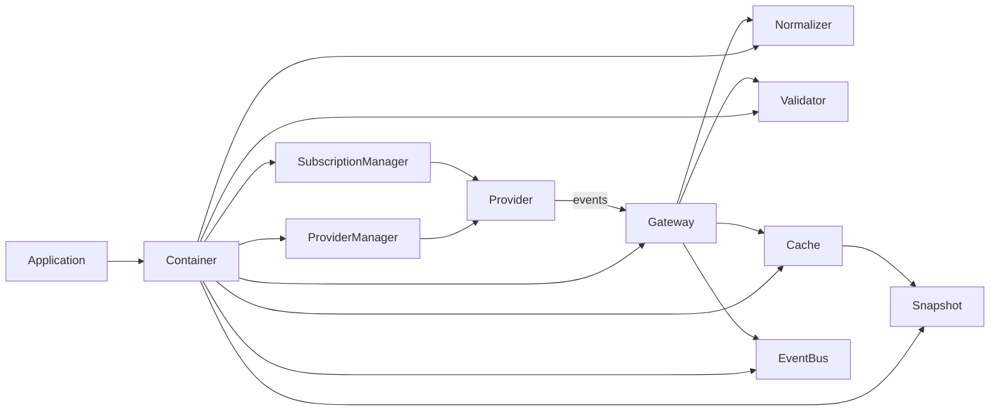
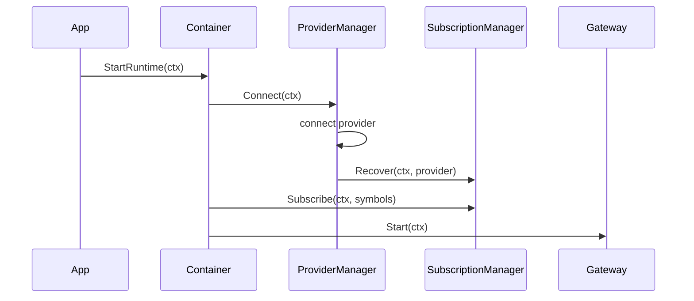
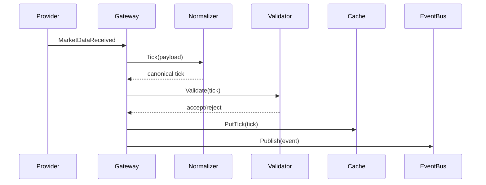
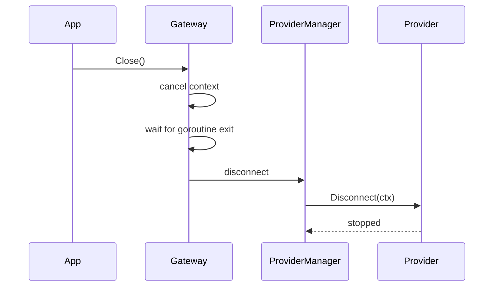
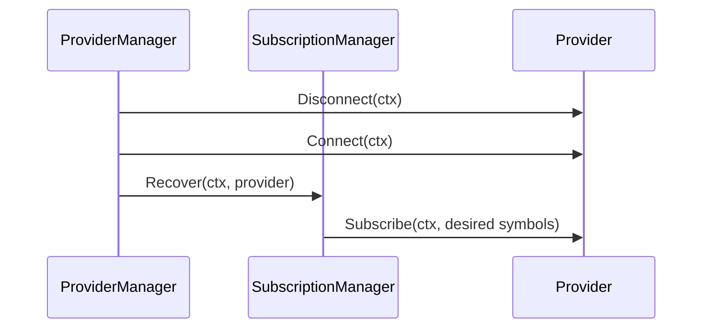

# Stage 2 Market Engine Architecture

## 1. High-level architecture

## 2. Runtime event flow

1. The application starts the container and connects the active provider.
2. The container subscribes the desired symbols through the subscription manager.
3. The gateway consumes provider events and routes them through normalization and validation.
4. Valid ticks update the cache, fan out to the event bus, and are reflected in snapshots.
5. On reconnect or provider switch, the subscription manager replays the desired subscriptions to the new provider instance.

## 3. Component responsibilities

- ProviderManager
  - Owns provider lifecycle and provider switching.
  - Connects, disconnects, and replays subscriptions after reconnect/switch.
  - Owns the active provider session and exposes it to the gateway as an event source.
  - Does not own desired subscription state.

- SubscriptionManager
  - Owns the desired symbol set.
  - Stores subscriptions independently of the active provider connection.
  - Replays desired subscriptions after reconnect or provider switch.

- Gateway
  - Is the only runtime consumer of provider events.
  - Depends on the provider event-source abstraction rather than a concrete provider instance.
  - Converts provider payloads into canonical market ticks.
  - Runs normalization, validation, cache updates, and event fan-out.

- Normalizer
  - Converts provider-specific payloads into canonical market ticks.
  - Is a pure transformation step for runtime data.

- Validator
  - Rejects malformed, stale, duplicate, or out-of-order ticks.
  - Protects the cache and downstream consumers from invalid state.

- Cache
  - Stores the current mutable market state.
  - Holds the latest ticks, chains, and depth snapshots.

- EventBus
  - Fan-outs canonical runtime events to subscribers.
  - Provides a non-blocking bounded distribution mechanism.

- Snapshot
  - Produces immutable read-model views from the cache.
  - Prevents downstream consumers from mutating the live runtime state.

## 4. Lifecycle

### Startup

### Tick processing

### Shutdown

### Reconnect

## 5. Ownership rules

- Provider ownership
  - The active provider instance is owned by ProviderManager.
  - The gateway only consumes events from the runtime event-source abstraction.
  - Provider lifecycle, reconnect, and switching are not exposed to the gateway.

- Cache ownership
  - The cache is the single mutable market-state store for runtime ticks and related snapshots.
  - No other component mutates runtime tick state directly.

- Snapshot ownership
  - Snapshots are derived from cache contents and are immutable from the caller perspective.
  - Snapshots must never be used as the source of truth for mutations.

- EventBus ownership
  - EventBus is a delivery mechanism for runtime events.
  - It should not own business state or provider subscriptions.

- SubscriptionManager ownership
  - SubscriptionManager owns the desired subscription set.
  - It is the only place where desired subscriptions are stored.

## 6. Thread-safety guarantees

- ProviderManager uses a mutex to guard the active provider reference and lifecycle state.
- SubscriptionManager uses a mutex to protect the desired symbol set.
- Cache uses a mutex to protect its maps and expose safe copies.
- EventBus uses a mutex to guard subscriptions and publish operations.
- The gateway processes provider events sequentially through its runtime loop and does not mutate shared runtime state outside the cache/event bus contracts.

## 7. Extension points for new providers

New providers should implement the provider interface in [internal/providers/api/provider.go](../providers/api/provider.go) and register themselves in the provider registry. They must support:

- Connect/Disconnect lifecycle
- Subscribe/Unsubscribe for the desired symbol set
- Event emission through the provider event channel
- Health reporting
- Capabilities reporting

The reconnect path works automatically as long as the provider can be reconnected and accepts subscriptions again.

## 8. Public interfaces

### Provider interface

- Connect(ctx)
- Disconnect(ctx)
- Subscribe(ctx, symbols)
- Unsubscribe(ctx, symbols)
- Events()
- Health()
- Capabilities()

### Runtime gateway interface

- Start(ctx)
- Close()

### Subscription manager interface

- Subscribe(ctx, symbols)
- Unsubscribe(ctx, symbols)
- Recover(ctx, provider)
- Symbols()

## 9. Configuration

Relevant runtime configuration is sourced from the container config and provider config:

- Provider selection
- Reconnect interval and retry count
- Subscription batch size
- Tick validation max age
- Logging level

The container wires those values into the provider manager, gateway, validator, and subscription manager.

## 10. Known limitations

- Reconnect subscription recovery is now handled by the subscription manager after provider reconnect and provider switch, but providers still need to implement stable connect/subscribe semantics.
- The current runtime path is focused on market data ticks; richer market features such as deeper option-chain fan-out and historical replay remain future work.
- Snapshot generation is derived from cache state and should be treated as a read model rather than a write path.
