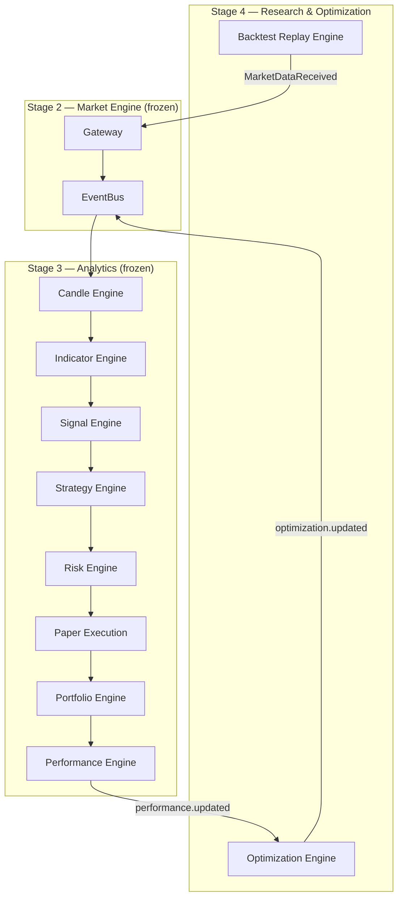
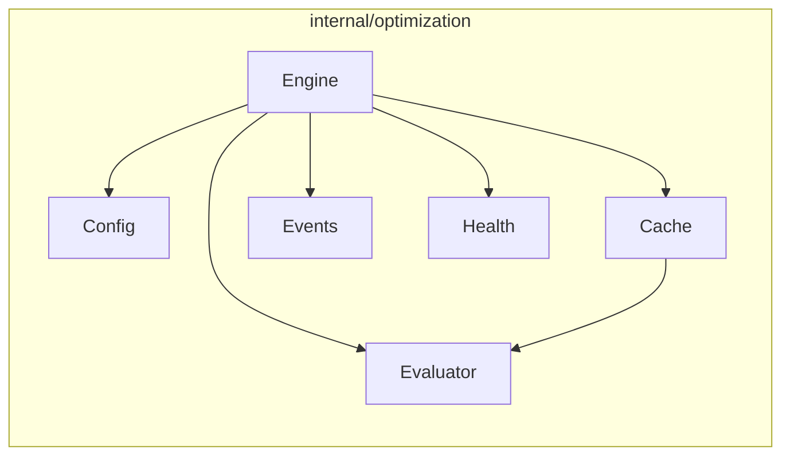
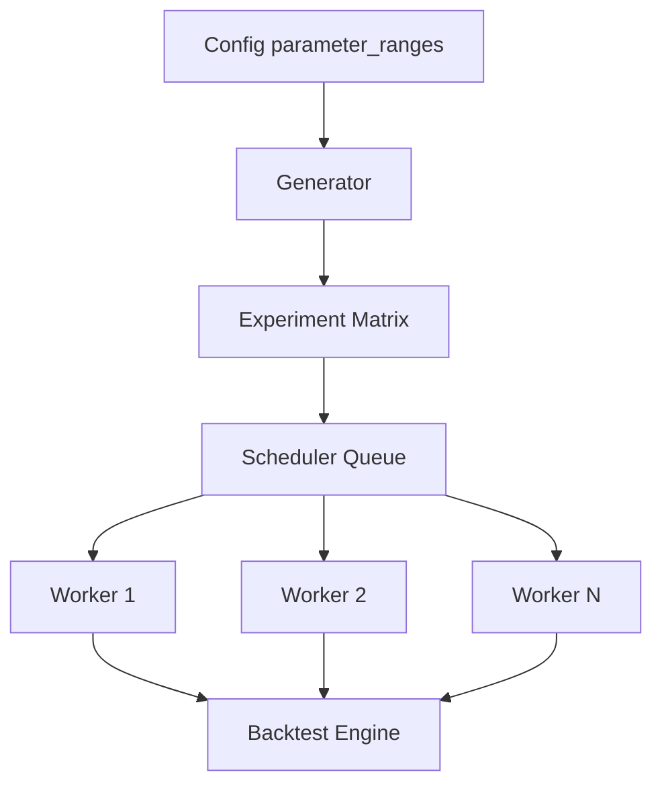
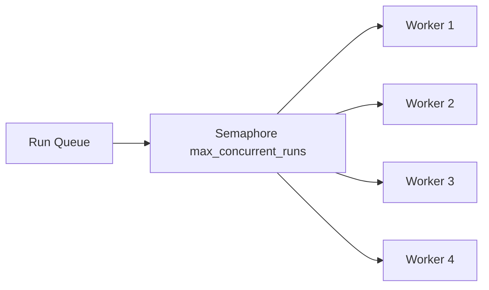

# Stage 4 — Research & Optimization Layer

Stage 4 consumes **only canonical events** from upstream analytics and backtest pipelines. No Stage 4 component may import providers, gateway code, broker adapters, or mutate Stage 2/3 engine state.

## Pipeline

```text
Backtest Replay Engine     ← Phase 1 (implemented, frozen)
    ↓  MarketDataReceived (via gateway)
Stage 3 Analytics Pipeline (frozen)
    ↓  … → portfolio.updated
Performance Engine         ← Stage 3 (frozen)
    ↓  performance.updated
Optimization Engine        ← Phase 2 (implemented)
    ↓  optimization.updated
Strategy Evaluation / Ranking Report
```

## 1. Stage 4 Goals

- Enable **offline research** by replaying historical market data through the full analytics pipeline.
- Evaluate completed backtest runs and **rank strategy performance** across symbols, timeframes, and parameter sets.
- Provide a modular foundation for future Stage 4 phases: walk-forward analysis, parameter sweeps, Monte Carlo simulation, and report export.
- Remain **analytics-only**: no trade execution, no strategy mutation, no broker interaction, no live-trading side effects.

## 2. Scope

### In scope (Phase 1 — Backtest Replay)

- Historical candle loading and replay through the provider contract.
- Replay clock integration for deterministic simulated time.
- Health reporting for replay lifecycle and throughput.

### In scope (Phase 2 — Strategy Optimization)

- Consume `performance.updated` events exclusively.
- Evaluate strategy performance per `(strategy, symbol, timeframe, parameters)` key.
- Compute ranking metrics and a configurable optimization score.
- Publish `optimization.updated` events with metrics, score, and rank.
- Maintain in-memory evaluations, rankings, and score history.

### Out of scope (current phases)

- Live parameter mutation or auto-tuning.
- Broker order routing.
- Persistent optimization result storage (future phase).
- Walk-forward and parameter grid search (future phases).

## 3. Design Principles

1. **Event-only integration** — downstream engines consume bus events; never read another engine's internal cache.
2. **Append-only contracts** — event payloads and public interfaces grow via new fields; breaking changes are forbidden.
3. **Single ownership** — each engine owns its mutable state; expose immutable read models only.
4. **Incremental computation** — apply updates on each event; avoid full recomputation.
5. **Configurable scoring** — weights and penalties are runtime-configurable, not hardcoded.
6. **Graceful lifecycle** — context-driven shutdown, WaitGroup for goroutines, no leaks.
7. **Stage freeze** — Phase 1 replay engine is frozen; Phase 2 does not modify Stage 2, Stage 3, or Phase 1.

## 4. Architecture Overview



## 5. Component Responsibilities

### Backtest Replay Engine (Phase 1, frozen)

| Responsibility | Detail |
|----------------|--------|
| Load historical candles | From file path or in-memory slice |
| Replay provider | Implements `api.Provider`; emits ticks at configured speed |
| Replay clock | Drives simulated time for the full pipeline |
| Health | `backtest_engine` with processed candles, status, speed |

### Optimization Engine (Phase 2)

| Responsibility | Detail |
|----------------|--------|
| Subscribe | `performance.updated` events only |
| Parse | Strategy, symbol, timeframe, parameters, and performance metrics |
| Evaluate | Compute derived metrics (profit factor, expectancy, risk/reward, etc.) |
| Score | Apply configurable weighted scoring formula |
| Rank | Order evaluations by score; assign rank per key |
| Publish | `optimization.updated` with metrics, score, rank |
| State | In-memory evaluations, rankings, historical scores |
| Health | `optimization_engine` with processed counts |

## 6. Event Flow

### Backtest → Optimization (end-to-end)

```mermaid
sequenceDiagram
    participant BT as Backtest Replay
    participant GW as Gateway
    participant S3 as Stage 3 Pipeline
    participant PERF as Performance Engine
    participant OPT as Optimization Engine
    participant BUS as EventBus

    BT->>GW: MarketDataReceived (replay tick)
    GW->>BUS: Publish tick
    BUS->>S3: Candle → … → Portfolio
    S3->>BUS: portfolio.updated
    BUS->>PERF: portfolio.updated
    PERF->>BUS: performance.updated
    BUS->>OPT: performance.updated
    OPT->>OPT: Evaluate, score, rank
    OPT->>BUS: optimization.updated
```

### Optimization event handling

```mermaid
sequenceDiagram
    participant BUS as EventBus
    participant OPT as Optimization Engine
    participant CACHE as Cache
    participant EVAL as Evaluator

    BUS->>OPT: performance.updated
    OPT->>OPT: parse payload
    OPT->>CACHE: Apply(update)
    CACHE->>EVAL: ComputeMetrics(state)
    EVAL-->>CACHE: EvaluationMetrics
    CACHE->>EVAL: Score(metrics, weights)
    EVAL-->>CACHE: score
    CACHE->>CACHE: Re-rank all evaluations
    OPT->>BUS: optimization.updated (per key)
```

## 7. Package Layout

```text
internal/
├── backtest/                  # Phase 1 — frozen
│   ├── engine.go
│   ├── config.go
│   ├── replay.go
│   ├── loader.go
│   ├── events.go
│   └── health.go
└── optimization/              # Phase 2
    ├── engine.go              # Lifecycle, bus subscription, publish
    ├── config.go              # Enabled flag, scoring weights
    ├── evaluator.go           # Metric computation and scoring
    ├── cache.go               # Thread-safe evaluations and rankings
    ├── events.go              # Input/output event payloads
    └── health.go              # Health reporter
```

Configuration wiring lives in `internal/infrastructure/config/optimization.go`.

## 8. Event Contracts

All contracts are **append-only**. New fields may be added; existing fields must not change semantics.

### Input: `performance.updated`

Consumed exclusively by the Optimization Engine.

| Field | Type | Required | Description |
|-------|------|----------|-------------|
| `strategy` | string | no | Strategy identifier; defaults to `"default"` |
| `symbol` | string | no | Instrument symbol; defaults to `"portfolio"` |
| `timeframe` | string | no | Bar timeframe; defaults to `"1m"` |
| `parameters` | string | no | Serialized parameter set identifier |
| `total_trades` | int | yes | Completed trade count |
| `win_rate` | float64 | yes | Fraction of winning trades |
| `realized_pnl` | float64 | yes | Cumulative realized PnL |
| `unrealized_pnl` | float64 | yes | Current unrealized PnL |
| `drawdown` | float64 | yes | Current drawdown from peak |
| `profit_factor` | float64 | no | Optional; computed if absent |
| `max_drawdown` | float64 | no | Optional; tracked if absent |
| `timestamp` | time | yes | Event timestamp |

### Output: `optimization.updated`

Published after each evaluation update.

| Field | Type | Description |
|-------|------|-------------|
| `strategy` | string | Strategy identifier |
| `symbol` | string | Instrument symbol |
| `timeframe` | string | Bar timeframe |
| `parameters` | string | Parameter set identifier |
| `metrics` | object | Full evaluation metrics (see below) |
| `score` | float64 | Configurable optimization score |
| `rank` | int | Rank among all evaluated keys (1 = best) |
| `timestamp` | time | Evaluation timestamp |

#### `metrics` object

| Field | Type | Description |
|-------|------|-------------|
| `total_trades` | int | Completed trades |
| `net_pnl` | float64 | Realized + unrealized PnL |
| `realized_pnl` | float64 | Cumulative realized PnL |
| `win_rate` | float64 | Winning trade fraction |
| `profit_factor` | float64 | Gross profit / gross loss |
| `average_trade` | float64 | Mean PnL per trade |
| `expectancy` | float64 | Expected value per trade |
| `max_drawdown` | float64 | Maximum peak-to-trough decline |
| `risk_reward` | float64 | Average win / average loss |
| `sharpe_ratio` | float64 | Placeholder (0 until return series available) |

## 9. Engine Lifecycle

### Startup order

Optimization Engine subscribes **before** Performance Engine starts publishing:

```text
Optimization → Performance → Portfolio → Paper → Risk → Strategy → Signal → Indicator → Candle → Gateway
```

### Shutdown order (reverse)

```text
Gateway → Candle → Indicator → Signal → Strategy → Risk → Paper → Portfolio → Performance → Optimization
```

### Lifecycle steps

1. `New(cfg, bus, clk)` — validate config, allocate cache.
2. `Start(ctx)` — subscribe to `performance.updated`, launch consumer goroutine.
3. Consumer loop — parse, evaluate, score, rank, publish.
4. `Close()` — cancel context, drain subscription, wait on WaitGroup, close subscription.

## 10. Configuration

```yaml
optimization:
  enabled: true
  subscriber_buffer: 256

  scoring:
    profit_factor_weight: 0.40
    win_rate_weight: 0.30
    expectancy_weight: 0.20
    drawdown_penalty: 0.10
```

| Key | Default | Description |
|-----|---------|-------------|
| `enabled` | `true` | Enable optimization engine |
| `subscriber_buffer` | `256` | Event bus subscriber buffer |
| `scoring.profit_factor_weight` | `0.40` | Weight for normalized profit factor |
| `scoring.win_rate_weight` | `0.30` | Weight for win rate |
| `scoring.expectancy_weight` | `0.20` | Weight for normalized expectancy |
| `scoring.drawdown_penalty` | `0.10` | Penalty for normalized max drawdown |

### Scoring formula

```text
score = profit_factor_weight × norm(profit_factor)
      + win_rate_weight     × win_rate
      + expectancy_weight   × norm(expectancy)
      - drawdown_penalty    × norm(max_drawdown)
```

Normalization clamps values to `[0, 1]` using configurable reference scales (profit factor cap 5.0, expectancy cap 100.0, drawdown cap 1000.0).

## 11. Health Reporting

`GET /health/components` includes `optimization_engine`:

| Detail key | Description |
|------------|-------------|
| `enabled` | Whether engine is configured on |
| `evaluations_processed` | Total performance events processed |
| `reports_generated` | Total optimization.updated events published |
| `strategies_evaluated` | Distinct strategy keys evaluated |
| `rankings_generated` | Total re-ranking operations performed |
| `dropped` | Subscription dropped event count |

Status is `degraded` when disconnected or events are dropped.

## 12. Thread Safety

- A **single consumer goroutine** processes bus events sequentially.
- The **cache mutex** protects evaluations, rankings, and score history maps.
- Health counters use **atomic** operations.
- `State()` returns an **immutable copy** of evaluations and rankings.
- No lock is held during bus publish.

## 13. Failure Handling

| Failure | Behavior |
|---------|----------|
| Malformed `performance.updated` payload | Skip silently; no publish |
| Missing optional dimension fields | Apply defaults (`default`, `portfolio`, `1m`) |
| Bus publish error | Skip; health counter still increments processed |
| Shutdown mid-event | Drain subscription channel before exit |
| Disabled engine | `Start`/`Close` are no-ops |

No panics for runtime failures. Structured errors returned from `New` and `Validate` only.

## 14. Backtest Integration

The Optimization Engine does **not** import the backtest package. Integration is purely event-driven:

1. Enable `backtest.enabled` to replay historical candles.
2. Stage 3 pipeline processes replayed ticks through execution and portfolio.
3. Performance Engine publishes `performance.updated` at each portfolio snapshot.
4. Optimization Engine evaluates and ranks the resulting metrics.

For multi-strategy backtests, upstream callers should include `strategy`, `symbol`, `timeframe`, and `parameters` in the `performance.updated` payload (append-only extension). Until Performance Engine emits these fields, the Optimization Engine applies documented defaults.

## 15. Optimization Pipeline

```text
performance.updated
    ↓
Parse & key (strategy, symbol, timeframe, parameters)
    ↓
Cache.Apply — update incremental trade state
    ↓
Evaluator.ComputeMetrics — derive all metrics
    ↓
Evaluator.Score — apply weighted formula
    ↓
Cache.ReRank — sort all evaluations by score
    ↓
optimization.updated (metrics + score + rank)
```

## 16. Future Stage 4 Phases

| Phase | Name | Consumes | Produces |
|-------|------|----------|----------|
| 1 | Backtest Replay | Historical data | `MarketDataReceived` |
| 2 | Strategy Optimization | `performance.updated` | `optimization.updated` |
| 3 | Parameter Sweep | Config grid + replay | Multiple `performance.updated` streams |
| 4 | Walk-Forward Analysis | Rolling replay windows | `optimization.updated` series |
| 5 | Report Export | `optimization.updated` | CSV/JSON reports |
| 6 | Monte Carlo | Trade shuffle / resample | Distribution metrics |

Each future phase must follow the same event-only, append-only, single-ownership rules.

## 17. Sequence Diagrams

### Multi-strategy evaluation

```mermaid
sequenceDiagram
    participant PERF as Performance Engine
    participant OPT as Optimization Engine
    participant CACHE as Cache

    PERF->>OPT: performance.updated (strategy=A)
    OPT->>CACHE: Apply A → score 0.82, rank 1
    OPT->>OPT: publish optimization.updated (A)

    PERF->>OPT: performance.updated (strategy=B)
    OPT->>CACHE: Apply B → score 0.45, rank 2
    OPT->>CACHE: Re-rank A=1, B=2
    OPT->>OPT: publish optimization.updated (B)
```

### Graceful shutdown

```mermaid
sequenceDiagram
    participant App
    participant PERF as Performance Engine
    participant OPT as Optimization Engine

    App->>PERF: Close()
    PERF->>PERF: cancel, drain, wait
    App->>OPT: Close()
    OPT->>OPT: cancel context
    OPT->>OPT: drain subscription
    OPT->>OPT: wg.Wait()
    OPT->>OPT: close subscription
```

## 18. Component Diagram



## 19. Data Flow

```text
┌─────────────────┐     performance.updated      ┌──────────────────┐
│ Performance     │ ────────────────────────────►│ Optimization     │
│ Engine (S3)     │                              │ Engine (S4)      │
└─────────────────┘                              └────────┬─────────┘
                                                          │
                        ┌─────────────────────────────────┤
                        ▼                                 ▼
                 ┌─────────────┐                  ┌───────────────┐
                 │ Cache       │                  │ optimization  │
                 │ evaluations │                  │ .updated      │
                 │ rankings    │                  └───────────────┘
                 │ score hist  │
                 └─────────────┘
```

## 20. Extension Guidelines

1. Add new scoring dimensions via config weights, not hardcoded branches.
2. Add new metrics to `EvaluationMetrics` as optional JSON fields.
3. New event types use new `events.Type` constants; never repurpose existing types.
4. Persistent storage belongs in a future phase with its own package.
5. Do not import `internal/backtest` or Stage 3 engine packages from optimization.

## 21. Testing Strategy

| Test | Validates |
|------|-----------|
| Profitable strategy | High optimization score |
| High drawdown strategy | Lower score due to drawdown penalty |
| Multiple strategies | Correct relative ranking |
| Engine lifecycle | Subscribe, publish, graceful close |
| Scoring weights | Configurable weight application |

Run `go build ./...` and `go test ./...` before completion.

## 22. Non-Goals

- Modifying live strategy parameters.
- Executing trades or interacting with brokers.
- Reading Performance Engine internal cache.
- Consuming provider or gateway events directly.
- O(n²) ranking on every event (ranking is O(n log n) over evaluation keys).

## 23. Design Decisions

| Decision | Rationale |
|----------|-----------|
| Consume only `performance.updated` | Maintains Stage 3 freeze; single upstream contract |
| Default dimension keys | Allows operation before Performance Engine emits strategy/symbol fields |
| In-memory state only | Phase 2 scope; persistence deferred |
| Modular `Evaluator` | Scoring formula can evolve without cache changes |
| Sharpe placeholder | Requires return series not yet in performance events |
| Re-rank on every update | Rankings stay current for multi-strategy comparisons |

## 24. Trade-offs

| Trade-off | Choice | Cost | Benefit |
|-----------|--------|------|---------|
| No persistence | In-memory only | Results lost on restart | Simple, fast, no DB dependency |
| Default dimension keys | `"default"` / `"portfolio"` | Less precise without upstream fields | Works with current Performance payload |
| Full re-rank per event | O(n log n) sort | Minor CPU at scale | Always-current rankings |
| Sharpe placeholder | Returns 0 | Incomplete risk metric | No false precision |
| Incremental trade tracking | Delta-based gross profit/loss | Approximation when events batch | No Stage 3 modification needed |

## 25. Experiment Framework

Phase 3 introduces an **Experiment Framework** that sits above the Backtest Replay and Optimization engines. The framework is purely orchestration: it generates parameter combinations, schedules backtest runs, correlates results via event metadata, and publishes aggregated experiment outcomes.

### Core concepts

| Concept | Description |
|---------|-------------|
| **Experiment** | A logical batch of parameter-sweep runs sharing an `experiment_id` |
| **ExperimentRun** | A single backtest execution with unique `run_id` and parameter set |
| **ParameterSet** | Serializable map of strategy/risk/indicator parameters for one run |
| **BacktestSession** | A single replay invocation through the existing Backtest Engine |
| **ExperimentResult** | Collected `optimization.updated` outcome correlated to a `run_id` |

### Design rules

- The Experiment Engine **never** duplicates analytics, backtest replay, or optimization logic.
- All execution flows through existing engines via event bus and injected runners.
- Experiment state is in-memory; persistence is deferred to Phase 5 (Report Export).
- Correlation uses append-only `performance.updated` metadata (`run_id`, `experiment_id`, `parameter_set`).

## 26. Parameter Sweep Architecture

Parameter sweeps generate a **Cartesian product** across configured ranges:

```text
symbols × timeframes × ema_fast × ema_slow × rsi_period × rsi_overbought ×
rsi_oversold × macd_fast × macd_slow × macd_signal × min_confidence × max_positions
```

### Generator responsibilities

1. Read `experiments.parameter_ranges` from configuration.
2. Expand ranges into discrete `ParameterSet` values.
3. Assign each combination a unique `run_id` within the parent `experiment_id`.
4. Serialize parameters into `parameter_set` JSON for event correlation.

### Sweep constraints

- Empty ranges are skipped (dimension omitted from product).
- `max_concurrent_runs` caps parallel backtest sessions.
- Duplicate `run_id` values are rejected by the scheduler.



## 27. Experiment Lifecycle

```text
CREATED → QUEUED → RUNNING → COMPLETED
                          └→ FAILED
```

| State | Description |
|-------|-------------|
| `CREATED` | Run generated and registered in cache |
| `QUEUED` | Waiting for an available worker slot |
| `RUNNING` | Backtest session active; `run_id` registered as in-flight |
| `COMPLETED` | `optimization.updated` received; `experiment.completed` published |
| `FAILED` | Backtest or correlation error; run marked failed |

### Lifecycle sequence

```mermaid
sequenceDiagram
    participant EXP as Experiment Engine
    participant SCH as Scheduler
    participant BT as Backtest Engine
    participant PERF as Performance Engine
    participant OPT as Optimization Engine

    EXP->>EXP: Generate experiment matrix
    EXP->>SCH: Enqueue runs
    SCH->>BT: Execute run (run_id)
    BT->>PERF: portfolio.updated → performance.updated
    Note over PERF: Carries run_id, experiment_id, parameter_set
    PERF->>OPT: performance.updated
    OPT->>EXP: optimization.updated
    EXP->>EXP: Correlate by run_id
    EXP->>EXP: Publish experiment.completed
```

## 28. Backtest Session Model

Each `ExperimentRun` maps to one **BacktestSession**:

- One invocation of the existing Backtest Replay Engine (no fork or copy of replay logic).
- Session metadata (`run_id`, `experiment_id`, `backtest_id`) flows through `performance.updated`.
- Sessions are isolated by serializing concurrent access per worker when sharing a single engine instance.
- For parallel execution, the DI layer may inject a factory that creates independent `backtest.Engine` instances per run.

```text
ExperimentRun
    ↓
BacktestSession.Run(ctx)
    ↓
ReplayProvider.Connect → replayLoop → MarketDataReceived
    ↓
Stage 3 pipeline (unchanged)
    ↓
performance.updated (tagged with run_id)
```

## 29. Run ID / Experiment ID

| Identifier | Scope | Format |
|------------|-------|--------|
| `experiment_id` | Entire parameter sweep batch | UUID v4 |
| `run_id` | Single backtest execution | UUID v4 |
| `backtest_id` | Logical backtest session label | Optional string |
| `parameter_set` | Serialized parameter JSON | JSON string |

### Correlation contract

1. Experiment Engine assigns `experiment_id` at batch creation.
2. Generator assigns unique `run_id` per matrix row.
3. Runner tags the session; Performance Engine forwards tags in `performance.updated`.
4. Optimization Engine keys evaluations by `parameter_set` (unchanged).
5. Experiment Engine correlates `optimization.updated` → `run_id` via `parameter_set` content.

## 30. Optimization Aggregation

The Experiment Engine aggregates optimization results at the experiment level:

```text
optimization.updated (per run)
    ↓
Experiment Cache.StoreResult(run_id, score, metrics, rank)
    ↓
Experiment Cache.ReRank() — sort completed runs by optimization score
    ↓
experiment.completed (per run, includes experiment-level rank)
```

Aggregation rules:

- Only `COMPLETED` runs participate in experiment rankings.
- Rank 1 = highest `optimization_score` within the experiment batch.
- Failed runs are excluded from rankings but counted in health metrics.

## 31. Parallel Execution Model



| Mechanism | Purpose |
|-----------|---------|
| `parallel_workers` | Number of worker goroutines |
| `max_concurrent_runs` | Semaphore limit on simultaneous backtests |
| `running` set | Prevents duplicate execution of the same `run_id` |
| Context cancellation | Graceful shutdown drains queue without new dispatches |

Workers:

1. Dequeue next `QUEUED` run.
2. Acquire semaphore slot.
3. Register `run_id` in `running` set.
4. Invoke `BacktestRunner.Execute(ctx, run)`.
5. Await `optimization.updated` correlation (or timeout).
6. Release slot, remove from `running`, publish `experiment.completed`.

## 32. Result Storage Model

Phase 3 uses **in-memory storage only**:

| Store | Content |
|-------|---------|
| `experiments` | Experiment metadata and batch state |
| `runs` | All `ExperimentRun` records by `run_id` |
| `running` | Currently executing `run_id` set |
| `completed` | Finished runs with optimization results |
| `rankings` | Sorted completed runs by score |

`State()` returns immutable snapshots. Persistence to PostgreSQL or file export is deferred to Phase 5.

## 33. Ranking Pipeline

```text
1. optimization.updated received
2. Match run_id from parameter_set JSON
3. Store RunResult { score, metrics, rank from optimization }
4. Re-rank all completed runs in experiment (descending score)
5. Publish experiment.completed with updated rank
```

Tie-breaking: higher score wins; equal scores broken by `run_id` lexicographic order.

## 34. Future Walk-Forward Validation

Walk-forward analysis will extend the Experiment Framework without architectural redesign:

| Extension | Integration point |
|-----------|-------------------|
| Rolling time windows | Generator adds `window_start` / `window_end` to `ParameterSet` |
| In-sample / out-of-sample split | Scheduler runs sequential windows per parameter set |
| Stability scoring | Optimization Aggregation computes cross-window score variance |
| New event | `walkforward.completed` (append-only) |

The existing `experiment_id` / `run_id` model accommodates window suffixes (e.g. `run_id_w3`).

## 35. Future Market Regime Detection

Market regime detection will consume Stage 3 indicator events and tag experiments:

| Extension | Integration point |
|-----------|-------------------|
| Regime classifier | New analytics consumer of `IndicatorUpdated` (Stage 3 extension) |
| Regime label in `performance.updated` | Append-only field `regime` |
| Regime-filtered ranking | Experiment Aggregation groups results by regime |
| New event | `regime.detected` (append-only) |

No changes to Experiment Engine orchestration logic; only new optional metadata fields.

## 36. Future Adaptive Strategy Selection

Adaptive strategy selection will close the loop between optimization rankings and live strategy configuration:

```text
optimization.updated → experiment.completed → strategy.selection.recommended
```

| Component | Role |
|-----------|------|
| Selection Engine (Phase 6+) | Consumes `experiment.completed` rankings |
| Recommendation event | Publishes top-ranked parameter set per symbol/timeframe |
| Live Strategy Engine | Consumes recommendations (read-only; no auto-mutation) |

The Experiment Framework provides ranked candidates; adaptive selection remains a separate, opt-in downstream consumer.

## 37. Phase 3 — Experiment Engine

### Responsibility

- Generate parameter sweep matrix from configuration.
- Schedule and execute backtest runs via injected `BacktestRunner`.
- Subscribe to `optimization.updated` for result collection.
- Publish `experiment.completed` per finished run.
- Maintain in-memory experiment state and rankings.

### Packages

| Package | Role |
|---------|------|
| `internal/experiments` | Generator, scheduler, cache, orchestration |
| `internal/infrastructure/config/experiments.go` | Configuration mapping |

### Configuration

```yaml
experiments:
  enabled: true
  parallel_workers: 4
  max_concurrent_runs: 4
  symbols:
    - NIFTY
  timeframes:
    - 5m
  parameter_ranges:
    ema_fast: [5, 9, 12]
    ema_slow: [21, 34, 50]
    rsi_period: [14, 21]
```

### Lifecycle

1. Experiment engine starts **before** optimization engine (subscribes first).
2. On `Start`, generate experiment batch and enqueue runs.
3. Workers invoke backtest runner; collect `optimization.updated`.
4. On shutdown: cancel workers, drain queue, wait on WaitGroup.

### Event payload (`experiment.completed`)

- `experiment_id`, `run_id`, `strategy`, `parameters`, `optimization_score`, `rank`, `metrics`, `timestamp`

### Health

`GET /health/components` includes `experiment_engine` with `experiments_created`, `runs_started`, `runs_completed`, `runs_failed`, `active_workers`, `queue_depth`.

