# Stage 5 — Trading Intelligence Platform

Stage 5 transforms the platform from an analytics and research backend into a **complete Trading Intelligence Platform**. Stage 5 components consume **only canonical events** from Stages 2–4. No Stage 5 component may import providers, market gateway code, broker adapters, or mutate frozen engine state.

**This platform is not an automated trading system.** Paper execution exists solely to simulate fills for portfolio, performance, and research evaluation. No broker integration, OMS, or live order placement is planned.

## Pipeline

```text
Stage 2 Market Engine (frozen)
    ↓  MarketDataReceived
Stage 3 Analytics Pipeline (frozen)
    ↓  … → SignalGenerated → StrategyDecision → … → PerformanceUpdated
Stage 4 Research Layer (frozen)
    ↓  optimization.updated, research.updated, …
Stage 5 Intelligence Layer
    ↓
Market Scanner Engine         ← Phase 1 (implemented)
    ↓  scanner.updated
(Future) Alert Engine
(Future) Dashboard APIs
(Future) Visualization Layer
```

---

## 1. Vision

Deliver a production-grade **NSE Intraday Trading Intelligence Platform** that empowers traders and researchers with:

- Real-time market analytics and scanning
- Strategy performance visibility across symbols and timeframes
- Research-backed insights from backtest, optimization, and Monte Carlo pipelines
- Alerting and dashboard APIs for decision support
- Historical query and visualization surfaces

The platform prioritizes **intelligence over execution**. Every architectural decision supports analytics, research, and user-facing insight — not automated order routing.

Paper execution remains a **simulation tool** for evaluating strategy behaviour. It is not a path to live trading.

---

## 2. Goals

| Goal | Detail |
|------|--------|
| Intelligence-first | All Stage 5 features serve analytics, scanning, alerting, and dashboards |
| Event-driven integration | Consume bus events only; never bypass the pipeline |
| Research consumption | Surface Stage 4 outputs (optimization, experiments, walk-forward, Monte Carlo) via APIs |
| Real-time scanning | Continuously evaluate symbols against configurable scanner rules |
| Extensible APIs | HTTP and WebSocket layers for dashboards without coupling to engine internals |
| No broker coupling | Zero broker SDKs, OMS, or order routing in Stage 5 |
| Single ownership | Each engine owns its mutable state; expose immutable read models |
| Observability | Health probes, structured logging, metrics for every Stage 5 component |

---

## 3. Scope

### In scope (Phase 1 — Market Scanner)

- Consume `signal.generated`, `strategy.decision`, and `performance.updated` events
- Maintain per-symbol scanner state
- Configurable scanners: EMA, RSI, MACD, trend, ranking
- Publish `scanner.updated` intelligence events
- Health reporting for scanner lifecycle and throughput
- Symbol watchlist filtering

### In scope (future phases)

- Alert Engine with notification channels
- Dashboard and query APIs
- WebSocket streaming of scanner and analytics events
- Historical analytics query layer
- Multi-strategy comparison and symbol ranking APIs
- Market breadth, heatmaps, and screeners
- Research and performance REST APIs

### Out of scope (entire Stage 5)

- Broker integration (Zerodha, Fyers, Angel One, Upstox)
- Order Management System (OMS)
- Live order placement or routing
- Execution gateway or broker manager
- Automated trading or strategy mutation
- Position synchronization with external brokers

---

## 4. Non-Goals

- Becoming an automated trading system
- Real broker connectivity or order routing
- OMS, RMS, or live portfolio reconciliation with brokers
- Modifying Stage 2, Stage 3, or Stage 4 frozen components
- Replacing paper execution with live execution
- Multi-broker support or HA failover for trading infrastructure
- Modifying `execution.report` or trade execution contracts

---

## 5. Design Principles

1. **Intelligence over execution** — Every feature answers "what does the market look like?" not "should we trade?"
2. **Event-only integration** — Downstream engines consume bus events; never read another engine's internal cache.
3. **Append-only contracts** — Event payloads and public interfaces grow via new fields; breaking changes are forbidden.
4. **Single ownership** — Scanner owns scan state; Alert Engine (future) owns alert state; APIs expose read models only.
5. **Configurable rules** — Scanner rules, alert thresholds, and API filters are runtime-configurable.
6. **Graceful lifecycle** — Context-driven shutdown, WaitGroup for goroutines, subscription drain.
7. **Stage freeze** — Phase 1 does not modify Stage 2, Stage 3, or Stage 4.
8. **Paper execution is simulation** — Retained for portfolio/performance evaluation only.

---

## 6. High-Level Architecture

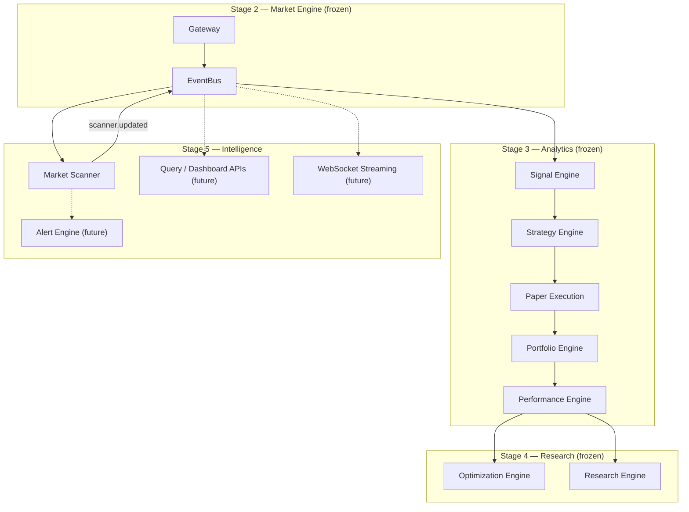
```mermaid
flowchart TB
    subgraph Stage2["Stage 2 — Market Engine (frozen)"]
        GW[Gateway]
        BUS[EventBus]
    end

    subgraph Stage3["Stage 3 — Analytics (frozen)"]
        SIG[Signal Engine]
        STRAT[Strategy Engine]
        PERF[Performance Engine]
        PAPER[Paper Execution]
        PORT[Portfolio Engine]
    end

    subgraph Stage4["Stage 4 — Research (frozen)"]
        OPT[Optimization Engine]
        RES[Research Engine]
    end

    subgraph Stage5["Stage 5 — Intelligence"]
        SCAN[Market Scanner]
        ALERT["Alert Engine (future)"]
        API["Query / Dashboard APIs (future)"]
        WS["WebSocket Streaming (future)"]
    end

    GW --> BUS
    BUS --> SIG --> STRAT
    STRAT --> PAPER --> PORT --> PERF
    PERF --> OPT
    PERF --> RES
    BUS --> SCAN
    SCAN -->|scanner.updated| BUS
    SCAN -.-> ALERT
    BUS -.-> API
    BUS -.-> WS
```

Execution path (unchanged, simulation only):

```text
Risk Engine → Paper Execution → execution.report → Portfolio → Performance
```

---

## 7. Component Diagram

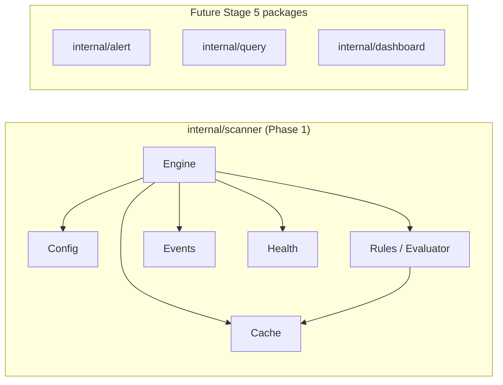
```mermaid
flowchart LR
    subgraph scanner_pkg["internal/scanner (Phase 1)"]
        ENG[Engine]
        CFG[Config]
        RULES[Rules / Evaluator]
        CACHE[Cache]
        EVT[Events]
        HLTH[Health]
    end

    subgraph future_pkg["Future Stage 5 packages"]
        ALERT_PKG[internal/alert]
        QUERY_PKG[internal/query]
        DASH_PKG[internal/dashboard]
    end

    ENG --> CFG
    ENG --> RULES
    ENG --> CACHE
    ENG --> EVT
    ENG --> HLTH
    RULES --> CACHE
```

| Component | Package | Responsibility |
|-----------|---------|----------------|
| Scanner Engine | `internal/scanner` | Event subscription, rule evaluation, `scanner.updated` publish |
| Rules / Evaluator | `internal/scanner` | EMA, RSI, MACD, trend, ranking scanner logic |
| Cache | `internal/scanner` | Per-symbol state from signals, decisions, performance |
| Alert Engine | `internal/alert` (future) | Threshold alerts, notification dispatch |
| Query Layer | `internal/query` (future) | Historical and aggregated read APIs |
| Dashboard Layer | `internal/dashboard` (future) | Composed views for UI consumers |

---

## 8. Event Flow

### Scanner pipeline (Phase 1)

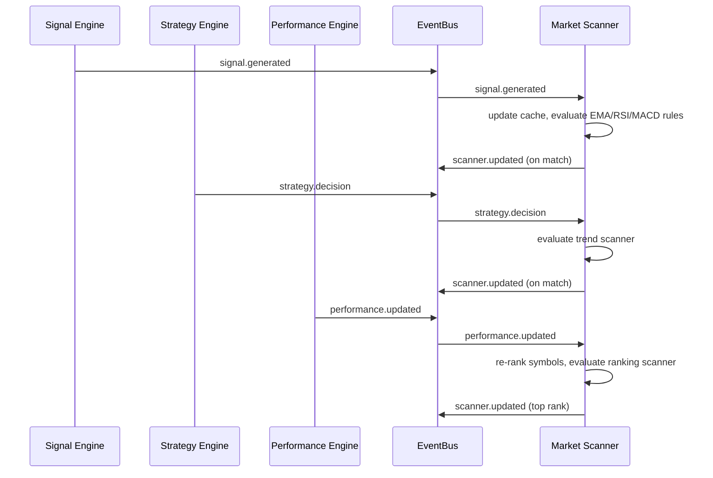
```mermaid
sequenceDiagram
    participant SIG as Signal Engine
    participant STRAT as Strategy Engine
    participant PERF as Performance Engine
    participant BUS as EventBus
    participant SCAN as Market Scanner

    SIG->>BUS: signal.generated
    BUS->>SCAN: signal.generated
    SCAN->>SCAN: update cache, evaluate EMA/RSI/MACD rules
    SCAN->>BUS: scanner.updated (on match)

    STRAT->>BUS: strategy.decision
    BUS->>SCAN: strategy.decision
    SCAN->>SCAN: evaluate trend scanner
    SCAN->>BUS: scanner.updated (on match)

    PERF->>BUS: performance.updated
    BUS->>SCAN: performance.updated
    SCAN->>SCAN: re-rank symbols, evaluate ranking scanner
    SCAN->>BUS: scanner.updated (top rank)
```

### End-to-end intelligence flow (target state)

```text
Market Data → Analytics → Signals → Scanner → scanner.updated
                                      ↓
                              Alert Engine (future)
                                      ↓
                              Dashboard / WebSocket APIs
```

---

## 9. Data Flow

```text
┌─────────────────┐   signal.generated     ┌──────────────────┐
│ Signal Engine   │ ──────────────────────►│ Market Scanner   │
│ (Stage 3)       │                        │ (Stage 5)        │
└─────────────────┘                        │                  │
┌─────────────────┐   strategy.decision      │  Cache           │
│ Strategy Engine │ ──────────────────────►│  Evaluator       │
└─────────────────┘                        │  Health          │
┌─────────────────┐   performance.updated    └────────┬─────────┘
│ Performance     │ ───────────────────────────────►│
│ Engine          │                                   ▼
└─────────────────┘                          scanner.updated
                                                      │
                        ┌─────────────────────────────┤
                        ▼                             ▼
                 ┌─────────────┐              ┌───────────────┐
                 │ Alert Engine│              │ Dashboard API │
                 │  (future)   │              │   (future)    │
                 └─────────────┘              └───────────────┘
```

Per-symbol state in the scanner cache:

| Field | Source event | Used by |
|-------|-------------|---------|
| `LastSignal` | `signal.generated` | EMA, RSI, MACD scanners |
| `LastDecision` | `strategy.decision` | Trend scanner |
| `Performance` | `performance.updated` | Ranking scanner |

---

## 10. Analytics APIs

Future HTTP endpoints (Phase 2+) exposing Stage 3/4 read models:

| Endpoint | Method | Description |
|----------|--------|-------------|
| `/api/v1/analytics/signals` | GET | Recent signals by symbol/timeframe |
| `/api/v1/analytics/indicators` | GET | Latest indicator values |
| `/api/v1/analytics/strategies` | GET | Strategy decisions and confidence |
| `/api/v1/analytics/performance` | GET | Performance metrics snapshot |
| `/api/v1/scanner/results` | GET | Latest scanner matches |
| `/api/v1/scanner/rankings` | GET | Symbol rankings from ranking scanner |

APIs return immutable snapshots. They never mutate engine state.

---

## 11. Query Layer

Future `internal/query` package providing:

- Time-range filtered queries over PostgreSQL historical tables
- Aggregated candle, indicator, and signal lookups
- Pagination and cursor-based navigation
- Read-only connection pool separate from research writes

Design constraints:

- Query layer reads from PostgreSQL and event snapshots only
- No direct cache access from Stage 2/3 engines
- Query results are denormalized DTOs, not internal engine types

---

## 12. Dashboard Layer

Future `internal/dashboard` package composing:

- Scanner match feed
- Performance leaderboards
- Strategy comparison panels
- Research report listings from Stage 4

Dashboard layer aggregates query layer responses. It does not subscribe to the event bus directly.

---

## 13. WebSocket Streaming

The existing `internal/adapters/ws` hub will be extended (future phase) to stream:

- `scanner.updated` events to connected clients
- `signal.generated` and `strategy.decision` for live dashboards
- `performance.updated` for real-time PnL panels

Streaming rules:

- Clients subscribe to event type filters
- Hub fans out from EventBus subscriptions
- Bounded buffers prevent slow-client backpressure on engines

---

## 14. Alert Engine

Future `internal/alert` package (Phase 2):

- Subscribe to `scanner.updated`, `signal.generated`, and custom threshold events
- Configurable alert rules (price, signal, scanner match, drawdown)
- Deduplication and cooldown windows
- Publish `alert.fired` events

Alert engine is **notification only** — it never triggers execution or modifies strategies.

---

## 15. Scanner Engine

Phase 1 implementation in `internal/scanner`.

### Responsibilities

| Responsibility | Detail |
|----------------|--------|
| Subscribe | `signal.generated`, `strategy.decision`, `performance.updated` |
| Filter | Process only symbols in configured watchlist |
| Evaluate | Run enabled scanner rules against per-symbol cache |
| Publish | `scanner.updated` on MATCH or WATCH status |
| State | In-memory per-symbol cache |
| Health | `scanner_engine` with throughput and match counters |

### Enabled scanners (Phase 1)

| Scanner | Trigger | Match condition |
|---------|---------|-----------------|
| `ema` | `signal.generated` with strategy `ema_cross` | BUY/SELL with confidence ≥ threshold |
| `rsi` | `signal.generated` with strategy `rsi` | BUY/SELL; WATCH if low confidence |
| `macd` | `signal.generated` with strategy `macd_cross` | BUY/SELL with confidence ≥ threshold |
| `trend` | `strategy.decision` with strategy `trend_following` | LONG_ENTRY/SHORT_ENTRY |
| `ranking` | `performance.updated` | Top-ranked symbol by composite score |

Future scanners (placeholder): high volume, new high/low, high confidence strategy.

---

## 16. Watchlists

Configured via `scanner.symbols`:

```yaml
scanner:
  symbols:
    - NIFTY
    - BANKNIFTY
```

- When the list is non-empty, only listed symbols are scanned
- When empty, all symbols passing through events are scanned
- Future: dynamic watchlists via API with persistent storage

---

## 17. Historical Query APIs

Future endpoints for time-series retrieval:

| Endpoint | Data |
|----------|------|
| `/api/v1/history/candles` | OHLCV bars by symbol/timeframe/range |
| `/api/v1/history/signals` | Historical signal events |
| `/api/v1/history/performance` | Equity curve and trade history |

Backed by PostgreSQL tables populated by Stage 2/3 persistence (future phase).

---

## 18. Research APIs

Expose Stage 4 research outputs:

| Endpoint | Source |
|----------|--------|
| `/api/v1/research/reports` | Research Engine repository |
| `/api/v1/research/optimization` | Optimization rankings |
| `/api/v1/research/experiments` | Experiment results |
| `/api/v1/research/walkforward` | Walk-forward analysis |
| `/api/v1/research/montecarlo` | Monte Carlo distributions |

Read-only. Research Engine remains the sole writer.

---

## 19. Performance APIs

| Endpoint | Description |
|----------|-------------|
| `/api/v1/performance/summary` | Aggregate PnL, win rate, drawdown |
| `/api/v1/performance/by-strategy` | Per-strategy breakdown |
| `/api/v1/performance/by-symbol` | Per-symbol breakdown |
| `/api/v1/performance/equity-curve` | Time-series equity points |

Sourced from Performance Engine snapshots and PostgreSQL (future persistence).

---

## 20. Portfolio APIs

| Endpoint | Description |
|----------|-------------|
| `/api/v1/portfolio/positions` | Current simulated positions |
| `/api/v1/portfolio/pnl` | Realized and unrealized PnL |
| `/api/v1/portfolio/history` | Closed position history |

Portfolio state is **simulated** via paper execution. No live broker positions.

---

## 21. Multi Strategy Comparison

Future capability combining:

- Optimization Engine rankings (`optimization.updated`)
- Performance Engine per-strategy metrics
- Scanner ranking scores

Produces comparative views:

- Side-by-side strategy performance tables
- Relative score charts
- Best-strategy-per-symbol recommendations (informational only)

---

## 22. Symbol Ranking

Implemented in Phase 1 via the **ranking scanner**:

```text
score = win_rate × 0.5 + normalize(pnl) × 0.5
```

On each `performance.updated` event, all cached symbol performances are ranked. The top symbol publishes a `scanner.updated` event with `scanner_name: "ranking"`.

Future: dedicated ranking API with sortable dimensions (Sharpe, profit factor, drawdown).

---

## 23. Market Breadth

Future Phase 4+ feature:

- Aggregate advancing/declining symbols from signal engine outputs
- Compute advance-decline ratio, new highs/lows
- Publish `breadth.updated` events
- No scanner package modification required — new engine subscribes to signals

---

## 24. Heatmaps

Future visualization data endpoints:

- Sector/symbol performance heatmap (color = PnL or score)
- Signal density heatmap (symbol × timeframe)
- Scanner match frequency heatmap

Delivered as JSON grids for frontend rendering. No server-side image generation.

---

## 25. Screeners

The Market Scanner Engine **is** the foundation for screeners. Future phases extend with:

- Composite screener rules (AND/OR across scanners)
- Saved screener definitions via API
- Scheduled screener runs with result history
- Export to CSV/JSON

Phase 1 provides individual scanner rules; composite screeners are Phase 3+.

---

## 26. Notification Channels

Future alert dispatch channels:

| Channel | Use case |
|---------|----------|
| WebSocket | Real-time dashboard updates |
| Webhook | External system integration |
| Email | Daily summary reports |
| Slack / Telegram | Team alert channels |

All channels are outbound only. No inbound trade commands.

---

## 27. PostgreSQL Usage

| Data | Storage | Writer |
|------|---------|--------|
| Research reports | `research` schema | Research Engine |
| Experiment results | `research` schema | Research Engine |
| Historical candles (future) | `market` schema | Persistence layer |
| Alert history (future) | `alerts` schema | Alert Engine |
| Scanner results (future) | `scanner` schema | Scanner persistence |

Phase 1 scanner is in-memory only. Persistence deferred to Phase 3+.

---

## 28. Caching Strategy

| Layer | Cache | Invalidation |
|-------|-------|--------------|
| Scanner Engine | Per-symbol in-memory map | Updated on each input event |
| Query Layer (future) | Redis or in-process LRU | TTL-based |
| Dashboard (future) | Short-lived composed cache | Event-driven refresh |
| Stage 2 Market Cache | Frozen | Not accessed by Stage 5 |

Stage 5 never reads Stage 2 cache directly. All data flows through events or PostgreSQL.

---

## 29. Thread Safety

| Component | Mechanism | Notes |
|-----------|-----------|-------|
| Scanner cache | `sync.Mutex` | Protects per-symbol state map |
| Scanner engine lifecycle | `sync.Mutex` | Protects started/closed flags |
| Health counters | `atomic.Uint64` | Lock-free increment |
| Event processing | Single goroutine | Sequential event handling |

Rules:

- No lock held during bus publish
- `Health()` safe for concurrent HTTP probe goroutines
- Cache returns internal pointers only to evaluator within the consumer goroutine

---

## 30. Health Monitoring

`GET /health/components` includes `scanner_engine`:

| Detail key | Description |
|------------|-------------|
| `enabled` | Whether scanner is configured on |
| `symbols_scanned` | Distinct symbols in cache |
| `events_processed` | Total input events processed |
| `matches_found` | Total `scanner.updated` events published |
| `scanner_count` | Number of enabled scanner rules |
| `dropped` | Subscription dropped event count |

Status is `degraded` when disconnected or events are dropped.

---

## 31. Configuration

```yaml
scanner:
  enabled: true
  symbols:
    - NIFTY
  subscriber_buffer: 256
  min_confidence: 0.5
  scanners:
    ema: true
    rsi: true
    macd: true
    trend: true
    ranking: true
```

| Key | Default | Description |
|-----|---------|-------------|
| `scanner.enabled` | `true` | Enable market scanner engine |
| `scanner.symbols` | `["NIFTY"]` | Symbol watchlist; empty = all |
| `scanner.subscriber_buffer` | `256` | Event bus subscriber buffer |
| `scanner.min_confidence` | `0.5` | Minimum confidence for MATCH status |
| `scanner.scanners.ema` | `true` | Enable EMA crossover scanner |
| `scanner.scanners.rsi` | `true` | Enable RSI threshold scanner |
| `scanner.scanners.macd` | `true` | Enable MACD crossover scanner |
| `scanner.scanners.trend` | `true` | Enable strong trend scanner |
| `scanner.scanners.ranking` | `true` | Enable performance ranking scanner |

Configuration wiring: `internal/infrastructure/config/scanner.go`

---

## 32. Logging

Structured logging via `slog`:

| Module | Events logged |
|--------|---------------|
| `scanner_engine` | Start, stop, match publish, parse failures |
| `alert_engine` (future) | Alert fired, channel dispatch |
| `query` (future) | Slow queries, cache misses |

Log fields: `symbol`, `timeframe`, `scanner_name`, `status`, `score`, `confidence`.

---

## 33. Metrics

Future Prometheus metrics:

| Metric | Type | Description |
|--------|------|-------------|
| `scanner_events_processed_total` | Counter | Input events processed |
| `scanner_matches_total` | Counter | Scanner matches published |
| `scanner_active_symbols` | Gauge | Symbols in cache |
| `scanner_evaluation_duration` | Histogram | Rule evaluation latency |
| `api_request_duration` | Histogram | API response times |

Phase 1 exposes counters via health endpoint; Prometheus integration in Phase 2+.

---

## 34. Security

| Concern | Mitigation |
|---------|------------|
| Unauthorized API access | Authentication middleware on HTTP endpoints (future) |
| Data exposure | APIs return aggregated intelligence, not raw provider credentials |
| WebSocket abuse | Connection limits and rate limiting |
| Injection | Parameterized SQL in query layer |
| Execution safety | No execution APIs exposed; paper engine is simulation only |

---

## 35. Future ML Integration

Planned integration points (no ML in Phase 1):

- Feature vectors from indicator and signal history
- Model inference service (external) consuming query layer data
- ML-generated scores published as `ml.score.updated` events
- Scanner rules extended to consume ML scores

ML models **never** generate trade signals directly. They produce intelligence scores for human or dashboard consumption.

---

## 36. Future AI Insights

Natural language explanations over:

- Scanner matches ("NIFTY triggered EMA crossover with 0.82 confidence because…")
- Performance summaries ("Strategy trend_following underperformed due to…")
- Research report narratives

AI explanation engine is Stage 12 in the original roadmap. Stage 5 provides the event and API data it consumes.

---

## 37. Future Mobile APIs

Mobile-optimized endpoints (future):

- Lightweight scanner match feed
- Push notification registration for alerts
- Compact performance summary cards
- Paginated symbol list with ranking

Same backend query layer; mobile-specific response shaping in the dashboard layer.

---

## 38. Future Multi User Support

| Feature | Approach |
|---------|----------|
| User accounts | Auth layer with JWT/session |
| Per-user watchlists | PostgreSQL user preferences |
| Per-user alerts | Alert rules scoped to user ID |
| Shared research | Organization-level report access |

Event bus remains shared; user scoping applies at API and alert layers only.

---

## 39. Scalability

| Dimension | Phase 1 | Future |
|-----------|---------|--------|
| Symbols | In-memory per symbol | Horizontal scanner instances with partitioned symbols |
| Events | Single consumer goroutine | Sharded subscriptions by symbol hash |
| APIs | Single HTTP server | Read replicas, CDN for static dashboards |
| Storage | Research in PostgreSQL | Time-series DB for historical analytics |

Phase 1 targets single-instance NSE intraday deployment. Architecture supports future horizontal scaling without contract changes.

---

## 40. Stage 5 Roadmap

| Phase | Name | Status | Delivers |
|-------|------|--------|----------|
| 1 | Market Scanner Engine | ✅ Complete | Scanner rules, `scanner.updated`, health, watchlists |
| 2 | Alert Engine | Planned | Threshold alerts, `alert.fired`, notification channels |
| 3 | Scanner Persistence | Planned | PostgreSQL storage for scanner results, saved screeners |
| 4 | Query Layer | Planned | Historical candle/signal/performance APIs |
| 5 | Dashboard APIs | Planned | Composed intelligence endpoints for UI |
| 6 | WebSocket Streaming | Planned | Real-time scanner/signal/performance fan-out |
| 7 | Market Breadth | Planned | Advance-decline, new highs/lows |
| 8 | Heatmaps & Screeners | Planned | Composite screener rules, heatmap APIs |
| 9 | Multi-User & Auth | Planned | User accounts, per-user watchlists and alerts |
| 10 | ML Score Integration | Planned | External model scores as scanner inputs |

Each phase follows event-only, append-only, single-ownership rules from `docs/ARCHITECTURE_RULES.md`. Completed phases are frozen before the next begins.

---

## Package Layout

```text
internal/
├── scanner/                   # Phase 1
│   ├── engine.go              # Lifecycle, bus subscription, publish
│   ├── config.go              # Enabled flag, symbols, scanner toggles
│   ├── rules.go               # EMA, RSI, MACD, trend, ranking evaluators
│   ├── cache.go               # Per-symbol state
│   ├── events.go              # Input/output event payloads
│   ├── health.go              # Health reporter
│   ├── errors.go              # Structured errors
│   └── engine_test.go         # Scanner and health tests
├── alert/                     # Phase 2 (future)
├── query/                     # Phase 4 (future)
└── dashboard/                 # Phase 5 (future)
```

Execution (unchanged, simulation only):

```text
internal/execution/
├── interfaces.go              # ExecutionAdapter (retained)
├── types.go
├── adapter.go
└── paper/                     # Paper adapter (frozen)
```

---

## Event Contracts

All contracts are **append-only**.

### Input: `signal.generated` (unchanged)

Consumed by Market Scanner for EMA, RSI, MACD rules.

### Input: `strategy.decision` (unchanged)

Consumed by Market Scanner for trend rule.

### Input: `performance.updated` (unchanged)

Consumed by Market Scanner for ranking rule.

### Output: `scanner.updated`

Published when a scanner rule produces a MATCH or WATCH result.

| Field | Type | Required | Description |
|-------|------|----------|-------------|
| `symbol` | string | yes | Instrument symbol |
| `timeframe` | string | yes | Bar timeframe |
| `scanner_name` | string | yes | Scanner identifier (`ema`, `rsi`, `macd`, `trend`, `ranking`) |
| `status` | string | yes | `MATCH`, `WATCH`, or `NEUTRAL` |
| `score` | float64 | yes | Composite scanner score |
| `confidence` | float64 | yes | Confidence from source signal/decision |
| `matched_rules` | []string | yes | Rule identifiers that matched |
| `timestamp` | time | yes | Evaluation timestamp |

---

## Engine Lifecycle

### Startup order

Scanner Engine subscribes **before** Signal, Strategy, and Performance engines start publishing:

```text
Scanner → Research → … → Performance → Strategy → Signal → … → Gateway
```

### Shutdown order (reverse)

```text
Gateway → … → Signal → Strategy → Performance → … → Scanner → Research
```

### Lifecycle steps

1. `New(cfg, bus, clk)` — validate config, allocate cache and evaluator.
2. `Start(ctx)` — subscribe to input events, launch consumer goroutine.
3. Consumer loop — parse, update cache, evaluate rules, publish matches.
4. `Close()` — cancel context, drain subscription, wait on WaitGroup, close subscription.

---

## Execution Architecture (Unchanged)

Paper execution remains the sole execution path:

```text
Risk Engine
    ↓  approved.trade.intent
Paper Execution Engine
    ↓  execution.report
Portfolio Engine
    ↓  portfolio.updated
Performance Engine
    ↓  performance.updated
```

The `ExecutionAdapter` abstraction is retained for clean separation but has only one implementation: the paper adapter. No gateway, broker manager, or routing layer exists.

---

## Testing Strategy

| Test | Validates |
|------|-----------|
| EMA scanner | BUY signal on `ema_cross` publishes MATCH |
| RSI scanner | Low-confidence SELL publishes WATCH |
| Ranking scanner | Top symbol by performance score published |
| Health reporting | `scanner_engine` details populated |
| Event publish | Health counters increment on match |

Run `go build ./...` and `go test ./...` before completion.

---

## Design Decisions

| Decision | Rationale |
|----------|-----------|
| No execution gateway | Platform is intelligence-first; routing layer not needed |
| Paper execution unchanged | Simulation path preserved for portfolio/performance evaluation |
| Scanner consumes 3 event types | Signals, decisions, and performance cover all Phase 1 rules |
| In-memory scanner state | Phase 1 scope; persistence deferred |
| Symbol watchlist filter | Focus scanning on configured universe |
| Ranking on performance events | Leverages existing performance pipeline without Stage 3 changes |
| WATCH status for low confidence | Distinguishes strong vs weak matches for dashboard use |

---

## Extension Guidelines

1. New scanner rules add evaluators in `rules.go` and config toggles — no engine changes.
2. New event types use new `events.Type` constants; never repurpose existing types.
3. APIs read from query layer or event snapshots — never from engine internal caches.
4. Alert engine (future) subscribes to `scanner.updated` — does not modify scanner.
5. Do not import Stage 2/3/4 engine packages from scanner code.
6. No broker, OMS, or execution routing code in Stage 5 packages.

---

## Trade-offs

| Trade-off | Choice | Cost | Benefit |
|-----------|--------|------|---------|
| In-memory scanner state | No persistence in Phase 1 | Results lost on restart | Simple, fast, no DB dependency |
| Single consumer goroutine | Sequential processing | Throughput ceiling | Thread-safe without complex locking |
| Ranking on every performance event | May publish frequently | Extra bus traffic | Always-current leader symbol |
| No execution gateway | Direct paper path | Less abstraction for future brokers | Aligns with no-broker project goal |
| Watchlist filter | Configured symbol list | Manual symbol management | Focused scanning for NSE intraday |

---

## Phase 2 — Confidence & Opportunity Ranking Engine

Phase 2 introduces the **Opportunity Ranking Engine** (`internal/opportunity`). The engine consumes scanner intelligence and upstream analytics events, combines all available factors into a weighted confidence score, ranks every symbol, and publishes `opportunity.updated` events. It does **not** generate signals or execute trades.

### Pipeline

```text
scanner.updated
    ↓
Opportunity Ranking Engine
    ↓
opportunity.updated
```

Supporting intelligence is accumulated from upstream events:

```text
signal.generated ────────┐
strategy.decision ───────┤
approved.trade.intent ───┤
performance.updated ─────┼──► Opportunity Cache ──► Score ──► Rank ──► opportunity.updated
optimization.updated ────┤
walkforward.completed ───┤
montecarlo.completed ────┘
```

Ranking is triggered when `scanner.updated` arrives. Other events update the per-symbol and platform cache without publishing.

### Goals

| Goal | Detail |
|------|--------|
| Rank opportunities | Combine multi-source intelligence into a single confidence score per symbol |
| Classify tiers | Assign `BUY`, `WATCH`, or `IGNORE` based on configurable thresholds |
| Top-N selection | Maintain and publish the highest-ranked opportunities |
| No signal generation | Read-only intelligence aggregation; never emits trade signals |
| Configurable weights | Runtime-tunable factor weights for scoring formula |
| Event-driven | Consume bus events only; no provider or broker dependencies |

### Package layout

```text
internal/opportunity/
├── engine.go       # Lifecycle, event subscription, ranking trigger, publish
├── config.go       # Enabled, top_n, thresholds, weights
├── scoring.go      # Weighted confidence computation and classification
├── ranking.go      # Symbol ranking, top-N selection, summary stats
├── cache.go        # Per-symbol and platform intelligence state
├── events.go       # OpportunityUpdated payload types
├── health.go       # Health reporter
├── errors.go       # Structured errors
├── scoring_test.go # Confidence, ranking, classification tests
└── engine_test.go  # Event publish integration test
```

Configuration wiring: `internal/infrastructure/config/opportunity.go`

### Scoring model

Weighted confidence score per symbol:

```text
base = (w_signal       × signal_confidence
      + w_strategy     × strategy_confidence
      + w_performance  × performance_score
      + w_optimization × optimization_score
      + w_walkforward  × walkforward_validation_score
      + w_montecarlo   × monte_carlo_probability) / Σweights

confidence = base × risk_factor
```

| Factor | Source event | Normalization |
|--------|-------------|---------------|
| Signal confidence | `signal.generated` | Direct `confidence` field; falls back to scanner confidence |
| Strategy confidence | `strategy.decision` | Direct `confidence` field |
| Risk approval | `approved.trade.intent` | `risk_factor = 1.0` if APPROVED, else `0.6` multiplier |
| Performance | `performance.updated` | `win_rate × 0.6 + normalize(pnl) × 0.4` |
| Optimization | `optimization.updated` | Direct `score` field (clamped 0–1) |
| Walk-forward | `walkforward.completed` | Platform-level `validation_score` |
| Monte Carlo | `montecarlo.completed` | Platform-level `probability_of_profit` |

### Classification

| Classification | Condition | Purpose |
|----------------|-----------|---------|
| `BUY` | `confidence ≥ buy_threshold` (default 0.70) | High-conviction opportunity |
| `WATCH` | `watch_threshold ≤ confidence < buy_threshold` (default 0.40–0.70) | Monitor for improvement |
| `IGNORE` | `confidence < watch_threshold` | Low priority |

### Ranking

1. Score all symbols in cache.
2. Sort by confidence descending (symbol name tiebreaker).
3. Assign rank 1…N.
4. Select top `top_n` candidates (default 20).
5. Publish `opportunity.updated` for each top-N symbol.

### Event contract: `opportunity.updated`

| Field | Type | Description |
|-------|------|-------------|
| `symbol` | string | Instrument symbol |
| `timeframe` | string | Bar timeframe |
| `rank` | int | Rank among all scored symbols (1 = best) |
| `confidence` | float64 | Weighted confidence score (0–1) |
| `classification` | string | `BUY`, `WATCH`, or `IGNORE` |
| `score` | float64 | Same as confidence |
| `components` | object | Per-factor score breakdown |
| `timestamp` | time | Evaluation timestamp |

#### `components` object

| Key | Description |
|-----|-------------|
| `signal` | Signal confidence contribution |
| `strategy` | Strategy confidence contribution |
| `performance` | Performance score contribution |
| `optimization` | Optimization score contribution |
| `walkforward` | Walk-forward validation contribution |
| `montecarlo` | Monte Carlo robustness contribution |
| `risk_factor` | Risk approval multiplier applied |

### Configuration

```yaml
intelligence:
  opportunity:
    enabled: true
    top_n: 20
    subscriber_buffer: 256
    buy_threshold: 0.70
    watch_threshold: 0.40
    weights:
      signal: 0.20
      strategy: 0.20
      performance: 0.15
      optimization: 0.15
      walkforward: 0.15
      montecarlo: 0.15
```

| Key | Default | Description |
|-----|---------|-------------|
| `enabled` | `true` | Enable opportunity ranking engine |
| `top_n` | `20` | Number of top candidates to publish |
| `subscriber_buffer` | `256` | Event bus subscriber buffer |
| `buy_threshold` | `0.70` | Minimum confidence for BUY classification |
| `watch_threshold` | `0.40` | Minimum confidence for WATCH classification |
| `weights.signal` | `0.20` | Signal confidence weight |
| `weights.strategy` | `0.20` | Strategy confidence weight |
| `weights.performance` | `0.15` | Performance statistics weight |
| `weights.optimization` | `0.15` | Optimization score weight |
| `weights.walkforward` | `0.15` | Walk-forward validation weight |
| `weights.montecarlo` | `0.15` | Monte Carlo robustness weight |

### Engine lifecycle

#### Startup order

Opportunity Engine subscribes **before** Scanner Engine publishes:

```text
Opportunity → Scanner → Research → … → Performance → Strategy → Signal → … → Gateway
```

#### Shutdown order (reverse)

```text
Gateway → … → Signal → Strategy → Performance → … → Scanner → Opportunity → Research
```

#### Lifecycle steps

1. `New(cfg, bus, clk)` — validate config, allocate cache, scorer, ranker.
2. `Start(ctx)` — subscribe to intelligence events, launch consumer goroutine.
3. Consumer loop — update cache on upstream events; rank and publish on `scanner.updated`.
4. `Close()` — cancel context, drain subscription, wait on WaitGroup, close subscription.

### Component diagram

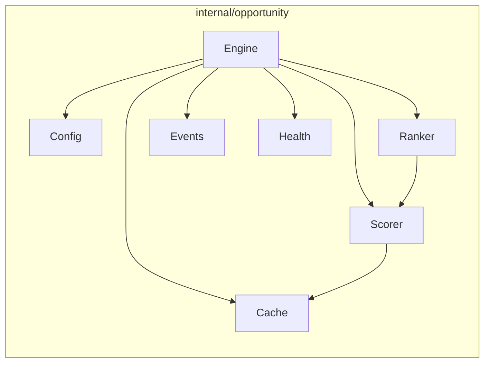
```mermaid
flowchart LR
    subgraph opportunity_pkg["internal/opportunity"]
        ENG[Engine]
        CFG[Config]
        SCORE[Scorer]
        RANK[Ranker]
        CACHE[Cache]
        EVT[Events]
        HLTH[Health]
    end

    ENG --> CFG
    ENG --> SCORE
    ENG --> RANK
    ENG --> CACHE
    ENG --> EVT
    ENG --> HLTH
    SCORE --> CACHE
    RANK --> SCORE
```

### Event flow

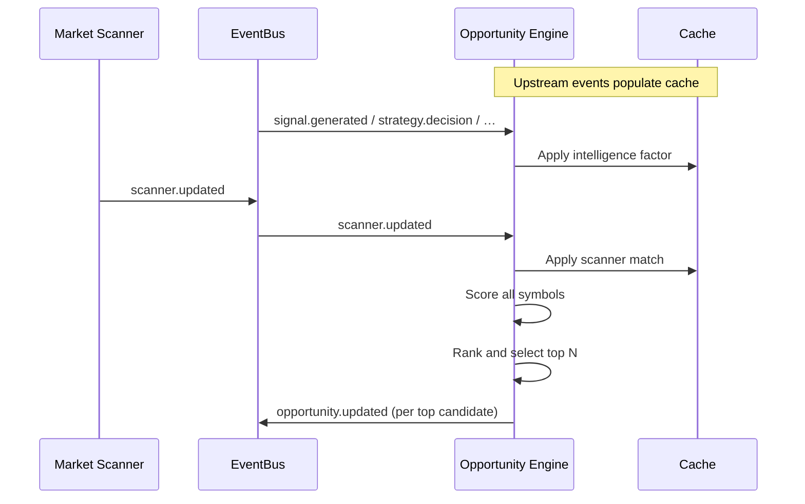
```mermaid
sequenceDiagram
    participant SCAN as Market Scanner
    participant BUS as EventBus
    participant OPP as Opportunity Engine
    participant CACHE as Cache

    Note over OPP,CACHE: Upstream events populate cache
    BUS->>OPP: signal.generated / strategy.decision / …
    OPP->>CACHE: Apply intelligence factor

    SCAN->>BUS: scanner.updated
    BUS->>OPP: scanner.updated
    OPP->>CACHE: Apply scanner match
    OPP->>OPP: Score all symbols
    OPP->>OPP: Rank and select top N
    OPP->>BUS: opportunity.updated (per top candidate)
```

### Health monitoring

`GET /health/components` includes `opportunity_engine`:

| Detail key | Description |
|------------|-------------|
| `enabled` | Whether engine is configured on |
| `opportunities_ranked` | Total symbols scored in last ranking pass |
| `top_candidates` | Number of top-N candidates published |
| `average_confidence` | Mean confidence across all ranked symbols |
| `buy_count` | Symbols classified as BUY |
| `watch_count` | Symbols classified as WATCH |
| `ignore_count` | Symbols classified as IGNORE |
| `dropped` | Subscription dropped event count |

### Thread safety

| Component | Mechanism |
|-----------|-----------|
| Cache | `sync.Mutex` on per-symbol and platform maps |
| Engine lifecycle | `sync.Mutex` on started/closed flags |
| Summary / health | Updated under engine mutex after each ranking pass |
| Event processing | Single consumer goroutine |

### Failure handling

| Failure | Behavior |
|---------|----------|
| Malformed event payload | Skip silently; no publish |
| Missing factor data | Factor contributes 0 to score |
| No symbols in cache on scanner trigger | No publish |
| Bus publish error | Skip; health summary still updated |
| Shutdown mid-event | Drain subscription before exit |

### Testing

| Test | Validates |
|------|-----------|
| Confidence calculation | Weighted score matches expected formula |
| Ranking order | Higher-confidence symbols rank first |
| BUY classification | High-confidence symbols classified BUY |
| WATCH classification | Mid-confidence symbols classified WATCH |
| Event publish | `scanner.updated` triggers `opportunity.updated` |

### Design decisions

| Decision | Rationale |
|----------|-----------|
| Rank on `scanner.updated` only | Matches documented pipeline; scanner is intelligence trigger |
| Cache from multiple event types | Scoring requires all factors; single-event trigger insufficient |
| Platform-level walk-forward/Monte Carlo | Research events are experiment-scoped; applied as platform robustness |
| Risk as multiplier not weight | Keeps weight sum at 1.0; risk gates confidence without dominating |
| Publish top-N only | Reduces bus noise; dashboards consume ranked shortlist |
| No signal generation | Intelligence platform ranks opportunities; does not trade |

### Phase 2 roadmap status

| Phase | Name | Status |
|-------|------|--------|
| 1 | Market Scanner Engine | ✅ Complete |
| 2 | Confidence & Opportunity Ranking | ✅ Complete |
| 3 | Alert Engine | Planned |
| 4 | Scanner Persistence | Planned |
| 5 | Query Layer | Planned |

---

## Phase 3 — Recommendation Engine

Phase 3 introduces the **Recommendation Engine** (`internal/recommendation`). The engine consumes **only** `opportunity.updated` events and transforms ranked opportunities into explainable trading recommendations. It does **not** execute trades or generate signals.

### Pipeline

```text
opportunity.updated
    ↓
Recommendation Engine
    ↓
recommendation.updated
```

### Goals

| Goal | Detail |
|------|--------|
| Explainable recommendations | Human-readable reasons and supporting evidence per symbol |
| Tiered levels | `STRONG_BUY`, `BUY`, `WATCH`, `AVOID` based on confidence thresholds |
| Latest per symbol | Maintain most recent recommendation per `(symbol, timeframe)` |
| Single input contract | Consume only `opportunity.updated`; no upstream engine imports |
| No execution | Intelligence output only; never routes orders |

### Package layout

```text
internal/recommendation/
├── engine.go       # Lifecycle, subscription, publish
├── config.go       # Thresholds and subscriber buffer
├── builder.go      # Recommendation assembly from opportunity input
├── formatter.go    # Human-readable reasons and summaries
├── cache.go        # Latest recommendation per symbol/timeframe
├── events.go       # RecommendationUpdated payload types
├── health.go       # Health reporter
├── errors.go       # Structured errors
└── engine_test.go  # Classification and publish tests
```

Configuration wiring: `internal/infrastructure/config/recommendation.go`

### Recommendation levels

| Level | Condition (default) | Purpose |
|-------|---------------------|---------|
| `STRONG_BUY` | `confidence ≥ 0.85` | High-conviction actionable setup |
| `BUY` | `0.70 ≤ confidence < 0.85` | Actionable with moderate conviction |
| `WATCH` | `0.40 ≤ confidence < 0.70` | Monitor; insufficient conviction |
| `AVOID` | `confidence < 0.40` | No actionable setup |

### Event contract: `recommendation.updated`

| Field | Type | Description |
|-------|------|-------------|
| `symbol` | string | Instrument symbol |
| `timeframe` | string | Bar timeframe |
| `recommendation` | string | `STRONG_BUY`, `BUY`, `WATCH`, or `AVOID` |
| `confidence` | float64 | Opportunity confidence (0–1) |
| `rank` | int | Opportunity rank from upstream |
| `reasons` | []string | Human-readable explanation bullets |
| `supporting_indicators` | []string | Indicator evidence from opportunity components |
| `supporting_strategies` | []string | Strategy evidence from opportunity components |
| `optimization_summary` | string | Optimization score narrative |
| `walk_forward_summary` | string | Walk-forward validation narrative |
| `monte_carlo_summary` | string | Monte Carlo robustness narrative |
| `generated_at` | time | Recommendation timestamp |

### Formatter and builder

The **Formatter** derives human-readable content from `opportunity.updated` component scores:

| Output | Source component |
|--------|-----------------|
| Reasons | Confidence, rank, signal/strategy/performance strength, risk factor |
| Supporting indicators | `signal` component |
| Supporting strategies | `strategy` component |
| Optimization summary | `optimization` component |
| Walk-forward summary | `walkforward` component |
| Monte Carlo summary | `montecarlo` component |

The **Builder** assembles the full `RecommendationUpdated` payload and assigns the recommendation level via configurable thresholds.

### Configuration

```yaml
intelligence:
  recommendation:
    enabled: true
    subscriber_buffer: 256
    strong_buy_threshold: 0.85
    buy_threshold: 0.70
    watch_threshold: 0.40
```

| Key | Default | Description |
|-----|---------|-------------|
| `enabled` | `true` | Enable recommendation engine |
| `subscriber_buffer` | `256` | Event bus subscriber buffer |
| `strong_buy_threshold` | `0.85` | Minimum confidence for STRONG_BUY |
| `buy_threshold` | `0.70` | Minimum confidence for BUY |
| `watch_threshold` | `0.40` | Minimum confidence for WATCH |

### Engine lifecycle

#### Startup order

Recommendation Engine subscribes **before** Opportunity Engine publishes:

```text
Recommendation → Opportunity → Scanner → Research → … → Gateway
```

#### Shutdown order (reverse)

```text
Gateway → … → Scanner → Opportunity → Recommendation → Research
```

#### Lifecycle steps

1. `New(cfg, bus, clk)` — validate config, allocate cache, builder, formatter.
2. `Start(ctx)` — subscribe to `opportunity.updated` only, launch consumer goroutine.
3. Consumer loop — parse opportunity, build recommendation, cache, publish.
4. `Close()` — cancel context, drain subscription, wait on WaitGroup, close subscription.

### Component diagram

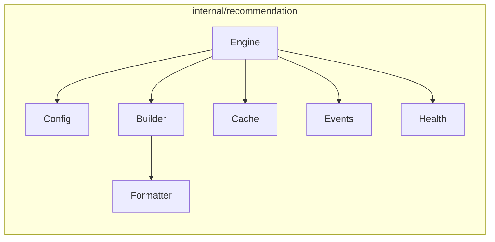
```mermaid
flowchart LR
    subgraph recommendation_pkg["internal/recommendation"]
        ENG[Engine]
        CFG[Config]
        BUILD[Builder]
        FMT[Formatter]
        CACHE[Cache]
        EVT[Events]
        HLTH[Health]
    end

    ENG --> CFG
    ENG --> BUILD
    ENG --> CACHE
    ENG --> EVT
    ENG --> HLTH
    BUILD --> FMT
```

### Event flow

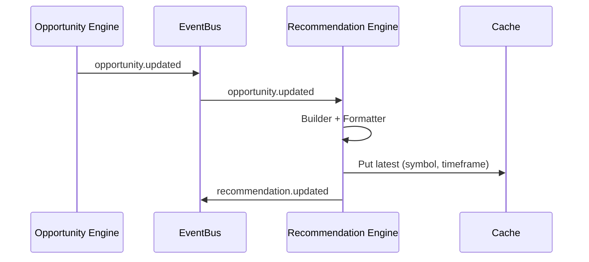
```mermaid
sequenceDiagram
    participant OPP as Opportunity Engine
    participant BUS as EventBus
    participant REC as Recommendation Engine
    participant CACHE as Cache

    OPP->>BUS: opportunity.updated
    BUS->>REC: opportunity.updated
    REC->>REC: Builder + Formatter
    REC->>CACHE: Put latest (symbol, timeframe)
    REC->>BUS: recommendation.updated
```

### Health monitoring

`GET /health/components` includes `recommendation_engine`:

| Detail key | Description |
|------------|-------------|
| `enabled` | Whether engine is configured on |
| `recommendations_generated` | Total recommendations published |
| `strong_buy` | STRONG_BUY count |
| `buy` | BUY count |
| `watch` | WATCH count |
| `avoid` | AVOID count |
| `average_confidence` | Mean confidence across generated recommendations |
| `dropped` | Subscription dropped event count |

### Thread safety

| Component | Mechanism |
|-----------|-----------|
| Cache | `sync.RWMutex` on recommendation map |
| Engine lifecycle | `sync.Mutex` on started/closed flags |
| Health counters | Updated on each published recommendation |
| Event processing | Single consumer goroutine |

### Failure handling

| Failure | Behavior |
|---------|----------|
| Malformed `opportunity.updated` payload | Skip silently; no publish |
| Bus publish error | Skip; cache still updated |
| Shutdown mid-event | Drain subscription before exit |

### Testing

| Test | Validates |
|------|-----------|
| STRONG_BUY generation | High confidence produces STRONG_BUY with summaries |
| BUY generation | Mid-high confidence produces BUY |
| WATCH generation | Moderate confidence produces WATCH |
| Event publish | `opportunity.updated` triggers `recommendation.updated` |

### Design decisions

| Decision | Rationale |
|----------|-----------|
| Consume only `opportunity.updated` | Clean single-input contract; all factors already scored upstream |
| Formatter derives text from components | Explainability without importing frozen stage packages |
| Cache latest per symbol/timeframe | Dashboards read most recent recommendation without history DB |
| Four recommendation levels | Finer granularity than opportunity BUY/WATCH/IGNORE |
| No trade execution | Aligns with intelligence-platform scope |

### Phase 3 roadmap status

| Phase | Name | Status |
|-------|------|--------|
| 1 | Market Scanner Engine | ✅ Complete |
| 2 | Confidence & Opportunity Ranking | ✅ Complete |
| 3 | Recommendation Engine | ✅ Complete |
| 4 | Recommendation Validation Engine | ✅ Complete |
| 5 | Alert Engine | Planned |
| 6 | Scanner Persistence | Planned |
| 7 | Query Layer | Planned |

---

## Phase 4 — Recommendation Validation Engine

Phase 4 introduces the **Recommendation Validation Engine** (`internal/validation`). The engine consumes **only** `recommendation.updated` events and validates recommendations against configurable research-quality thresholds before they become final validated recommendations. It does **not** execute trades.

### Pipeline

```text
recommendation.updated
    ↓
Recommendation Validation Engine
    ↓
validated.recommendation
```

### Goals

| Goal | Detail |
|------|--------|
| Quality gating | Reject recommendations that fail research-quality thresholds |
| Freshness enforcement | Discard stale recommendations beyond configured age |
| Duplicate suppression | Avoid republishing identical consecutive recommendations |
| Latest per symbol | Maintain most recent validation per `(symbol, timeframe)` |
| Single input contract | Consume only `recommendation.updated`; no upstream engine imports |
| No execution | Intelligence output only; never routes orders |

### Package layout

```text
internal/validation/
├── engine.go       # Lifecycle, subscription, publish
├── config.go       # Thresholds and subscriber buffer
├── validator.go    # Threshold checks and duplicate detection
├── cache.go        # Latest validation per symbol/timeframe
├── events.go       # ValidatedRecommendation payload types
├── health.go       # Health reporter
├── errors.go       # Structured errors
├── validator_test.go # Threshold validation tests
└── engine_test.go  # Publish and duplicate suppression tests
```

Configuration wiring: `internal/infrastructure/config/validation_engine.go`

### Validation checks

| Check | Default threshold | Source |
|-------|-------------------|--------|
| Minimum confidence | `0.70` | `confidence` field |
| Minimum optimization score | `0.60` | `optimization_score` or parsed summary |
| Minimum walk-forward score | `0.60` | `walkforward_score` or parsed summary |
| Minimum Monte Carlo robustness | `0.60` | `monte_carlo_score` or parsed summary |
| Minimum win rate | `0.50` | `win_rate` when provided |
| Maximum drawdown | `0.20` | `drawdown` when provided |
| Freshness | `300s` | `generated_at` age |
| Duplicate suppression | enabled | Same recommendation + confidence as previous |

### Validation result

| Status | Meaning |
|--------|---------|
| `VALID` | All applicable checks passed |
| `REJECTED` | One or more checks failed |

### Event contract: `validated.recommendation`

| Field | Type | Description |
|-------|------|-------------|
| `symbol` | string | Instrument symbol |
| `timeframe` | string | Bar timeframe |
| `recommendation` | string | `STRONG_BUY`, `BUY`, `WATCH`, or `AVOID` |
| `confidence` | float64 | Recommendation confidence (0–1) |
| `validation_status` | string | `VALID` or `REJECTED` |
| `rejection_reasons` | []string | Human-readable failure reasons (empty when valid) |
| `validated_at` | time | Validation timestamp |

### Configuration

```yaml
intelligence:
  validation:
    enabled: true
    min_confidence: 0.70
    min_optimization_score: 0.60
    min_walkforward_score: 0.60
    min_montecarlo_score: 0.60
    min_win_rate: 0.50
    max_drawdown: 0.20
    freshness_seconds: 300
    suppress_duplicates: true
```

| Key | Default | Description |
|-----|---------|-------------|
| `enabled` | `true` | Enable validation engine |
| `subscriber_buffer` | `256` | Event bus subscriber buffer |
| `min_confidence` | `0.70` | Minimum recommendation confidence |
| `min_optimization_score` | `0.60` | Minimum optimization score |
| `min_walkforward_score` | `0.60` | Minimum walk-forward validation score |
| `min_montecarlo_score` | `0.60` | Minimum Monte Carlo robustness score |
| `min_win_rate` | `0.50` | Minimum win rate when provided |
| `max_drawdown` | `0.20` | Maximum drawdown when provided |
| `freshness_seconds` | `300` | Maximum recommendation age in seconds |
| `suppress_duplicates` | `true` | Suppress identical consecutive recommendations |

### Engine lifecycle

#### Startup order

Validation Engine subscribes **before** Recommendation Engine publishes:

```text
Validation → Recommendation → Opportunity → Scanner → Research → … → Gateway
```

#### Shutdown order (reverse)

```text
Gateway → … → Scanner → Opportunity → Recommendation → Validation → Research
```

#### Lifecycle steps

1. `New(cfg, bus, clk)` — validate config, allocate cache and validator.
2. `Start(ctx)` — subscribe to `recommendation.updated` only, launch consumer goroutine.
3. Consumer loop — parse recommendation, validate thresholds, cache, publish.
4. `Close()` — cancel context, drain subscription, wait on WaitGroup, close subscription.

### Component diagram

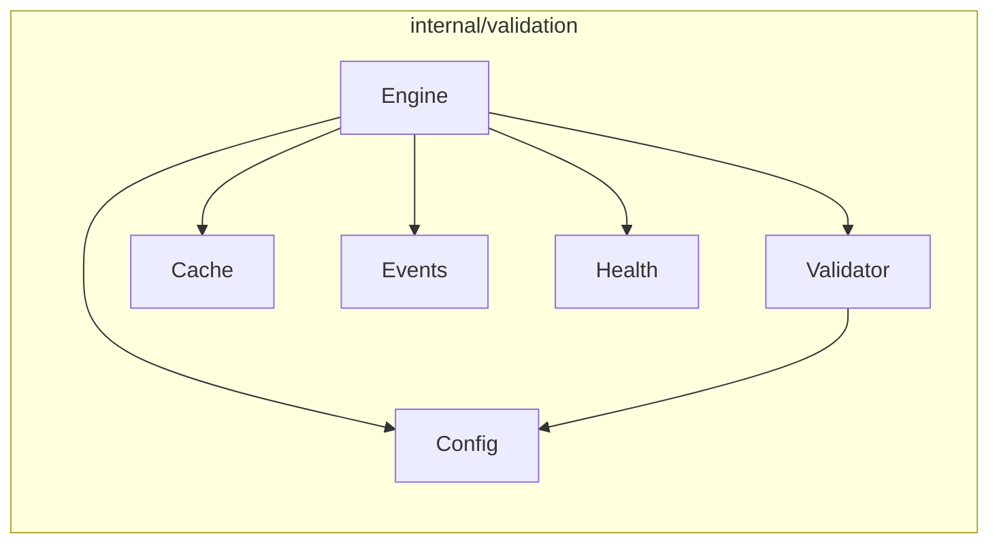
```mermaid
flowchart LR
    subgraph validation_pkg["internal/validation"]
        ENG[Engine]
        CFG[Config]
        VAL[Validator]
        CACHE[Cache]
        EVT[Events]
        HLTH[Health]
    end

    ENG --> CFG
    ENG --> VAL
    ENG --> CACHE
    ENG --> EVT
    ENG --> HLTH
    VAL --> CFG
```

### Event flow

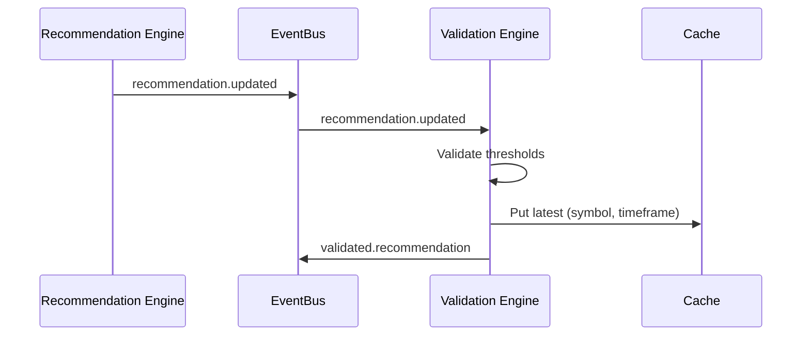
```mermaid
sequenceDiagram
    participant REC as Recommendation Engine
    participant BUS as EventBus
    participant VAL as Validation Engine
    participant CACHE as Cache

    REC->>BUS: recommendation.updated
    BUS->>VAL: recommendation.updated
    VAL->>VAL: Validate thresholds
    VAL->>CACHE: Put latest (symbol, timeframe)
    VAL->>BUS: validated.recommendation
```

### Health monitoring

`GET /health/components` includes `validation_engine`:

| Detail key | Description |
|------------|-------------|
| `enabled` | Whether engine is configured on |
| `validated` | Recommendations that passed all checks |
| `rejected` | Recommendations that failed one or more checks |
| `duplicate_suppressed` | Identical consecutive recommendations suppressed |
| `expired` | Recommendations rejected for staleness |
| `average_validation_score` | Mean composite validation score |
| `dropped` | Subscription dropped event count |

### Thread safety

| Component | Mechanism |
|-----------|-----------|
| Cache | `sync.RWMutex` on validation map |
| Engine lifecycle | `sync.Mutex` on started/closed flags |
| Health counters | Updated on each processed recommendation |
| Event processing | Single consumer goroutine |

### Failure handling

| Failure | Behavior |
|---------|----------|
| Malformed `recommendation.updated` payload | Skip silently; no publish |
| Missing optional research metrics | Skip checks for unavailable metrics |
| Bus publish error | Skip; cache still updated |
| Shutdown mid-event | Drain subscription before exit |

### Testing

| Test | Validates |
|------|-----------|
| Valid recommendation | All thresholds pass produces `VALID` |
| Rejected low confidence | Below-threshold confidence produces `REJECTED` |
| Rejected high drawdown | Excessive drawdown produces `REJECTED` |
| Duplicate suppression | Identical consecutive events not republished |
| Event publish | `recommendation.updated` triggers `validated.recommendation` |

### Design decisions

| Decision | Rationale |
|----------|-----------|
| Consume only `recommendation.updated` | Clean single-input contract; validation is downstream of recommendation |
| Optional metric fields | Append-only JSON fields; summary parsing fallback for optimization/walk-forward/Monte Carlo |
| Skip unavailable metrics | Win rate and drawdown checked only when explicitly provided |
| Duplicate suppression configurable | Reduces bus noise for unchanged recommendations |
| Publish rejected results | Downstream consumers can audit rejection reasons |
| No trade execution | Aligns with intelligence-platform scope |

### Phase 4 roadmap status

| Phase | Name | Status |
|-------|------|--------|
| 1 | Market Scanner Engine | ✅ Complete |
| 2 | Confidence & Opportunity Ranking | ✅ Complete |
| 3 | Recommendation Engine | ✅ Complete |
| 4 | Recommendation Validation Engine | ✅ Complete |
| 5 | Alert Engine | Planned |
| 6 | Scanner Persistence | Planned |
| 7 | Query Layer | Planned |

---

## Phase 5 — Recommendation State Manager

Phase 5 introduces the **Recommendation State Manager** (`internal/recommendationstate`). Internal engine events (`recommendation.updated`, `validated.recommendation`) are implementation details. This engine exposes a **single, persistent recommendation lifecycle** that evolves over time with a stable `RecommendationID`. Future Alert Engine, Dashboard APIs, Email, Mobile Apps, and WebSocket streaming consume `recommendation.state.updated` instead of raw engine events.

### Purpose

| Goal | Detail |
|------|--------|
| Stable identity | Every recommendation receives a globally unique `RecommendationID` (e.g. `REC-20260802-NIFTY-000001`) |
| Lifecycle management | Track states: `CREATED`, `ACTIVE`, `WATCH`, `EXIT_RECOMMENDED`, `CLOSED` |
| Single source of truth | One active recommendation per `(symbol, timeframe, strategy)` |
| Timeline history | Chronological audit trail of confidence and status changes |
| Duplicate merge | Repeated validated recommendations update existing state — never create duplicates |
| Downstream contract | Publish only `recommendation.state.updated` for all consumer surfaces |

### Pipeline

```text
validated.recommendation
    ↓
Recommendation State Manager
    ↓
recommendation.state.updated
    ↓
Future:
    Alert Engine
    Dashboard APIs
    WebSocket
    Mobile
    Email
    Research reports
```

### Goals

| Goal | Detail |
|------|--------|
| Persistent lifecycle | Recommendations evolve; consumers subscribe to state, not raw BUY/WATCH/AVOID events |
| Globally unique IDs | `REC-{YYYYMMDD}-{SYMBOL}-{sequence}` format |
| Composite uniqueness | One active recommendation per `(symbol, timeframe, strategy)` |
| Timeline audit | Every change appends a chronological timeline entry |
| Single input contract | Consume only `validated.recommendation`; no upstream engine imports |
| No execution | Intelligence output only; never routes orders |

### Package layout

```text
internal/recommendationstate/
├── engine.go       # Lifecycle, subscription, state merge, publish
├── config.go       # Enabled flag, max_active, subscriber buffer
├── cache.go        # Active/closed stores, indexes, ID generation
├── timeline.go     # Timeline entry logic and state transitions
├── events.go       # RecommendationStateUpdated payload types
├── health.go       # Health reporter
├── errors.go       # Structured errors
└── engine_test.go  # Creation, update, duplicate merge, publish tests
```

Configuration wiring: `internal/infrastructure/config/recommendation_state.go`

### Architecture

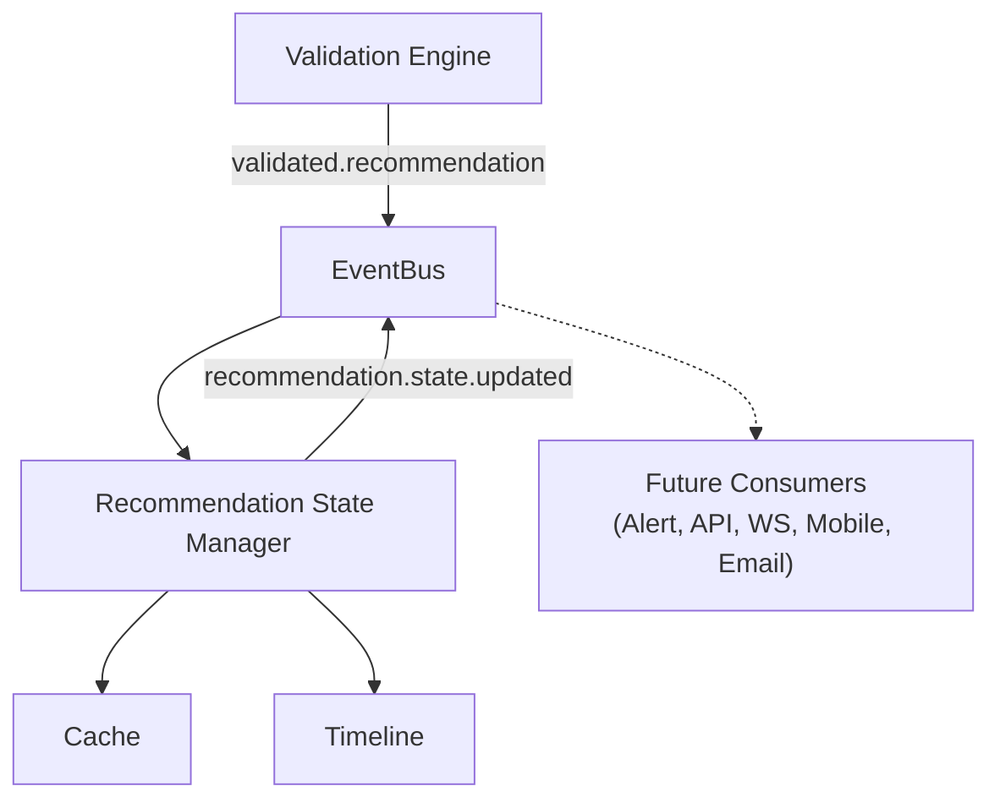
```mermaid
flowchart TB
    VAL[Validation Engine]
    BUS[EventBus]
    RSM[Recommendation State Manager]
    CACHE[Cache]
    TL[Timeline]
    FUTURE["Future Consumers\n(Alert, API, WS, Mobile, Email)"]

    VAL -->|validated.recommendation| BUS
    BUS --> RSM
    RSM --> CACHE
    RSM --> TL
    RSM -->|recommendation.state.updated| BUS
    BUS -.-> FUTURE
```

### Component responsibilities

| Component | File | Responsibility |
|-----------|------|----------------|
| Engine | `engine.go` | Subscribe to `validated.recommendation`, merge state, publish updates |
| Cache | `cache.go` | Thread-safe active/closed stores, indexes, ID sequencing |
| Timeline | `timeline.go` | Append chronological entries on confidence/status changes |
| Events | `events.go` | `RecommendationStateUpdated` and internal input types |
| Health | `health.go` | Active/closed counts, timeline entries, merge statistics |
| Config | `config.go` | `enabled`, `max_active`, `subscriber_buffer` |

### Lifecycle diagram

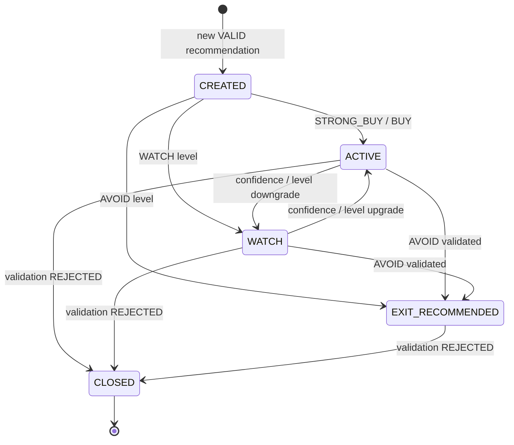
```mermaid
stateDiagram-v2
    [*] --> CREATED: new VALID recommendation
    CREATED --> ACTIVE: STRONG_BUY / BUY
    CREATED --> WATCH: WATCH level
    CREATED --> EXIT_RECOMMENDED: AVOID level
    ACTIVE --> WATCH: confidence / level downgrade
    ACTIVE --> EXIT_RECOMMENDED: AVOID validated
    WATCH --> ACTIVE: confidence / level upgrade
    WATCH --> EXIT_RECOMMENDED: AVOID validated
    ACTIVE --> CLOSED: validation REJECTED
    WATCH --> CLOSED: validation REJECTED
    EXIT_RECOMMENDED --> CLOSED: validation REJECTED
    CLOSED --> [*]
```

### State transitions

| Input recommendation | Validation | Target status |
|---------------------|------------|---------------|
| `STRONG_BUY`, `BUY` | `VALID` | `ACTIVE` |
| `WATCH` | `VALID` | `WATCH` |
| `AVOID` | `VALID` | `EXIT_RECOMMENDED` |
| any | `REJECTED` | `CLOSED` (existing recommendation only) |

New recommendations are created only for `VALID` inputs. `REJECTED` inputs close an existing recommendation or are skipped when no prior state exists.

### Recommendation identity

Format: `REC-{YYYYMMDD}-{SYMBOL}-{sequence}`

Example: `REC-20260802-NIFTY-000001`

- Sequence is per-symbol per-day, zero-padded to 6 digits
- ID is assigned once at creation and preserved across all updates
- Duplicate validated recommendations merge into the existing ID

### Timeline model

Each timeline entry contains:

| Field | Type | Description |
|-------|------|-------------|
| `timestamp` | time | When the change occurred |
| `event` | string | Event type (see below) |
| `reason` | string | Human-readable explanation |
| `previous_value` | string | Value before change |
| `new_value` | string | Value after change |

Timeline event types:

| Event | Trigger |
|-------|---------|
| `Recommendation Created` | New recommendation for `(symbol, timeframe, strategy)` |
| `Confidence Increased` | Validated confidence rose |
| `Confidence Decreased` | Validated confidence fell |
| `Status Changed` | Lifecycle status transition |
| `Exit Recommended` | Transition to `EXIT_RECOMMENDED` |
| `Closed` | Validation rejected or explicit close |

### Cache model

Thread-safe in-memory cache with:

| Store | Key | Value |
|-------|-----|-------|
| Active recommendations | `(symbol, timeframe, strategy)` | `RecommendationID` |
| Closed recommendations | `(symbol, timeframe, strategy)` | `RecommendationID` |
| By ID | `RecommendationID` | `Recommendation` + timeline |
| By symbol | `symbol` | Set of `RecommendationID` |
| By strategy | `strategy` | Set of `RecommendationID` |

Each recommendation stores:

| Field | Description |
|-------|-------------|
| `RecommendationID` | Stable globally unique identifier |
| `Symbol` | Instrument symbol |
| `Timeframe` | Bar timeframe |
| `Strategy` | Strategy identifier (defaults to `default` when absent in payload) |
| `CurrentStatus` | Lifecycle state |
| `Confidence` | Latest validated confidence |
| `CreatedAt` | First creation timestamp |
| `UpdatedAt` | Last mutation timestamp |
| `ClosedAt` | Close timestamp (when `CLOSED`) |

`max_active` caps the number of concurrently active recommendations. When the limit is reached, new recommendations are not created; existing entries continue to receive updates.

### Event contract: `recommendation.state.updated`

Published on every state mutation (creation, confidence change, status change, close).

| Field | Type | Required | Description |
|-------|------|----------|-------------|
| `recommendation_id` | string | yes | Stable recommendation identifier |
| `symbol` | string | yes | Instrument symbol |
| `timeframe` | string | yes | Bar timeframe |
| `strategy` | string | yes | Strategy identifier |
| `current_status` | string | yes | `CREATED`, `ACTIVE`, `WATCH`, `EXIT_RECOMMENDED`, or `CLOSED` |
| `confidence` | float64 | yes | Latest confidence (0–1) |
| `latest_timeline_entry` | object | yes | Most recent timeline entry |
| `summary` | string | yes | Human-readable state summary |

#### `latest_timeline_entry` object

| Field | Type | Description |
|-------|------|-------------|
| `timestamp` | time | Entry timestamp |
| `event` | string | Timeline event type |
| `reason` | string | Explanation |
| `previous_value` | string | Prior value |
| `new_value` | string | New value |

### Configuration

```yaml
intelligence:
  recommendation_state:
    enabled: true
    max_active: 10000
```

| Key | Default | Description |
|-----|---------|-------------|
| `enabled` | `true` | Enable recommendation state manager |
| `subscriber_buffer` | `256` | Event bus subscriber buffer |
| `max_active` | `10000` | Maximum concurrently active recommendations |

### Engine lifecycle

#### Startup order

Recommendation State Manager subscribes **before** Validation Engine publishes:

```text
RecommendationState → Validation → Recommendation → Opportunity → Scanner → Research → … → Gateway
```

#### Shutdown order (reverse)

```text
Gateway → … → Scanner → Opportunity → Recommendation → Validation → RecommendationState → Research
```

#### Lifecycle steps

1. `New(cfg, bus, clk)` — validate config, allocate cache.
2. `Start(ctx)` — subscribe to `validated.recommendation` only, launch consumer goroutine.
3. Consumer loop — parse validated input, merge state, append timeline, publish.
4. `Close()` — cancel context, drain subscription, wait on WaitGroup, close subscription.

### Component diagram

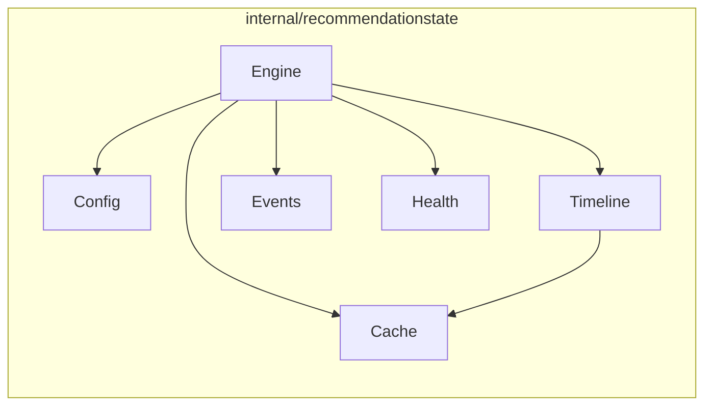
```mermaid
flowchart LR
    subgraph recommendationstate_pkg["internal/recommendationstate"]
        ENG[Engine]
        CFG[Config]
        CACHE[Cache]
        TL[Timeline]
        EVT[Events]
        HLTH[Health]
    end

    ENG --> CFG
    ENG --> CACHE
    ENG --> TL
    ENG --> EVT
    ENG --> HLTH
    TL --> CACHE
```

### Event flow

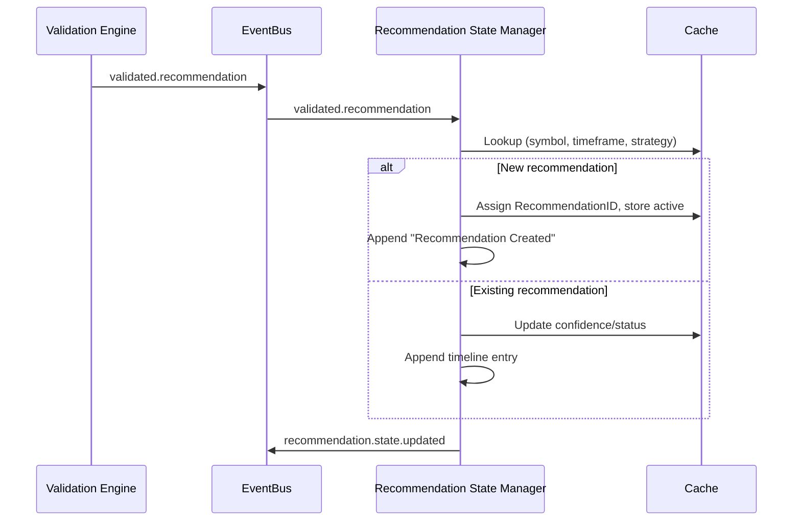
```mermaid
sequenceDiagram
    participant VAL as Validation Engine
    participant BUS as EventBus
    participant RSM as Recommendation State Manager
    participant CACHE as Cache

    VAL->>BUS: validated.recommendation
    BUS->>RSM: validated.recommendation
    RSM->>CACHE: Lookup (symbol, timeframe, strategy)
    alt New recommendation
        RSM->>CACHE: Assign RecommendationID, store active
        RSM->>RSM: Append "Recommendation Created"
    else Existing recommendation
        RSM->>CACHE: Update confidence/status
        RSM->>RSM: Append timeline entry
    end
    RSM->>BUS: recommendation.state.updated
```

### Health monitoring

`GET /health/components` includes `recommendation_state_engine`:

| Detail key | Description |
|------------|-------------|
| `enabled` | Whether engine is configured on |
| `active_recommendations` | Count of active lifecycle entries |
| `closed_recommendations` | Count of closed lifecycle entries |
| `timeline_entries` | Total timeline entries across all recommendations |
| `updates_processed` | Total validated recommendations processed |
| `duplicates_merged` | Updates merged into existing recommendations |
| `average_confidence` | Mean confidence across all stored recommendations |
| `dropped` | Subscription dropped event count |

### Thread safety

| Component | Mechanism |
|-----------|-----------|
| Cache | `sync.RWMutex` on all maps and indexes |
| Engine lifecycle | `sync.Mutex` on started/closed flags |
| Health counters | Updated on each processed update |
| Event processing | Single consumer goroutine |
| ID sequencing | Protected under cache write lock |

Rules:

- No lock held during bus publish
- `Health()` safe for concurrent HTTP probe goroutines
- Cache returns copies of timeline slices via `GetByID`

### Failure handling

| Failure | Behavior |
|---------|----------|
| Malformed `validated.recommendation` payload | Skip silently; no publish |
| `REJECTED` with no existing recommendation | Skip; no state created |
| Active limit reached | Skip new creation; existing updates still processed |
| Bus publish error | Skip; cache still updated |
| Shutdown mid-event | Drain subscription before exit |

### Future integration

| Consumer | Integration |
|----------|-------------|
| Alert Engine | Subscribe to `recommendation.state.updated`; fire alerts on status transitions |
| Dashboard APIs | Expose active/closed recommendations and timelines via query layer |
| WebSocket | Fan out `recommendation.state.updated` to connected clients |
| Mobile | Push notifications on `ACTIVE` and `EXIT_RECOMMENDED` transitions |
| Email | Daily digest of closed recommendations with timeline summaries |
| Research reports | Correlate recommendation lifecycle with backtest and optimization outcomes |

All future consumers subscribe to `recommendation.state.updated` only. They never read the recommendation state manager's internal cache directly.

### Testing

| Test | Validates |
|------|-----------|
| Recommendation creation | VALID input creates recommendation with stable ID and timeline |
| Recommendation update | Confidence change appends timeline and preserves ID |
| Duplicate merge | Same `(symbol, timeframe, strategy)` updates existing state |
| Timeline append | Multiple updates accumulate chronological entries |
| Event publish | `validated.recommendation` triggers `recommendation.state.updated` |

### Design decisions

| Decision | Rationale |
|----------|-----------|
| Consume only `validated.recommendation` | Quality-gated input; state reflects validated intelligence only |
| Composite key includes strategy | Supports multi-strategy recommendations per symbol/timeframe |
| Default strategy `default` | Backward compatible when strategy field absent from payload |
| Merge duplicates in-place | Prevents recommendation ID proliferation |
| Publish on every meaningful change | Downstream consumers receive incremental lifecycle updates |
| In-memory state | Phase 5 scope; PostgreSQL persistence deferred to future phase |
| No trade execution | Aligns with intelligence-platform scope |

### Phase 5 roadmap status

| Phase | Name | Status |
|-------|------|--------|
| 1 | Market Scanner Engine | ✅ Complete |
| 2 | Confidence & Opportunity Ranking | ✅ Complete |
| 3 | Recommendation Engine | ✅ Complete |
| 4 | Recommendation Validation Engine | ✅ Complete |
| 5 | Recommendation State Manager | ✅ Complete |
| 6 | Alert Engine | Planned |
| 7 | Scanner Persistence | Planned |
| 8 | Query Layer | Planned |

---

## Phase 6 — Alert Engine

Phase 6 introduces the **Alert Engine** (`internal/alerts`). The engine consumes **only** `recommendation.state.updated` events and publishes **only** `alert.generated` events. Alerts are downstream consumers — they never influence recommendation generation. No provider dependency, notification channel, or broker integration is included in this phase.

### Purpose

| Goal | Detail |
|------|--------|
| Meaningful notifications | Emit alerts only for significant recommendation lifecycle changes |
| Downstream-only | Consume recommendation state; never read upstream caches or influence generation |
| Event contract | Single input (`recommendation.state.updated`), single output (`alert.generated`) |
| Deduplication | Suppress identical alerts within a configurable cooldown window |
| Future-ready | Publish structured alerts for Dashboard, Email, Push, Telegram, Slack, WhatsApp |

### Pipeline

```text
Recommendation State Manager
    ↓
recommendation.state.updated
    ↓
Alert Engine
    ↓
alert.generated
    ↓
Future Consumers:
    Dashboard
    Email
    Push Notifications
    Telegram
    Slack
    WhatsApp
```

### Goals

| Goal | Detail |
|------|--------|
| Lifecycle-driven alerts | Derive alert types from recommendation timeline entries and status transitions |
| Threshold filtering | Confidence alerts require delta ≥ `confidence_change_threshold` |
| No alert spam | Skip non-meaningful updates; deduplicate via fingerprint + cooldown |
| Thread-safe | Mutex-protected cache; single consumer goroutine |
| Graceful shutdown | Context cancel, subscription drain, WaitGroup join |
| No execution | Intelligence output only; never routes orders |

### Package layout

```text
internal/alerts/
├── engine.go       # Subscription, rule evaluation, dedup, publish
├── config.go       # Enabled flag, thresholds, cooldown, subscriber buffer
├── rules.go        # Alert type derivation from state updates
├── cache.go        # Deduplication fingerprints, alert ID sequencing
├── events.go       # AlertGenerated payload and alert types
├── health.go       # Health reporter
├── errors.go       # Structured errors
└── engine_test.go  # Creation, status, confidence, dedup, cooldown, publish tests
```

Configuration wiring: `internal/infrastructure/config/alerts.go`

### Architecture

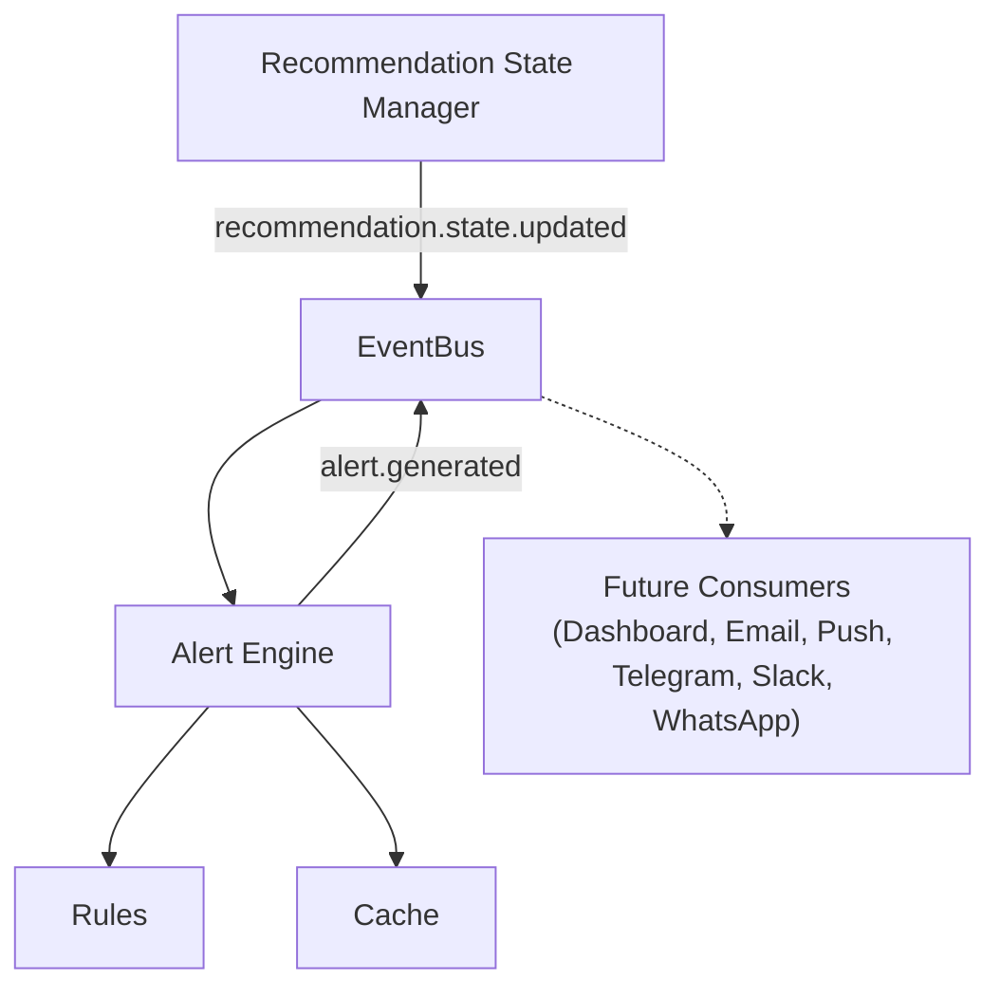
```mermaid
flowchart TB
    RSM[Recommendation State Manager]
    BUS[EventBus]
    AE[Alert Engine]
    RULES[Rules]
    CACHE[Cache]
    FUTURE["Future Consumers\n(Dashboard, Email, Push, Telegram, Slack, WhatsApp)"]

    RSM -->|recommendation.state.updated| BUS
    BUS --> AE
    AE --> RULES
    AE --> CACHE
    AE -->|alert.generated| BUS
    BUS -.-> FUTURE
```

### Component responsibilities

| Component | File | Responsibility |
|-----------|------|----------------|
| Engine | `engine.go` | Subscribe to `recommendation.state.updated`, evaluate rules, deduplicate, publish |
| Rules | `rules.go` | Map timeline entries and status transitions to alert types |
| Cache | `cache.go` | Track seen recommendations, fingerprint cooldown, alert ID generation |
| Events | `events.go` | `AlertGenerated` payload and alert type constants |
| Health | `health.go` | Alert counters and suppression statistics |
| Config | `config.go` | `enabled`, `confidence_change_threshold`, `cooldown_seconds` |

### Lifecycle diagram

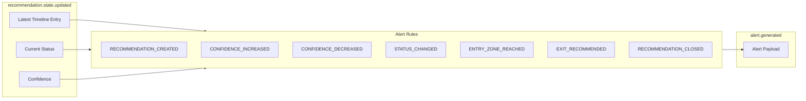
```mermaid
flowchart LR
    subgraph Input["recommendation.state.updated"]
        TL[Latest Timeline Entry]
        ST[Current Status]
        CF[Confidence]
    end

    subgraph Rules["Alert Rules"]
        RC[RECOMMENDATION_CREATED]
        CI[CONFIDENCE_INCREASED]
        CD[CONFIDENCE_DECREASED]
        SC[STATUS_CHANGED]
        EZ[ENTRY_ZONE_REACHED]
        ER[EXIT_RECOMMENDED]
        CL[RECOMMENDATION_CLOSED]
    end

    subgraph Output["alert.generated"]
        AG[Alert Payload]
    end

    TL --> Rules
    ST --> Rules
    CF --> Rules
    Rules --> AG
```

### Alert rules

Alerts are derived from the `latest_timeline_entry` event and first-observation state. Not every `recommendation.state.updated` event produces an alert.

| Alert type | Trigger |
|------------|---------|
| `RECOMMENDATION_CREATED` | First observation of a `recommendation_id` |
| `CONFIDENCE_INCREASED` | Timeline event `Confidence Increased` with delta ≥ `confidence_change_threshold` |
| `CONFIDENCE_DECREASED` | Timeline event `Confidence Decreased` with delta ≥ `confidence_change_threshold` |
| `STATUS_CHANGED` | Timeline event `Status Changed` to a non-`ACTIVE` meaningful transition (e.g. `ACTIVE` → `WATCH`) |
| `ENTRY_ZONE_REACHED` | Timeline event `Status Changed` with `new_value` = `ACTIVE` (e.g. `WATCH` → `ACTIVE`, `CREATED` → `ACTIVE`) |
| `EXIT_RECOMMENDED` | Timeline event `Exit Recommended` |
| `RECOMMENDATION_CLOSED` | Timeline event `Closed` |

#### Meaningful transition examples

| Transition | Alert type |
|------------|------------|
| New recommendation | `RECOMMENDATION_CREATED` + `ENTRY_ZONE_REACHED` (when status becomes `ACTIVE`) |
| `ACTIVE` → `WATCH` | `STATUS_CHANGED` |
| `WATCH` → `ACTIVE` | `ENTRY_ZONE_REACHED` |
| `ACTIVE` → `EXIT_RECOMMENDED` | `EXIT_RECOMMENDED` |
| `EXIT_RECOMMENDED` → `CLOSED` | `RECOMMENDATION_CLOSED` |
| Confidence +0.08 (threshold 0.05) | `CONFIDENCE_INCREASED` |
| Confidence −0.02 (threshold 0.05) | *(no alert — below threshold)* |

### Deduplication

The cache maintains a fingerprint per alert candidate:

```text
fingerprint = recommendation_id + alert_type + current_status + reason
```

Before publishing, the engine checks whether an identical fingerprint was emitted within `cooldown_seconds`. If so, the alert is suppressed and `cooldown_suppressed` is incremented.

### Cooldown

| Setting | Default | Behavior |
|---------|---------|----------|
| `cooldown_seconds` | `300` | Minimum interval between identical alert fingerprints |

Cooldown is evaluated against the timeline entry timestamp from the state update. After the cooldown window expires, the same alert type may fire again for the same recommendation (e.g. repeated confidence increases).

### Event contract: `alert.generated`

Published when a meaningful lifecycle change passes rule evaluation and deduplication.

| Field | Type | Required | Description |
|-------|------|----------|-------------|
| `alert_id` | string | yes | Unique alert identifier (`ALT-{YYYYMMDD}-{SYMBOL}-{sequence}`) |
| `recommendation_id` | string | yes | Stable recommendation identifier |
| `symbol` | string | yes | Instrument symbol |
| `timeframe` | string | yes | Bar timeframe |
| `alert_type` | string | yes | One of the alert type constants |
| `current_status` | string | yes | Lifecycle status at alert time |
| `confidence` | float64 | yes | Confidence at alert time |
| `message` | string | yes | Human-readable alert summary |
| `reason` | string | yes | Explanation from timeline entry |
| `generated_at` | time | yes | Alert generation timestamp |

### Configuration

```yaml
intelligence:
  alerts:
    enabled: true
    confidence_change_threshold: 0.05
    cooldown_seconds: 300
```

| Key | Default | Description |
|-----|---------|-------------|
| `enabled` | `true` | Enable alert engine |
| `subscriber_buffer` | `256` | Event bus subscriber buffer |
| `confidence_change_threshold` | `0.05` | Minimum confidence delta for increase/decrease alerts |
| `cooldown_seconds` | `300` | Deduplication cooldown window |

### Engine lifecycle

#### Startup order

Alert Engine subscribes **before** Recommendation State Manager publishes:

```text
AlertEngine → RecommendationState → Validation → Recommendation → Opportunity → Scanner → … → Gateway
```

#### Shutdown order (reverse)

```text
Gateway → … → Scanner → Opportunity → Recommendation → Validation → RecommendationState → AlertEngine
```

#### Lifecycle steps

1. `New(cfg, bus, clk)` — validate config, allocate deduplication cache.
2. `Start(ctx)` — subscribe to `recommendation.state.updated` only, launch consumer goroutine.
3. Consumer loop — parse state update, evaluate rules, deduplicate, publish `alert.generated`.
4. `Close()` — cancel context, drain subscription, wait on WaitGroup, close subscription.

### Component diagram

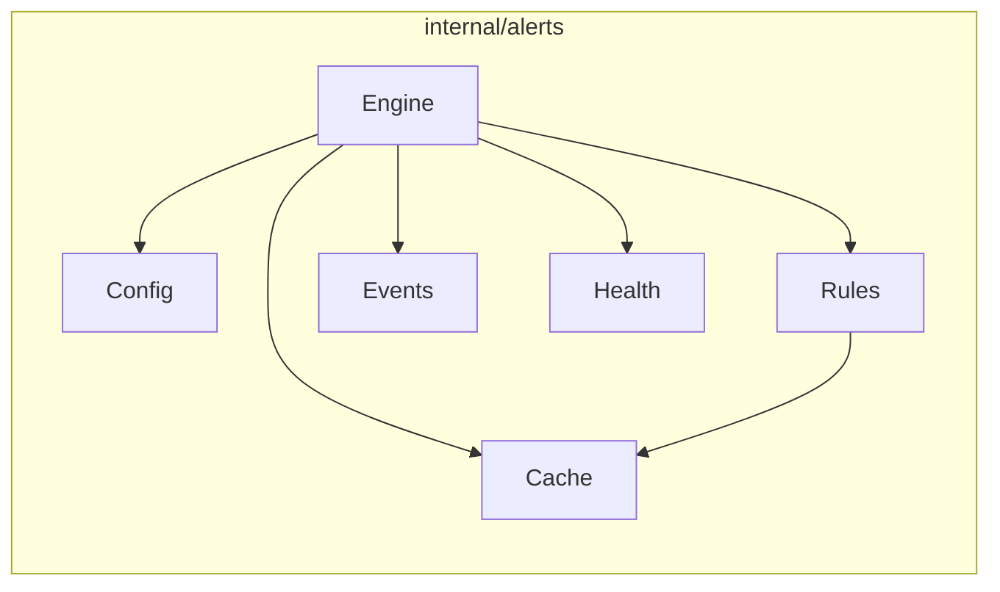
```mermaid
flowchart LR
    subgraph alerts_pkg["internal/alerts"]
        ENG[Engine]
        CFG[Config]
        RULES[Rules]
        CACHE[Cache]
        EVT[Events]
        HLTH[Health]
    end

    ENG --> CFG
    ENG --> RULES
    ENG --> CACHE
    ENG --> EVT
    ENG --> HLTH
    RULES --> CACHE
```

### Event flow

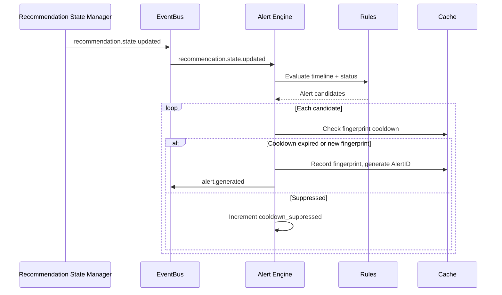
```mermaid
sequenceDiagram
    participant RSM as Recommendation State Manager
    participant BUS as EventBus
    participant AE as Alert Engine
    participant RULES as Rules
    participant CACHE as Cache

    RSM->>BUS: recommendation.state.updated
    BUS->>AE: recommendation.state.updated
    AE->>RULES: Evaluate timeline + status
    RULES-->>AE: Alert candidates
    loop Each candidate
        AE->>CACHE: Check fingerprint cooldown
        alt Cooldown expired or new fingerprint
            AE->>CACHE: Record fingerprint, generate AlertID
            AE->>BUS: alert.generated
        else Suppressed
            AE->>AE: Increment cooldown_suppressed
        end
    end
```

### Health monitoring

`GET /health/components` includes `alert_engine`:

| Detail key | Description |
|------------|-------------|
| `enabled` | Whether engine is configured on |
| `alerts_generated` | Total alerts published |
| `duplicates_suppressed` | Alerts suppressed as logical duplicates |
| `confidence_alerts` | Confidence increase/decrease alerts published |
| `status_alerts` | Status, entry zone, and exit alerts published |
| `created_alerts` | Recommendation created alerts published |
| `closed_alerts` | Recommendation closed alerts published |
| `cooldown_suppressed` | Alerts suppressed by cooldown deduplication |
| `dropped` | Subscription dropped event count |

### Thread safety

| Component | Mechanism |
|-----------|-----------|
| Cache | `sync.Mutex` on fingerprints, seen IDs, and ID sequencing |
| Engine lifecycle | `sync.Mutex` on started/closed flags |
| Health counters | Updated on each processed candidate |
| Event processing | Single consumer goroutine |
| Alert ID generation | Protected under cache write lock |

Rules:

- No lock held during bus publish
- `Health()` safe for concurrent HTTP probe goroutines
- Deduplication state is private to the alert engine

### Failure handling

| Failure | Behavior |
|---------|----------|
| Malformed `recommendation.state.updated` payload | Skip silently; no publish |
| No meaningful lifecycle change | Skip; no publish |
| Confidence delta below threshold | Skip confidence alert; other candidates may still fire |
| Cooldown active for fingerprint | Suppress; increment `cooldown_suppressed` |
| Bus publish error | Skip; dedup state still updated |
| Shutdown mid-event | Drain subscription before exit |

### Future integrations

| Consumer | Integration |
|----------|-------------|
| Dashboard | Subscribe to `alert.generated`; display real-time alert feed and history |
| Email | SMTP/webhook adapter consuming `alert.generated` for digest and instant notifications |
| Push Notifications | Mobile push gateway (FCM/APNs) triggered by `alert.generated` |
| Telegram | Bot webhook adapter filtering by symbol and alert type |
| Slack | Incoming webhook or Slack API for channel notifications |
| WhatsApp | Business API adapter for trader alert delivery |

All notification channels are **future adapters** that subscribe to `alert.generated`. The Alert Engine itself has no provider or channel dependency.

### Testing

| Test | Validates |
|------|-----------|
| Recommendation created alert | First observation emits `RECOMMENDATION_CREATED` and `ENTRY_ZONE_REACHED` |
| Status change alert | `ACTIVE` → `WATCH` emits `STATUS_CHANGED` |
| Confidence increase alert | Delta above threshold emits `CONFIDENCE_INCREASED` |
| Duplicate suppression | Identical state update does not re-emit alerts |
| Cooldown behavior | Same fingerprint suppressed within cooldown; fires after expiry |
| Event publish | State update triggers `alert.generated` with correct source |

### Design decisions

| Decision | Rationale |
|----------|-----------|
| Consume only `recommendation.state.updated` | Alerts reflect managed lifecycle, not raw analytics |
| Publish only `alert.generated` | Clean downstream contract for all notification surfaces |
| Threshold-gated confidence alerts | Prevents noise from minor confidence fluctuations |
| Fingerprint + cooldown dedup | Prevents alert storms on repeated identical updates |
| Multiple alerts per update | Creation + entry zone are distinct meaningful events |
| No notification providers | Keeps engine focused; channels are future adapters |
| In-memory dedup state | Phase 6 scope; persistent alert history deferred to future phase |

### Phase 6 roadmap status

| Phase | Name | Status |
|-------|------|--------|
| 1 | Market Scanner Engine | ✅ Complete |
| 2 | Confidence & Opportunity Ranking | ✅ Complete |
| 3 | Recommendation Engine | ✅ Complete |
| 4 | Recommendation Validation Engine | ✅ Complete |
| 5 | Recommendation State Manager | ✅ Complete |
| 6 | Alert Engine | ✅ Complete |
| 7 | Scanner Persistence | Planned |
| 8 | Query Layer | Planned |

---

## Phase 6 — Alert Engine

Phase 6 introduces the **Alert Engine** (`internal/alerts`). The engine consumes **only** `recommendation.state.updated` events and publishes **only** `alert.generated` events. Alerts are downstream consumers — they never influence recommendation generation. No provider dependency, notification channel, or broker integration is included in this phase.

### Purpose

| Goal | Detail |
|------|--------|
| Meaningful notifications | Emit alerts only for significant recommendation lifecycle changes |
| Downstream-only | Consume recommendation state; never read upstream caches or influence generation |
| Event contract | Single input (`recommendation.state.updated`), single output (`alert.generated`) |
| Deduplication | Suppress identical alerts within a configurable cooldown window |
| Future-ready | Publish structured alerts for Dashboard, Email, Push, Telegram, Slack, WhatsApp |

### Pipeline

```text
Recommendation State Manager
    ↓
recommendation.state.updated
    ↓
Alert Engine
    ↓
alert.generated
    ↓
Future Consumers:
    Dashboard
    Email
    Push Notifications
    Telegram
    Slack
    WhatsApp
```

### Goals

| Goal | Detail |
|------|--------|
| Lifecycle-driven alerts | Derive alert types from recommendation timeline entries and status transitions |
| Threshold filtering | Confidence alerts require delta ≥ `confidence_change_threshold` |
| No alert spam | Skip non-meaningful updates; deduplicate via fingerprint + cooldown |
| Thread-safe | Mutex-protected cache; single consumer goroutine |
| Graceful shutdown | Context cancel, subscription drain, WaitGroup join |
| No execution | Intelligence output only; never routes orders |

### Package layout

```text
internal/alerts/
├── engine.go       # Subscription, rule evaluation, dedup, publish
├── config.go       # Enabled flag, thresholds, cooldown, subscriber buffer
├── rules.go        # Alert type derivation from state updates
├── cache.go        # Deduplication fingerprints, alert ID sequencing
├── events.go       # AlertGenerated payload and alert types
├── health.go       # Health reporter
├── errors.go       # Structured errors
└── engine_test.go  # Creation, status, confidence, dedup, cooldown, publish tests
```

Configuration wiring: `internal/infrastructure/config/alerts.go`

### Architecture


```mermaid
flowchart TB
    RSM[Recommendation State Manager]
    BUS[EventBus]
    AE[Alert Engine]
    RULES[Rules]
    CACHE[Cache]
    FUTURE["Future Consumers\n(Dashboard, Email, Push, Telegram, Slack, WhatsApp)"]

    RSM -->|recommendation.state.updated| BUS
    BUS --> AE
    AE --> RULES
    AE --> CACHE
    AE -->|alert.generated| BUS
    BUS -.-> FUTURE
```

### Component responsibilities

| Component | File | Responsibility |
|-----------|------|----------------|
| Engine | `engine.go` | Subscribe to `recommendation.state.updated`, evaluate rules, deduplicate, publish |
| Rules | `rules.go` | Map timeline entries and status transitions to alert types |
| Cache | `cache.go` | Track seen recommendations, fingerprint cooldown, alert ID generation |
| Events | `events.go` | `AlertGenerated` payload and alert type constants |
| Health | `health.go` | Alert counters and suppression statistics |
| Config | `config.go` | `enabled`, `confidence_change_threshold`, `cooldown_seconds` |

### Lifecycle diagram


```mermaid
flowchart LR
    subgraph Input["recommendation.state.updated"]
        TL[Latest Timeline Entry]
        ST[Current Status]
        CF[Confidence]
    end

    subgraph Rules["Alert Rules"]
        RC[RECOMMENDATION_CREATED]
        CI[CONFIDENCE_INCREASED]
        CD[CONFIDENCE_DECREASED]
        SC[STATUS_CHANGED]
        EZ[ENTRY_ZONE_REACHED]
        ER[EXIT_RECOMMENDED]
        CL[RECOMMENDATION_CLOSED]
    end

    subgraph Output["alert.generated"]
        AG[Alert Payload]
    end

    TL --> Rules
    ST --> Rules
    CF --> Rules
    Rules --> AG
```

### Alert rules

Alerts are derived from the `latest_timeline_entry` event and first-observation state. Not every `recommendation.state.updated` event produces an alert.

| Alert type | Trigger |
|------------|---------|
| `RECOMMENDATION_CREATED` | First observation of a `recommendation_id` |
| `CONFIDENCE_INCREASED` | Timeline event `Confidence Increased` with delta ≥ `confidence_change_threshold` |
| `CONFIDENCE_DECREASED` | Timeline event `Confidence Decreased` with delta ≥ `confidence_change_threshold` |
| `STATUS_CHANGED` | Timeline event `Status Changed` to a non-`ACTIVE` meaningful transition (e.g. `ACTIVE` → `WATCH`) |
| `ENTRY_ZONE_REACHED` | Timeline event `Status Changed` with `new_value` = `ACTIVE` (e.g. `WATCH` → `ACTIVE`, `CREATED` → `ACTIVE`) |
| `EXIT_RECOMMENDED` | Timeline event `Exit Recommended` |
| `RECOMMENDATION_CLOSED` | Timeline event `Closed` |

#### Meaningful transition examples

| Transition | Alert type |
|------------|------------|
| New recommendation | `RECOMMENDATION_CREATED` + `ENTRY_ZONE_REACHED` (when status becomes `ACTIVE`) |
| `ACTIVE` → `WATCH` | `STATUS_CHANGED` |
| `WATCH` → `ACTIVE` | `ENTRY_ZONE_REACHED` |
| `ACTIVE` → `EXIT_RECOMMENDED` | `EXIT_RECOMMENDED` |
| `EXIT_RECOMMENDED` → `CLOSED` | `RECOMMENDATION_CLOSED` |
| Confidence +0.08 (threshold 0.05) | `CONFIDENCE_INCREASED` |
| Confidence −0.02 (threshold 0.05) | *(no alert — below threshold)* |

### Deduplication

The cache maintains a fingerprint per alert candidate:

```text
fingerprint = recommendation_id + alert_type + current_status + reason
```

Before publishing, the engine checks whether an identical fingerprint was emitted within `cooldown_seconds`. If so, the alert is suppressed and `cooldown_suppressed` is incremented.

### Cooldown

| Setting | Default | Behavior |
|---------|---------|----------|
| `cooldown_seconds` | `300` | Minimum interval between identical alert fingerprints |

Cooldown is evaluated against the timeline entry timestamp from the state update. After the cooldown window expires, the same alert type may fire again for the same recommendation (e.g. repeated confidence increases).

### Event contract: `alert.generated`

Published when a meaningful lifecycle change passes rule evaluation and deduplication.

| Field | Type | Required | Description |
|-------|------|----------|-------------|
| `alert_id` | string | yes | Unique alert identifier (`ALT-{YYYYMMDD}-{SYMBOL}-{sequence}`) |
| `recommendation_id` | string | yes | Stable recommendation identifier |
| `symbol` | string | yes | Instrument symbol |
| `timeframe` | string | yes | Bar timeframe |
| `alert_type` | string | yes | One of the alert type constants |
| `current_status` | string | yes | Lifecycle status at alert time |
| `confidence` | float64 | yes | Confidence at alert time |
| `message` | string | yes | Human-readable alert summary |
| `reason` | string | yes | Explanation from timeline entry |
| `generated_at` | time | yes | Alert generation timestamp |

### Configuration

```yaml
intelligence:
  alerts:
    enabled: true
    confidence_change_threshold: 0.05
    cooldown_seconds: 300
```

| Key | Default | Description |
|-----|---------|-------------|
| `enabled` | `true` | Enable alert engine |
| `subscriber_buffer` | `256` | Event bus subscriber buffer |
| `confidence_change_threshold` | `0.05` | Minimum confidence delta for increase/decrease alerts |
| `cooldown_seconds` | `300` | Deduplication cooldown window |

### Engine lifecycle

#### Startup order

Alert Engine subscribes **before** Recommendation State Manager publishes:

```text
AlertEngine → RecommendationState → Validation → Recommendation → Opportunity → Scanner → … → Gateway
```

#### Shutdown order (reverse)

```text
Gateway → … → Scanner → Opportunity → Recommendation → Validation → RecommendationState → AlertEngine
```

#### Lifecycle steps

1. `New(cfg, bus, clk)` — validate config, allocate deduplication cache.
2. `Start(ctx)` — subscribe to `recommendation.state.updated` only, launch consumer goroutine.
3. Consumer loop — parse state update, evaluate rules, deduplicate, publish `alert.generated`.
4. `Close()` — cancel context, drain subscription, wait on WaitGroup, close subscription.

### Component diagram


```mermaid
flowchart LR
    subgraph alerts_pkg["internal/alerts"]
        ENG[Engine]
        CFG[Config]
        RULES[Rules]
        CACHE[Cache]
        EVT[Events]
        HLTH[Health]
    end

    ENG --> CFG
    ENG --> RULES
    ENG --> CACHE
    ENG --> EVT
    ENG --> HLTH
    RULES --> CACHE
```

### Event flow

```mermaid
sequenceDiagram
    participant RSM as Recommendation State Manager
    participant BUS as EventBus
    participant AE as Alert Engine
    participant RULES as Rules
    participant CACHE as Cache

    RSM->>BUS: recommendation.state.updated
    BUS->>AE: recommendation.state.updated
    AE->>RULES: Evaluate timeline + status
    RULES-->>AE: Alert candidates
    loop Each candidate
        AE->>CACHE: Check fingerprint cooldown
        alt Cooldown expired or new fingerprint
            AE->>CACHE: Record fingerprint, generate AlertID
            AE->>BUS: alert.generated
        else Suppressed
            AE->>AE: Increment cooldown_suppressed
        end
    end
```

### Health monitoring

`GET /health/components` includes `alert_engine`:

| Detail key | Description |
|------------|-------------|
| `enabled` | Whether engine is configured on |
| `alerts_generated` | Total alerts published |
| `duplicates_suppressed` | Alerts suppressed as logical duplicates |
| `confidence_alerts` | Confidence increase/decrease alerts published |
| `status_alerts` | Status, entry zone, and exit alerts published |
| `created_alerts` | Recommendation created alerts published |
| `closed_alerts` | Recommendation closed alerts published |
| `cooldown_suppressed` | Alerts suppressed by cooldown deduplication |
| `dropped` | Subscription dropped event count |

### Thread safety

| Component | Mechanism |
|-----------|-----------|
| Cache | `sync.Mutex` on fingerprints, seen IDs, and ID sequencing |
| Engine lifecycle | `sync.Mutex` on started/closed flags |
| Health counters | Updated on each processed candidate |
| Event processing | Single consumer goroutine |
| Alert ID generation | Protected under cache write lock |

Rules:

- No lock held during bus publish
- `Health()` safe for concurrent HTTP probe goroutines
- Deduplication state is private to the alert engine

### Failure handling

| Failure | Behavior |
|---------|----------|
| Malformed `recommendation.state.updated` payload | Skip silently; no publish |
| No meaningful lifecycle change | Skip; no publish |
| Confidence delta below threshold | Skip confidence alert; other candidates may still fire |
| Cooldown active for fingerprint | Suppress; increment `cooldown_suppressed` |
| Bus publish error | Skip; dedup state still updated |
| Shutdown mid-event | Drain subscription before exit |

### Future integrations

| Consumer | Integration |
|----------|-------------|
| Dashboard | Subscribe to `alert.generated`; display real-time alert feed and history |
| Email | SMTP/webhook adapter consuming `alert.generated` for digest and instant notifications |
| Push Notifications | Mobile push gateway (FCM/APNs) triggered by `alert.generated` |
| Telegram | Bot webhook adapter filtering by symbol and alert type |
| Slack | Incoming webhook or Slack API for channel notifications |
| WhatsApp | Business API adapter for trader alert delivery |

All notification channels are **future adapters** that subscribe to `alert.generated`. The Alert Engine itself has no provider or channel dependency.

### Testing

| Test | Validates |
|------|-----------|
| Recommendation created alert | First observation emits `RECOMMENDATION_CREATED` and `ENTRY_ZONE_REACHED` |
| Status change alert | `ACTIVE` → `WATCH` emits `STATUS_CHANGED` |
| Confidence increase alert | Delta above threshold emits `CONFIDENCE_INCREASED` |
| Duplicate suppression | Identical state update does not re-emit alerts |
| Cooldown behavior | Same fingerprint suppressed within cooldown; fires after expiry |
| Event publish | State update triggers `alert.generated` with correct source |

### Design decisions

| Decision | Rationale |
|----------|-----------|
| Consume only `recommendation.state.updated` | Alerts reflect managed lifecycle, not raw analytics |
| Publish only `alert.generated` | Clean downstream contract for all notification surfaces |
| Threshold-gated confidence alerts | Prevents noise from minor confidence fluctuations |
| Fingerprint + cooldown dedup | Prevents alert storms on repeated identical updates |
| Multiple alerts per update | Creation + entry zone are distinct meaningful events |
| No notification providers | Keeps engine focused; channels are future adapters |
| In-memory dedup state | Phase 6 scope; persistent alert history deferred to future phase |

### Phase 6 roadmap status

| Phase | Name | Status |
|-------|------|--------|
| 1 | Market Scanner Engine | ✅ Complete |
| 2 | Confidence & Opportunity Ranking | ✅ Complete |
| 3 | Recommendation Engine | ✅ Complete |
| 4 | Recommendation Validation Engine | ✅ Complete |
| 5 | Recommendation State Manager | ✅ Complete |
| 6 | Alert Engine | ✅ Complete |
| 7 | Scanner Persistence | Planned |
| 8 | Query Layer | Planned |

---

## Phase 7 — Research Query API

Phase 7 introduces the **Research Query API** (`internal/query`). The API is a read-only HTTP layer that exposes the platform's complete research, recommendation, alert, and analytics state. It is the single interface for dashboards, mobile apps, email services, Telegram bots, CLI tools, and future integrations. No UI logic, no business logic, and no recommendation generation are included.

### Purpose

| Goal | Detail |
|------|--------|
| Single read interface | One REST surface for all intelligence and research state |
| Read-only | No writes, no EventBus subscriptions, no side effects |
| Downstream-facing | Serves Dashboard, Mobile, Email, Telegram, CLI, and REST clients |
| Denormalized responses | Returns query DTOs with metadata, filters, and pagination |
| No execution | Intelligence queries only; never routes orders |

### Pipeline

```text
Dashboard / Mobile / REST / CLI / Email / Telegram
    ↓
Research Query API (internal/query)
    ↓
Read-only sources:
    Recommendation State Manager
    Alert Engine
    Research Repository (PostgreSQL)
    Optimization Engine
    Performance Engine
    Scanner Engine
    Opportunity Engine
```

### Goals

| Goal | Detail |
|------|--------|
| REST endpoints | Standard `GET` routes under `/api/v1` |
| Filtering | `symbol`, `strategy`, `timeframe`, `status`, `confidence_min` |
| Pagination | `limit` and `offset` on list endpoints |
| Response envelope | `metadata`, `data`, `pagination`, `timestamp`, `filters` |
| Health observability | Request counts, latency, repository latency, cache hit/miss |
| Thread-safe reads | Delegates to engine snapshot/read APIs only |

### Package layout

```text
internal/query/
├── api.go          # Query facade, filter normalization, response envelopes
├── handlers.go     # Gin HTTP handlers
├── router.go       # Route registration
├── repository.go   # Read-only aggregation from engines and PostgreSQL
├── models.go       # DTOs, filters, pagination, response types
├── health.go       # Query API health reporter
├── config.go       # Enabled flag, API prefix, pagination defaults
├── errors.go       # Structured errors
└── api_test.go     # List, detail, timeline, alerts, filter, pagination tests
```

Configuration wiring: `internal/infrastructure/config/query.go`

### Architecture

```mermaid
flowchart TB
    CLIENTS["Clients\n(Dashboard, Mobile, CLI, Email, Telegram)"]
    API[Research Query API]
    RSM[Recommendation State]
    AE[Alert Engine]
    REPO[Research Repository]
    OPT[Optimization Engine]
    PERF[Performance Engine]
    SCAN[Scanner Engine]
    OPP[Opportunity Engine]

    CLIENTS --> API
    API --> RSM
    API --> AE
    API --> REPO
    API --> OPT
    API --> PERF
    API --> SCAN
    API --> OPP
```

### Component responsibilities

| Component | File | Responsibility |
|-----------|------|----------------|
| API | `api.go` | Normalize filters, paginate, build response envelopes |
| Handlers | `handlers.go` | Parse query params, invoke API, return JSON |
| Router | `router.go` | Mount routes on Gin engine group |
| Repository | `repository.go` | Aggregate read-only calls to engines and PostgreSQL |
| Models | `models.go` | DTOs, filters, pagination metadata |
| Health | `health.go` | Request/error/latency metrics |
| Config | `config.go` | `enabled`, `api_prefix`, pagination limits |

### REST API

| Method | Path | Description |
|--------|------|-------------|
| `GET` | `/api/v1/recommendations` | List recommendations with filters and pagination |
| `GET` | `/api/v1/recommendations/{id}` | Single recommendation detail |
| `GET` | `/api/v1/recommendations/{id}/timeline` | Recommendation timeline entries |
| `GET` | `/api/v1/alerts` | List generated alerts |
| `GET` | `/api/v1/opportunities` | Current opportunity rankings snapshot |
| `GET` | `/api/v1/scanner` | Current scanner results and symbol states |
| `GET` | `/api/v1/performance` | Performance engine snapshot |
| `GET` | `/api/v1/optimization` | Optimization engine snapshot |
| `GET` | `/api/v1/research/{id}` | Research bundle by experiment ID |
| `GET` | `/api/v1/health/intelligence` | Aggregated intelligence component health |

### Routing

Routes are registered on the configured API prefix (default `/api/v1`) during DI bootstrap:

```text
query.RegisterRoutes(httpServer.Engine().Group("/api/v1"), queryAPI)
```

More specific routes (e.g. `/recommendations/:id/timeline`) are registered before parameterized routes to avoid shadowing.

### Filtering

All list and snapshot endpoints accept optional query parameters:

| Parameter | Type | Description |
|-----------|------|-------------|
| `symbol` | string | Filter by instrument symbol |
| `strategy` | string | Filter by strategy identifier |
| `timeframe` | string | Filter by bar timeframe |
| `status` | string | Filter by recommendation/alert lifecycle status |
| `confidence_min` | float | Minimum confidence threshold |
| `limit` | int | Page size (default `50`, max `500`) |
| `offset` | int | Page offset (default `0`) |

Applied filters are echoed in the response `metadata.filters` object.

### Pagination

List endpoints (`/recommendations`, `/alerts`) return:

```json
{
  "metadata": {
    "timestamp": "2026-08-02T10:00:00Z",
    "filters": { "limit": 50, "offset": 0 },
    "pagination": { "limit": 50, "offset": 0, "total": 128, "has_more": true }
  },
  "data": []
}
```

### Response model

#### List response

| Field | Description |
|-------|-------------|
| `metadata.timestamp` | Response generation time (UTC) |
| `metadata.filters` | Applied query filters |
| `metadata.pagination` | `limit`, `offset`, `total`, `has_more` |
| `data` | Array of result items |

#### Item response

| Field | Description |
|-------|-------------|
| `metadata` | Timestamp and filters |
| `data` | Single item (recommendation, research bundle, etc.) |

#### Timeline response

| Field | Description |
|-------|-------------|
| `metadata` | Timestamp and filters |
| `recommendation_id` | Stable recommendation identifier |
| `timeline` | Chronological timeline entries |

### Repository usage

The query repository reads **only** from engine public read APIs and PostgreSQL:

| Endpoint | Data source | Read method |
|----------|-------------|-------------|
| Recommendations | Recommendation State Manager | `List()`, `Get()` |
| Alerts | Alert Engine | `List()` |
| Opportunities | Opportunity Engine | `Snapshot()` |
| Scanner | Scanner Engine | `Snapshot()` |
| Performance | Performance Engine | `State()` |
| Optimization | Optimization Engine | `State()` |
| Research | Research Repository | `GetResearchBundle()` |
| Intelligence health | Intelligence engines | `Health()` |

No EventBus subscriptions. No direct cache access bypassing engine APIs. No writes.

### Configuration

```yaml
query:
  enabled: true
  api_prefix: /api/v1
```

| Key | Default | Description |
|-----|---------|-------------|
| `enabled` | `true` | Enable query API route registration |
| `api_prefix` | `/api/v1` | Base path for query routes |
| `default_limit` | `50` | Default page size for list endpoints |
| `max_limit` | `500` | Maximum allowed page size |

### Health monitoring

`GET /health/components` includes `query_api`:

| Detail key | Description |
|------------|-------------|
| `enabled` | Whether query API is configured on |
| `requests` | Total API requests served |
| `errors` | Total error responses |
| `average_latency` | Mean request latency (ms) |
| `repository_latency` | Mean PostgreSQL read latency (ms) |
| `cache_hits` | Successful repository reads |
| `cache_misses` | Repository reads that returned not-found |

`GET /api/v1/health/intelligence` returns aggregated health from scanner, opportunity, recommendation, validation, recommendation state, alert, and research engines.

### Thread safety

| Component | Mechanism |
|-----------|-----------|
| API handlers | Stateless; concurrent HTTP goroutines |
| Repository | Delegates to thread-safe engine read APIs |
| Health counters | `sync.Mutex` on global metrics |
| Engine snapshots | Immutable copies returned from engines |

Rules:

- No mutable state in query package beyond health counters
- Repository never holds locks across engine calls
- PostgreSQL reads use request context with timeout

### Failure handling

| Failure | Behavior |
|---------|----------|
| Query API disabled | `503 Service Unavailable` |
| Resource not found | `404 Not Found` |
| Malformed query params | Defaults applied; invalid numerics treated as zero |
| PostgreSQL error | `500 Internal Server Error` |
| Nil engine dependency | Empty result set (graceful degradation) |

### Future Dashboard integration

| Consumer | Integration |
|----------|-------------|
| Dashboard | Poll or WebSocket-bridge query endpoints for live views |
| Mobile | REST client against `/api/v1/recommendations` and `/api/v1/alerts` |
| Email digest | Scheduled job queries closed recommendations and alerts |
| Telegram bot | Command handlers call query API for symbol lookups |
| CLI | `curl` or SDK against standard REST endpoints |
| WebSocket bridge | Future adapter fans out query snapshots to connected clients |

The Dashboard layer (`internal/dashboard`, future) will consume the Query API — not engine internals directly.

### Testing

| Test | Validates |
|------|-----------|
| List recommendations | `GET /recommendations` returns paginated list |
| Recommendation detail | `GET /recommendations/{id}` returns single item |
| Timeline endpoint | `GET /recommendations/{id}/timeline` returns entries |
| Alert endpoint | `GET /alerts` returns alert list |
| Filter by symbol | `?symbol=NIFTY` filters results |
| Pagination | `?limit=1&offset=0` returns `has_more: true` |

### Design decisions

| Decision | Rationale |
|----------|-----------|
| Read-only repository | Query layer never mutates platform state |
| Engine read APIs only | Respects single-ownership; no cache bypass |
| Append-only engine snapshots | `Snapshot()`/`State()`/`List()` added to engines without changing event flow |
| Gin route registration in DI | Keeps HTTP adapter thin; query owns its routes |
| Denormalized DTOs | Stable API contract independent of internal engine types |
| In-memory alert history | Phase 7 scope; persistent alert store deferred to future phase |
| No authentication | Auth layer deferred to future multi-user phase |

### Phase 7 roadmap status

| Phase | Name | Status |
|-------|------|--------|
| 1 | Market Scanner Engine | ✅ Complete |
| 2 | Confidence & Opportunity Ranking | ✅ Complete |
| 3 | Recommendation Engine | ✅ Complete |
| 4 | Recommendation Validation Engine | ✅ Complete |
| 5 | Recommendation State Manager | ✅ Complete |
| 6 | Alert Engine | ✅ Complete |
| 7 | Research Query API | ✅ Complete |
| 8 | Scanner Persistence | Planned |
| 9 | Dashboard Layer | Planned |

---

## Phase 7 — Intelligence API Layer

Phase 7 introduces the permanent **Intelligence API** (`internal/api`). This is the first API layer of the platform and the single read-only REST surface for dashboards, mobile apps, email services, Telegram bots, CLI tools, and future integrations. No UI logic, no business logic, and no recommendation generation are included.

### Purpose

| Goal | Detail |
|------|--------|
| Single read interface | One REST surface for all intelligence and research state |
| Read-only | No writes, no EventBus subscriptions, no side effects |
| Downstream-facing | Serves Dashboard, Mobile, Email, Telegram, CLI, and REST clients |
| Standard envelope | Every endpoint returns `success`, `timestamp`, `metadata`, `pagination`, `filters`, `data`, `errors` |
| No execution | Intelligence queries only; never routes orders |

### Architecture

```text
Dashboard / Mobile / CLI / Email / Telegram / REST Clients
    ↓
Intelligence API (internal/api)
    ↓
Read-only sources:
    Recommendation State Manager  → active recommendations only
    Alert Engine                  → in-memory alert history
    Opportunity Engine            → current rankings snapshot
    Performance Engine            → current analytics snapshot
    Research Repository (PostgreSQL) → optimization, walk-forward, Monte Carlo, research reports
```

```mermaid
flowchart TB
    CLIENTS["Clients\n(Dashboard, Mobile, CLI, Email, Telegram)"]
    API[Intelligence API\ninternal/api]
    RSM[Recommendation State]
    AE[Alert Engine]
    OPP[Opportunity Engine]
    PERF[Performance Engine]
    REPO[Research Repository\nPostgreSQL]

    CLIENTS --> API
    API --> RSM
    API --> AE
    API --> OPP
    API --> PERF
    API --> REPO
```

### Package layout

```text
internal/api/
├── server.go       # Server facade, route registration
├── router.go       # Route mounting with timeout middleware
├── handlers.go     # Thin Gin HTTP handlers
├── repository.go   # Read-only aggregation from engines and PostgreSQL
├── models.go       # DTOs and filter types
├── pagination.go   # Page-based pagination helpers
├── response.go     # Standard response envelope
├── middleware.go   # Request timeout middleware
├── config.go       # Enabled flag, prefix, timeouts, pagination limits
├── health.go       # Request/error/latency metrics
├── errors.go       # Structured errors
└── api_test.go     # List, detail, timeline, alerts, optimization, research, filter, pagination, health tests
```

Configuration wiring: `internal/infrastructure/config/api.go`

### REST API

| Method | Path | Description |
|--------|------|-------------|
| `GET` | `/api/v1/recommendations` | List recommendations with filters and pagination |
| `GET` | `/api/v1/recommendations/{id}` | Single recommendation detail |
| `GET` | `/api/v1/recommendations/{id}/timeline` | Recommendation timeline entries |
| `GET` | `/api/v1/alerts` | List generated alerts |
| `GET` | `/api/v1/opportunities` | Current opportunity rankings snapshot |
| `GET` | `/api/v1/performance` | Performance engine snapshot |
| `GET` | `/api/v1/optimization` | Persisted optimization results from PostgreSQL |
| `GET` | `/api/v1/research/{id}` | Research bundle by experiment ID |
| `GET` | `/api/v1/health/intelligence` | Aggregated intelligence component health |

### Routing

Routes are registered on the configured API prefix (default `/api/v1`) during DI bootstrap:

```text
intelligenceAPI.Register(httpServer.Engine())
```

More specific routes (e.g. `/recommendations/:id/timeline`) are registered before parameterized routes to avoid shadowing. Request timeouts are applied via `TimeoutMiddleware` using the configured `read_timeout`.

### Repository

The API repository reads **only** from engine public read APIs and PostgreSQL:

| Endpoint | Data source | Read method |
|----------|-------------|-------------|
| Recommendations | Recommendation State Manager | `List()`, `Get()` — active only |
| Timeline | Recommendation State Manager | `Get()` |
| Alerts | Alert Engine | `List()` |
| Opportunities | Opportunity Engine | `Snapshot()` |
| Performance | Performance Engine | `State()` |
| Optimization | Research Repository (PostgreSQL) | `ListExperiments()`, `GetResearchBundle()` |
| Research | Research Repository (PostgreSQL) | `GetResearchBundle()` |
| Intelligence health | Intelligence engines | `Health()` |

No EventBus subscriptions. No direct cache access bypassing engine APIs. No writes.

### PostgreSQL usage

Historical and persisted data always comes from PostgreSQL via the research repository:

| Table | Used by |
|-------|---------|
| `research_experiments` | `/optimization`, `/research/{id}` |
| `optimization_results` | `/optimization`, `/research/{id}` |
| `walkforward_results` | `/research/{id}` |
| `montecarlo_results` | `/research/{id}` |
| `research_reports` | `/research/{id}` |

Indexed columns (`strategy`, `symbol`, `timeframe`, `experiment_id`) support filtered queries. Repository reads use request context with timeout for stream-safe iteration and cancellation.

### Recommendation State usage

The Recommendation State Manager cache is the source for **active recommendations only** — recommendations that have not yet been persisted to PostgreSQL. When recommendation persistence is added in a future phase, the repository will merge active cache entries with historical PostgreSQL rows without changing the API contract.

### Filtering

All list and snapshot endpoints accept optional query parameters:

| Parameter | Type | Description |
|-----------|------|-------------|
| `symbol` | string | Filter by instrument symbol |
| `strategy` | string | Filter by strategy identifier |
| `timeframe` | string | Filter by bar timeframe |
| `status` | string | Filter by recommendation/alert lifecycle status |
| `confidence_min` | float | Minimum confidence threshold |
| `from` | RFC3339 | Lower bound on `created_at` / `generated_at` |
| `to` | RFC3339 | Upper bound on `created_at` / `generated_at` |
| `limit` | int | Page size (default `50`, max `500`) |
| `offset` | int | Row offset (alternative to `page`) |
| `page` | int | Page number (1-based) |
| `sort` | string | Sort field (`created_at`, `confidence`, `symbol`) |
| `order` | string | Sort direction (`asc` or `desc`) |

Applied filters are echoed in the response `filters` object.

### Pagination

List endpoints return page-based pagination metadata:

```json
{
  "success": true,
  "timestamp": "2026-08-02T10:00:00Z",
  "pagination": {
    "page": 1,
    "limit": 50,
    "total": 128,
    "total_pages": 3,
    "next_page": 2,
    "previous_page": null
  },
  "filters": { "limit": 50, "page": 1 },
  "data": []
}
```

### Response model

Every endpoint returns the standard envelope:

| Field | Description |
|-------|-------------|
| `success` | `true` on success, `false` on error |
| `timestamp` | Response generation time (UTC) |
| `metadata` | API version and auxiliary metadata |
| `pagination` | Page metadata (list endpoints only) |
| `filters` | Applied query filters |
| `data` | Result payload (array or object) |
| `errors` | Error messages (present when `success` is `false`) |

### Configuration

```yaml
api:
  enabled: true
  prefix: /api/v1
  read_timeout: 30s
  write_timeout: 30s
```

| Key | Default | Description |
|-----|---------|-------------|
| `enabled` | `true` | Enable Intelligence API route registration |
| `prefix` | `/api/v1` | Base path for API routes |
| `read_timeout` | `30s` | Per-request read timeout |
| `write_timeout` | `30s` | Per-request write timeout |
| `default_limit` | `50` | Default page size for list endpoints |
| `max_limit` | `500` | Maximum allowed page size |

### Health

`GET /health/components` includes `intelligence_api`:

| Detail key | Description |
|------------|-------------|
| `enabled` | Whether Intelligence API is configured on |
| `requests` | Total API requests served |
| `errors` | Total error responses |
| `average_latency` | Mean request latency (ms) |
| `repository_latency` | Mean PostgreSQL read latency (ms) |
| `cache_hits` | Successful repository reads |
| `cache_misses` | Repository reads that returned not-found |

`GET /api/v1/health/intelligence` returns aggregated health from scanner, opportunity, recommendation, validation, recommendation state, alert, and research engines.

### Performance

| Concern | Approach |
|---------|----------|
| Indexed queries | PostgreSQL indexes on `strategy`, `symbol`, `timeframe`, `experiment_id` |
| Pagination | In-memory slice pagination after filtered reads; DB-level pagination deferred to persistence phase |
| Stream-safe iteration | Row iteration with `rows.Next()` in research repository |
| Context cancellation | Request context propagated to all PostgreSQL reads |
| Timeouts | `TimeoutMiddleware` applies `read_timeout` per request |

### Thread safety

| Component | Mechanism |
|-----------|-----------|
| HTTP handlers | Stateless; concurrent HTTP goroutines |
| Repository | Delegates to thread-safe engine read APIs |
| Health counters | `sync.Mutex` on global metrics |
| Engine snapshots | Immutable copies returned from engines |

Rules:

- No mutable state in API package beyond health counters
- Repository never holds locks across engine calls
- PostgreSQL reads use request context with timeout

### Failure handling

| Failure | Behavior |
|---------|----------|
| API disabled | `503 Service Unavailable` with `success: false` |
| Resource not found | `404 Not Found` with `success: false` |
| Malformed query params | Defaults applied; invalid numerics treated as zero |
| PostgreSQL error | `500 Internal Server Error` with `success: false` |
| Nil engine dependency | Empty result set (graceful degradation) |

### Dashboard integration

| Consumer | Integration |
|----------|-------------|
| Dashboard | Poll Intelligence API endpoints for live views |
| Mobile | REST client against `/api/v1/recommendations` and `/api/v1/alerts` |
| Email digest | Scheduled job queries closed recommendations and alerts |
| Telegram bot | Command handlers call Intelligence API for symbol lookups |
| CLI | `curl` or SDK against standard REST endpoints |

The Dashboard layer (`internal/dashboard`, future) **must** consume the Intelligence API — not engine internals directly.

### Future WebSocket integration

A future WebSocket bridge will fan out Intelligence API snapshots to connected clients. The bridge will call the same `internal/api` repository and response types — no duplicate API implementation.

### Future Mobile integration

Mobile clients will authenticate against a future auth layer and consume the same `/api/v1` routes. Response envelopes are stable and versioned via `metadata.version`.

### Future Email integration

Email digest services will poll `/api/v1/recommendations` and `/api/v1/alerts` on a schedule. Filter parameters (`symbol`, `from`, `to`, `status`) support targeted digests without custom query logic.

### Testing

| Test | Validates |
|------|-----------|
| List recommendations | `GET /recommendations` returns paginated list with standard envelope |
| Recommendation detail | `GET /recommendations/{id}` returns single item |
| Timeline endpoint | `GET /recommendations/{id}/timeline` returns entries |
| Alert endpoint | `GET /alerts` returns alert list |
| Optimization endpoint | `GET /optimization` returns PostgreSQL-backed results |
| Research endpoint | `GET /research/{id}` returns research bundle |
| Filter by symbol | `?symbol=NIFTY` filters results |
| Pagination | `?limit=1&page=1` returns `next_page: 2` |
| Intelligence health | `GET /health/intelligence` returns component health |

### Design decisions

| Decision | Rationale |
|----------|-----------|
| `internal/api` package | Permanent API layer; all future consumers reuse this package |
| Read-only repository | API layer never mutates platform state |
| PostgreSQL for historical data | Single source of truth for persisted research artifacts |
| Recommendation State for active only | Avoids stale cache reads for closed recommendations |
| Standard response envelope | Stable contract for Dashboard, Mobile, Email, CLI |
| Thin handlers | Validate → repository → serialize; no business logic in HTTP layer |
| No authentication | Auth layer deferred to future multi-user phase |
| Gin route registration in DI | Keeps HTTP adapter thin; API owns its routes |

### Phase 7 roadmap status (Intelligence API)

| Phase | Name | Status |
|-------|------|--------|
| 1 | Market Scanner Engine | ✅ Complete |
| 2 | Confidence & Opportunity Ranking | ✅ Complete |
| 3 | Recommendation Engine | ✅ Complete |
| 4 | Recommendation Validation Engine | ✅ Complete |
| 5 | Recommendation State Manager | ✅ Complete |
| 6 | Alert Engine | ✅ Complete |
| 7 | Intelligence API Layer | ✅ Complete |
| 8 | Scanner Persistence | Planned |
| 9 | Dashboard Layer | Planned |

---

## Phase 8 — Recommendation Intelligence Engine

Phase 8 introduces the **Recommendation Intelligence Engine** (`internal/intelligence`). The engine transforms managed recommendation lifecycle events into human-readable intelligence documents. It answers *why* a recommendation exists, *why* confidence changed, and *what* research supports the decision. This is an explanation-only layer — it never generates, modifies, or validates recommendations.

### Purpose

| Goal | Detail |
|------|--------|
| Explain recommendations | Transform lifecycle state into trust-building narratives |
| Read-only explanation | Never changes recommendations, confidence, or validation outcomes |
| Single input contract | Consumes only `recommendation.state.updated` |
| Single output contract | Publishes only `recommendation.intelligence.updated` |
| User trust | Maximize transparency for Dashboard, Mobile, Email, and CLI consumers |

### Architecture

```text
recommendation.state.updated
    ↓
Recommendation Intelligence Engine (internal/intelligence)
    ↓
recommendation.intelligence.updated
```

```mermaid
flowchart LR
    RSM[Recommendation State Manager]
    BUS[EventBus]
    RIE[Recommendation Intelligence Engine]
    DOWN[Dashboard / API / Email / Mobile]

    RSM -->|recommendation.state.updated| BUS
    BUS --> RIE
    RIE -->|recommendation.intelligence.updated| BUS
    BUS --> DOWN
```

### Pipeline

1. Recommendation State Manager publishes `recommendation.state.updated`.
2. Intelligence Engine subscribes, parses the state update payload.
3. Builder assembles an `IntelligenceDocument` with explanations, evidence, and summaries.
4. Cache stores the latest document per `RecommendationID`.
5. Engine publishes `recommendation.intelligence.updated` with the full document.

### Responsibilities

| Component | File | Responsibility |
|-----------|------|----------------|
| Engine | `engine.go` | Subscribe, handle events, publish intelligence updates |
| Builder | `builder.go` | Assemble complete intelligence documents |
| Explainer | `explainer.go` | Generate explanations, evidence, upgrade/downgrade detection |
| Summary | `summary.go` | Timeline, research, and decision summaries |
| Formatter | `formatter.go` | Human-readable labels and text formatting |
| Cache | `cache.go` | Latest intelligence per recommendation ID (`sync.RWMutex`) |
| Events | `events.go` | Input/output payload types |
| Health | `health.go` | Runtime metrics and observability |

### Input

Consumes **only** `recommendation.state.updated` events.

Parsed fields include `recommendation_id`, `symbol`, `timeframe`, `strategy`, `current_status`, `confidence`, `latest_timeline_entry`, `summary`, and optional extended fields (`components`, `optimization_summary`, `walk_forward_summary`, `monte_carlo_summary`, `supporting_indicators`, `supporting_strategies`) when present in the payload.

### Output

Publishes **only** `recommendation.intelligence.updated` events containing:

| Field | Description |
|-------|-------------|
| `recommendation_id` | Stable recommendation identifier |
| `symbol`, `timeframe`, `strategy` | Instrument context |
| `document` | Complete `IntelligenceDocument` |
| `generated_at` | Document generation timestamp (UTC) |

### Explanation generation

Each `IntelligenceDocument` contains:

- Recommendation ID, symbol, timeframe, strategy
- Recommendation level and confidence
- Current status and recommendation state label
- Research summary and decision summary
- Primary explanation narrative
- Supporting factors and risk factors
- Timeline summary and recommendation history
- Reason for upgrade / reason for downgrade
- Confidence breakdown and research evidence

### Confidence breakdown

When `include_confidence_breakdown` is enabled, the document includes per-factor contributions:

| Factor | Source |
|--------|--------|
| Signal Contribution | `components.signal` when available |
| Strategy Contribution | `components.strategy` when available |
| Performance Contribution | `components.performance` when available |
| Optimization Contribution | `components.optimization` when available |
| Walk Forward Contribution | `components.walkforward` when available |
| Monte Carlo Contribution | `components.montecarlo` when available |
| Validation Contribution | Inferred from lifecycle status |
| Overall Confidence | Current recommendation confidence |

Unavailable factors are omitted gracefully (`omitempty`).

### Timeline summary

When `include_timeline` is enabled, the engine accumulates timeline entries across state updates and produces a readable lifecycle narrative:

```text
Lifecycle: Recommendation Created → Status Changed (CREATED to ACTIVE) → Confidence Increased (0.7000 to 0.8200).
```

### Research summary

When `include_research` is enabled, structured `ResearchEvidence` is assembled from available payload data:

| Section | Example |
|---------|---------|
| Signal | Strong EMA crossover; MACD bullish confirmation |
| Strategy | Trend Following confirmed |
| Risk | Approved by validation engine |
| Performance | Historical win rate and performance score |
| Optimization | Optimization score 75% |
| Walk Forward | Walk-forward validation score 71% |
| Monte Carlo | Monte Carlo profit probability 68% |
| Freshness | Recommendation freshness label |

Sections without data are omitted.

### Upgrade detection

The engine compares the current document against the cached prior snapshot:

| Transition | Example reason |
|------------|----------------|
| WATCH → BUY | Recommendation upgraded; confidence increased; validation succeeded |
| WATCH → STRONG_BUY | Recommendation upgraded; confidence increased; optimization improved |

### Downgrade detection

| Transition | Example reason |
|------------|----------------|
| BUY → WATCH | Recommendation downgraded; confidence decreased; performance deteriorated |
| ACTIVE → EXIT_RECOMMENDED | Status changed; exit recommended |

### Configuration

```yaml
intelligence:
  explanation:
    enabled: true
    include_timeline: true
    include_research: true
    include_confidence_breakdown: true
```

| Key | Default | Description |
|-----|---------|-------------|
| `enabled` | `true` | Enable intelligence engine |
| `include_timeline` | `true` | Include timeline summary and history |
| `include_research` | `true` | Include research evidence and summary |
| `include_confidence_breakdown` | `true` | Include per-factor confidence breakdown |

Recommendation level thresholds are inherited from `intelligence.recommendation` settings.

### Health

Component name: `recommendation_intelligence_engine`

| Detail key | Description |
|------------|-------------|
| `enabled` | Whether engine is configured on |
| `documents_generated` | Total intelligence documents produced |
| `average_confidence` | Mean confidence across generated documents |
| `timeline_summaries` | Documents with timeline summaries |
| `research_summaries` | Documents with research summaries |
| `upgrade_explanations` | Upgrade explanations generated |
| `downgrade_explanations` | Downgrade explanations generated |
| `cached_documents` | Documents currently in cache |
| `dropped` | Dropped EventBus messages |

### Thread safety

| Component | Mechanism |
|-----------|-----------|
| Engine goroutine | Single consumer; stateless handler |
| Cache | `sync.RWMutex` on per-recommendation map |
| Health counters | Updated from consumer goroutine only |

### Failure handling

| Failure | Behavior |
|---------|----------|
| Engine disabled | No subscription; graceful no-op |
| Malformed payload | Skip silently; no publish |
| Missing optional fields | Omit sections gracefully |
| EventBus backpressure | `dropped` counter incremented |

### Future Dashboard integration

| Consumer | Integration |
|----------|-------------|
| Dashboard | Display `document.explanation` and `research_evidence` on recommendation detail views |
| Intelligence API | Future endpoint exposes cached intelligence documents |
| Email digest | Include explanation narratives in recommendation emails |
| Mobile | Show confidence breakdown and upgrade/downgrade reasons |
| WebSocket | Fan out `recommendation.intelligence.updated` to connected clients |

### Testing

| Test | Validates |
|------|-----------|
| Recommendation explanation | Document generated with explanation and decision summary |
| Research summary generation | Research evidence and summary populated |
| Confidence breakdown | Per-factor contributions and overall confidence |
| Upgrade explanation | WATCH → BUY upgrade reason detected |
| Downgrade explanation | BUY → WATCH downgrade reason detected |
| Timeline summary | Accumulated timeline narrative |
| Event publishing | `recommendation.intelligence.updated` published |
| Health metrics | Documents, summaries, and upgrade/downgrade counters |

### Design decisions

| Decision | Rationale |
|----------|-----------|
| Explanation-only | Never mutates recommendation state or confidence |
| Single event input | Respects event pipeline; no cache bypass |
| Optional payload fields | Forward-compatible with enriched state updates |
| Per-recommendation cache | Enables upgrade/downgrade detection across updates |
| Inherited level thresholds | Consistent classification with recommendation engine |

### Phase 8 roadmap status

| Phase | Name | Status |
|-------|------|--------|
| 1 | Market Scanner Engine | ✅ Complete |
| 2 | Confidence & Opportunity Ranking | ✅ Complete |
| 3 | Recommendation Engine | ✅ Complete |
| 4 | Recommendation Validation Engine | ✅ Complete |
| 5 | Recommendation State Manager | ✅ Complete |
| 6 | Alert Engine | ✅ Complete |
| 7 | Intelligence API Layer | ✅ Complete |
| 8 | Recommendation Intelligence Engine | ✅ Complete |
| 9 | Scanner Persistence | Planned |
| 10 | Dashboard Layer | Planned |

---

## Stage 5 Phase 9 — Recommendation Quality Engine

Phase 9 introduces the **Recommendation Quality Engine** (`internal/quality`). This engine measures what actually happened after a recommendation was issued. It is strictly an **evaluation engine** — it never generates recommendations, modifies confidence, changes state, alters validation, or fires alerts.

### Purpose

Answer operational questions about recommendation effectiveness:

- Did the recommendation work?
- How much profit was available?
- How much adverse movement occurred?
- How long did it remain valid?
- Was it an excellent recommendation?
- How accurate is the platform?

### Architecture

```text
Recommendation Intelligence
recommendation.intelligence.updated
            +
Completed Candle Events (market.candle.closed)
            +
Recommendation State
recommendation.state.updated
                    ↓
Recommendation Quality Engine (internal/quality)
                    ↓
recommendation.quality.updated
```

| File | Responsibility |
|------|----------------|
| `engine.go` | Event subscription, routing, lifecycle, publish |
| `tracker.go` | Per-recommendation active price tracking |
| `evaluator.go` | Outcome evaluation and report assembly |
| `statistics.go` | Price statistics, MFE/MAE, historical aggregates |
| `scoring.go` | Quality score formula and classification |
| `cache.go` | Thread-safe active/completed/latest caches |
| `events.go` | Input/output payload types |
| `config.go` | Runtime configuration |
| `health.go` | Observability counters |
| `errors.go` | Structured errors |

### Pipeline

1. `recommendation.intelligence.updated` starts or refreshes a tracker with recommendation metadata.
2. `market.candle.closed` updates entry/current/high/low prices for matching symbol and timeframe.
3. `recommendation.state.updated` refreshes lifecycle status; `CLOSED` finalizes the evaluation.
4. Tracking timeout (configurable) finalizes with `EXPIRED` outcome when no close event arrives.
5. Engine publishes `recommendation.quality.updated` on each progress update and on completion.

### Lifecycle

| Step | Behavior |
|------|----------|
| `New(cfg, bus, clk)` | Validate config; allocate tracker registry, evaluator, cache |
| `Start(ctx)` | Subscribe to intelligence, candle, and state events; launch consumer |
| Event loop | Route events; update trackers; evaluate; publish |
| `Close()` | Cancel context; drain subscription; wait for goroutine |

### Tracker

One active tracker per `RecommendationID` maintains:

| Field | Description |
|-------|-------------|
| Entry time | Recommendation issue time |
| Entry price | First matching candle close |
| Current price | Latest candle close |
| Highest / lowest | Running OHLC extremes |
| Holding duration | Elapsed time since entry |
| MFE / MAE | Maximum favorable / adverse excursion |
| Status | Latest lifecycle status |

Tracking stops when status becomes `CLOSED` or tracking timeout expires.

### Evaluation flow

```mermaid
flowchart TD
    INT[recommendation.intelligence.updated] --> START[Start / refresh tracker]
    CANDLE[market.candle.closed] --> PRICE[Update price statistics]
    STATE[recommendation.state.updated] --> STATUS[Update status]
    STATUS -->|CLOSED| FINAL[Finalize report]
    PRICE --> TIMEOUT{Timeout exceeded?}
    TIMEOUT -->|yes| EXPIRE[Finalize as EXPIRED]
    TIMEOUT -->|no| PROGRESS[Publish progress report]
    START --> PROGRESS
    FINAL --> PUB[recommendation.quality.updated]
    EXPIRE --> PUB
    PROGRESS --> PUB
```

### Price tracking

- Uses **completed candle events only** — never raw ticks.
- Entry price is the close of the first matching candle after tracking starts.
- Symbol must match; timeframe must match when both sides specify one.
- Deterministic and replay-compatible with backtest and walk-forward pipelines.

### MFE / MAE

For long-direction recommendations (BUY / STRONG_BUY):

| Metric | Formula |
|--------|---------|
| MFE | `(highest_price - entry_price) / entry_price` |
| MAE | `(entry_price - lowest_price) / entry_price` |
| Maximum return | Equal to MFE |
| Maximum drawdown | Equal to MAE |
| Return % | `(current_price - entry_price) / entry_price` |

### Outcome evaluation

| Outcome | Rule |
|---------|------|
| `SUCCESS` | Return % ≥ `success_return_pct` (default 0.5%) |
| `FAILED` | Return % ≤ `failure_return_pct` (default -0.5%) |
| `NEUTRAL` | Return between failure and success thresholds |
| `EXPIRED` | Tracking timeout reached before `CLOSED` |

### Quality score

Range: **0.0 → 1.0**

```
returnFactor   = clamp((return_pct + 0.05) / 0.10, 0, 1)
mfeFactor      = clamp(mfe / 0.05, 0, 1)
maePenalty     = clamp(1 - mae / 0.03, 0, 1)
durationFactor = piecewise (peak 5–90 minutes)
confidenceFactor = confidence
levelFactor    = STRONG_BUY=1.0, BUY=0.85, WATCH=0.50, AVOID=0.20
outcomeFactor  = SUCCESS=1.0, NEUTRAL=0.5, EXPIRED=0.3, FAILED=0.0

quality_score = 0.30*returnFactor + 0.20*mfeFactor + 0.15*maePenalty
              + 0.10*durationFactor + 0.10*confidenceFactor
              + 0.05*levelFactor + 0.10*outcomeFactor
```

### Classification

| Classification | Threshold |
|----------------|-----------|
| `EXCELLENT` | quality_score ≥ excellent_threshold (0.90) |
| `GOOD` | quality_score ≥ good_threshold (0.75) |
| `AVERAGE` | quality_score ≥ average_threshold (0.50) |
| `POOR` | quality_score > 0 below average |
| `FAILED` | outcome is `FAILED` |

### Configuration

```yaml
intelligence:
  quality:
    enabled: true
    tracking_timeout_minutes: 120
    excellent_threshold: 0.90
    good_threshold: 0.75
    average_threshold: 0.50
```

### Health

Component name: `recommendation_quality_engine`

| Detail key | Description |
|------------|-------------|
| `recommendations_tracked` | Total trackers started |
| `recommendations_completed` | Total evaluations finalized |
| `successful` | Completed with SUCCESS outcome |
| `failed` | Completed with FAILED outcome |
| `expired` | Completed with EXPIRED outcome |
| `average_return` | Mean return % across completed reports |
| `average_quality_score` | Mean quality score across completed reports |
| `average_tracking_minutes` | Mean holding duration in minutes |
| `active_trackers` | Currently tracking |
| `completed_reports` | Reports in completed cache |
| `dropped_events` | Dropped EventBus messages |

### Thread safety

| Component | Mechanism |
|-----------|-----------|
| Engine goroutine | Single consumer |
| Tracker registry | `sync.RWMutex` |
| Cache | `sync.RWMutex` |
| Health counters | Updated from consumer goroutine |

### Failure handling

| Failure | Behavior |
|---------|----------|
| Engine disabled | No subscription; graceful no-op |
| Malformed payload | Skip silently; no publish |
| Missing candle data | Tracker waits for first matching candle |
| EventBus backpressure | `dropped_events` counter incremented |

### Performance considerations

- Candle-driven updates only — dramatically lower CPU and memory than tick subscriptions.
- O(active trackers) per candle event; typical intraday cardinality is small.
- Incremental MFE/MAE from running high/low — no historical recomputation.

### Backtest compatibility

Timeout checks use **event timestamps**, not wall clock. Replay and backtest engines produce identical quality reports for the same event sequence.

### Replay compatibility

Deterministic entry from first candle close, deterministic timeout from event time, immutable published reports.

### Future learning engine integration

`recommendation.quality.updated` reports provide labeled outcomes (SUCCESS/FAILED/EXPIRED), quality scores, and MFE/MAE features for a future machine-learning feedback loop. The quality engine does not train models — it only emits evaluation events.

### Testing

| Test | Validates |
|------|-----------|
| Recommendation tracking | Tracker starts; entry price from candle |
| Recommendation close | CLOSED state finalizes report |
| Tracking timeout | EXPIRED outcome after timeout |
| Successful recommendation | SUCCESS outcome on positive return |
| Failed recommendation | FAILED outcome on negative return |
| Expired recommendation | EXPIRED on timeout |
| Positive / negative return | Price statistics |
| MFE / MAE calculation | Excursion metrics |
| Quality score | Score in 0–1 range |
| Classification | Threshold labels |
| Health metrics | Component and counters |
| Event publishing | `recommendation.quality.updated` |
| Thread safety | Concurrent tracker creation |

### Design decisions

| Decision | Rationale |
|----------|-----------|
| Candle-only pricing | Deterministic, replay-safe, low resource usage |
| Read-only evaluation | Never mutates upstream intelligence or state |
| Event-time timeouts | Backtest and replay parity |
| Progress + completion publish | Downstream dashboards can stream in-flight quality |
| Documented score formula | Auditable, tunable, learning-engine ready |

### Phase 9 roadmap status

| Phase | Name | Status |
|-------|------|--------|
| 9 | Recommendation Quality Engine | ✅ Complete |

