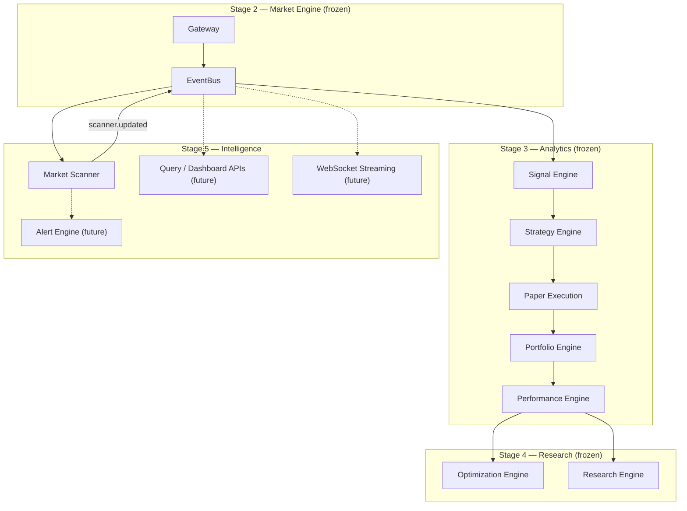
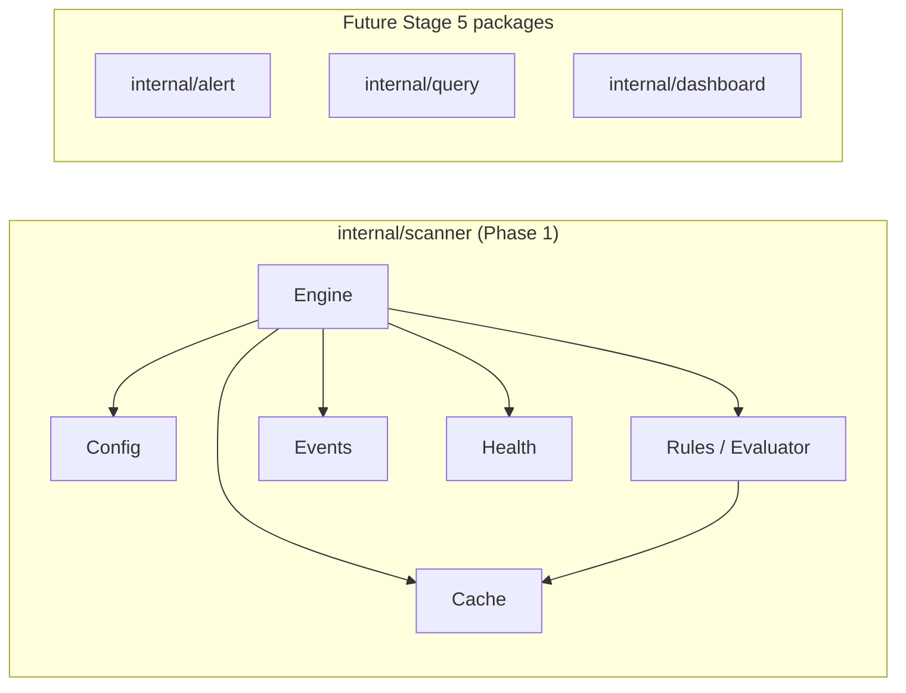
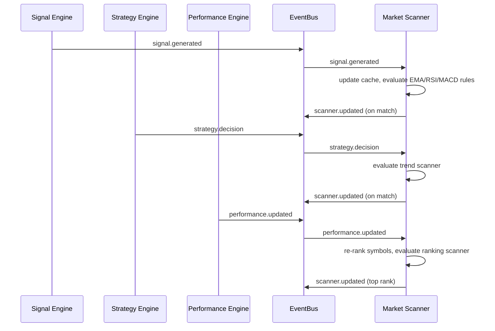

# Stage 5 — Trading Intelligence Platform

Stage 5 transforms the platform from an analytics and research backend into a **complete Trading Intelligence Platform**. Stage 5 components consume **only canonical events** from Stages 2–4. No Stage 5 component may import providers, market gateway code, broker adapters, or mutate frozen engine state.

**This platform is not an automated trading system.** Paper execution exists solely to simulate fills for portfolio, performance, and research evaluation. No broker integration, OMS, or live order placement is planned.

## Pipeline

```text
Stage 2 Market Engine (frozen)
    ↓  MarketDataReceived
Stage 3 Analytics Pipeline (frozen)
    ↓  … → SignalGenerated → StrategyDecision → … → PerformanceUpdated
Stage 4 Research Layer (frozen)
    ↓  optimization.updated, research.updated, …
Stage 5 Intelligence Layer
    ↓
Market Scanner Engine         ← Phase 1 (implemented)
    ↓  scanner.updated
(Future) Alert Engine
(Future) Dashboard APIs
(Future) Visualization Layer
```

---

## 1. Vision

Deliver a production-grade **NSE Intraday Trading Intelligence Platform** that empowers traders and researchers with:

- Real-time market analytics and scanning
- Strategy performance visibility across symbols and timeframes
- Research-backed insights from backtest, optimization, and Monte Carlo pipelines
- Alerting and dashboard APIs for decision support
- Historical query and visualization surfaces

The platform prioritizes **intelligence over execution**. Every architectural decision supports analytics, research, and user-facing insight — not automated order routing.

Paper execution remains a **simulation tool** for evaluating strategy behaviour. It is not a path to live trading.

---

## 2. Goals

| Goal | Detail |
|------|--------|
| Intelligence-first | All Stage 5 features serve analytics, scanning, alerting, and dashboards |
| Event-driven integration | Consume bus events only; never bypass the pipeline |
| Research consumption | Surface Stage 4 outputs (optimization, experiments, walk-forward, Monte Carlo) via APIs |
| Real-time scanning | Continuously evaluate symbols against configurable scanner rules |
| Extensible APIs | HTTP and WebSocket layers for dashboards without coupling to engine internals |
| No broker coupling | Zero broker SDKs, OMS, or order routing in Stage 5 |
| Single ownership | Each engine owns its mutable state; expose immutable read models |
| Observability | Health probes, structured logging, metrics for every Stage 5 component |

---

## 3. Scope

### In scope (Phase 1 — Market Scanner)

- Consume `signal.generated`, `strategy.decision`, and `performance.updated` events
- Maintain per-symbol scanner state
- Configurable scanners: EMA, RSI, MACD, trend, ranking
- Publish `scanner.updated` intelligence events
- Health reporting for scanner lifecycle and throughput
- Symbol watchlist filtering

### In scope (future phases)

- Alert Engine with notification channels
- Dashboard and query APIs
- WebSocket streaming of scanner and analytics events
- Historical analytics query layer
- Multi-strategy comparison and symbol ranking APIs
- Market breadth, heatmaps, and screeners
- Research and performance REST APIs

### Out of scope (entire Stage 5)

- Broker integration (Zerodha, Fyers, Angel One, Upstox)
- Order Management System (OMS)
- Live order placement or routing
- Execution gateway or broker manager
- Automated trading or strategy mutation
- Position synchronization with external brokers

---

## 4. Non-Goals

- Becoming an automated trading system
- Real broker connectivity or order routing
- OMS, RMS, or live portfolio reconciliation with brokers
- Modifying Stage 2, Stage 3, or Stage 4 frozen components
- Replacing paper execution with live execution
- Multi-broker support or HA failover for trading infrastructure
- Modifying `execution.report` or trade execution contracts

---

## 5. Design Principles

1. **Intelligence over execution** — Every feature answers "what does the market look like?" not "should we trade?"
2. **Event-only integration** — Downstream engines consume bus events; never read another engine's internal cache.
3. **Append-only contracts** — Event payloads and public interfaces grow via new fields; breaking changes are forbidden.
4. **Single ownership** — Scanner owns scan state; Alert Engine (future) owns alert state; APIs expose read models only.
5. **Configurable rules** — Scanner rules, alert thresholds, and API filters are runtime-configurable.
6. **Graceful lifecycle** — Context-driven shutdown, WaitGroup for goroutines, subscription drain.
7. **Stage freeze** — Phase 1 does not modify Stage 2, Stage 3, or Stage 4.
8. **Paper execution is simulation** — Retained for portfolio/performance evaluation only.

---

## 6. High-Level Architecture



Execution path (unchanged, simulation only):

```text
Risk Engine → Paper Execution → execution.report → Portfolio → Performance
```

---

## 7. Component Diagram



| Component | Package | Responsibility |
|-----------|---------|----------------|
| Scanner Engine | `internal/scanner` | Event subscription, rule evaluation, `scanner.updated` publish |
| Rules / Evaluator | `internal/scanner` | EMA, RSI, MACD, trend, ranking scanner logic |
| Cache | `internal/scanner` | Per-symbol state from signals, decisions, performance |
| Alert Engine | `internal/alert` (future) | Threshold alerts, notification dispatch |
| Query Layer | `internal/query` (future) | Historical and aggregated read APIs |
| Dashboard Layer | `internal/dashboard` (future) | Composed views for UI consumers |

---

## 8. Event Flow

### Scanner pipeline (Phase 1)



### End-to-end intelligence flow (target state)

```text
Market Data → Analytics → Signals → Scanner → scanner.updated
                                      ↓
                              Alert Engine (future)
                                      ↓
                              Dashboard / WebSocket APIs
```

---

## 9. Data Flow

```text
┌─────────────────┐   signal.generated     ┌──────────────────┐
│ Signal Engine   │ ──────────────────────►│ Market Scanner   │
│ (Stage 3)       │                        │ (Stage 5)        │
└─────────────────┘                        │                  │
┌─────────────────┐   strategy.decision      │  Cache           │
│ Strategy Engine │ ──────────────────────►│  Evaluator       │
└─────────────────┘                        │  Health          │
┌─────────────────┐   performance.updated    └────────┬─────────┘
│ Performance     │ ───────────────────────────────►│
│ Engine          │                                   ▼
└─────────────────┘                          scanner.updated
                                                      │
                        ┌─────────────────────────────┤
                        ▼                             ▼
                 ┌─────────────┐              ┌───────────────┐
                 │ Alert Engine│              │ Dashboard API │
                 │  (future)   │              │   (future)    │
                 └─────────────┘              └───────────────┘
```

Per-symbol state in the scanner cache:

| Field | Source event | Used by |
|-------|-------------|---------|
| `LastSignal` | `signal.generated` | EMA, RSI, MACD scanners |
| `LastDecision` | `strategy.decision` | Trend scanner |
| `Performance` | `performance.updated` | Ranking scanner |

---

## 10. Analytics APIs

Future HTTP endpoints (Phase 2+) exposing Stage 3/4 read models:

| Endpoint | Method | Description |
|----------|--------|-------------|
| `/api/v1/analytics/signals` | GET | Recent signals by symbol/timeframe |
| `/api/v1/analytics/indicators` | GET | Latest indicator values |
| `/api/v1/analytics/strategies` | GET | Strategy decisions and confidence |
| `/api/v1/analytics/performance` | GET | Performance metrics snapshot |
| `/api/v1/scanner/results` | GET | Latest scanner matches |
| `/api/v1/scanner/rankings` | GET | Symbol rankings from ranking scanner |

APIs return immutable snapshots. They never mutate engine state.

---

## 11. Query Layer

Future `internal/query` package providing:

- Time-range filtered queries over PostgreSQL historical tables
- Aggregated candle, indicator, and signal lookups
- Pagination and cursor-based navigation
- Read-only connection pool separate from research writes

Design constraints:

- Query layer reads from PostgreSQL and event snapshots only
- No direct cache access from Stage 2/3 engines
- Query results are denormalized DTOs, not internal engine types

---

## 12. Dashboard Layer

Future `internal/dashboard` package composing:

- Scanner match feed
- Performance leaderboards
- Strategy comparison panels
- Research report listings from Stage 4

Dashboard layer aggregates query layer responses. It does not subscribe to the event bus directly.

---

## 13. WebSocket Streaming

The existing `internal/adapters/ws` hub will be extended (future phase) to stream:

- `scanner.updated` events to connected clients
- `signal.generated` and `strategy.decision` for live dashboards
- `performance.updated` for real-time PnL panels

Streaming rules:

- Clients subscribe to event type filters
- Hub fans out from EventBus subscriptions
- Bounded buffers prevent slow-client backpressure on engines

---

## 14. Alert Engine

Future `internal/alert` package (Phase 2):

- Subscribe to `scanner.updated`, `signal.generated`, and custom threshold events
- Configurable alert rules (price, signal, scanner match, drawdown)
- Deduplication and cooldown windows
- Publish `alert.fired` events

Alert engine is **notification only** — it never triggers execution or modifies strategies.

---

## 15. Scanner Engine

Phase 1 implementation in `internal/scanner`.

### Responsibilities

| Responsibility | Detail |
|----------------|--------|
| Subscribe | `signal.generated`, `strategy.decision`, `performance.updated` |
| Filter | Process only symbols in configured watchlist |
| Evaluate | Run enabled scanner rules against per-symbol cache |
| Publish | `scanner.updated` on MATCH or WATCH status |
| State | In-memory per-symbol cache |
| Health | `scanner_engine` with throughput and match counters |

### Enabled scanners (Phase 1)

| Scanner | Trigger | Match condition |
|---------|---------|-----------------|
| `ema` | `signal.generated` with strategy `ema_cross` | BUY/SELL with confidence ≥ threshold |
| `rsi` | `signal.generated` with strategy `rsi` | BUY/SELL; WATCH if low confidence |
| `macd` | `signal.generated` with strategy `macd_cross` | BUY/SELL with confidence ≥ threshold |
| `trend` | `strategy.decision` with strategy `trend_following` | LONG_ENTRY/SHORT_ENTRY |
| `ranking` | `performance.updated` | Top-ranked symbol by composite score |

Future scanners (placeholder): high volume, new high/low, high confidence strategy.

---

## 16. Watchlists

Configured via `scanner.symbols`:

```yaml
scanner:
  symbols:
    - NIFTY
    - BANKNIFTY
```

- When the list is non-empty, only listed symbols are scanned
- When empty, all symbols passing through events are scanned
- Future: dynamic watchlists via API with persistent storage

---

## 17. Historical Query APIs

Future endpoints for time-series retrieval:

| Endpoint | Data |
|----------|------|
| `/api/v1/history/candles` | OHLCV bars by symbol/timeframe/range |
| `/api/v1/history/signals` | Historical signal events |
| `/api/v1/history/performance` | Equity curve and trade history |

Backed by PostgreSQL tables populated by Stage 2/3 persistence (future phase).

---

## 18. Research APIs

Expose Stage 4 research outputs:

| Endpoint | Source |
|----------|--------|
| `/api/v1/research/reports` | Research Engine repository |
| `/api/v1/research/optimization` | Optimization rankings |
| `/api/v1/research/experiments` | Experiment results |
| `/api/v1/research/walkforward` | Walk-forward analysis |
| `/api/v1/research/montecarlo` | Monte Carlo distributions |

Read-only. Research Engine remains the sole writer.

---

## 19. Performance APIs

| Endpoint | Description |
|----------|-------------|
| `/api/v1/performance/summary` | Aggregate PnL, win rate, drawdown |
| `/api/v1/performance/by-strategy` | Per-strategy breakdown |
| `/api/v1/performance/by-symbol` | Per-symbol breakdown |
| `/api/v1/performance/equity-curve` | Time-series equity points |

Sourced from Performance Engine snapshots and PostgreSQL (future persistence).

---

## 20. Portfolio APIs

| Endpoint | Description |
|----------|-------------|
| `/api/v1/portfolio/positions` | Current simulated positions |
| `/api/v1/portfolio/pnl` | Realized and unrealized PnL |
| `/api/v1/portfolio/history` | Closed position history |

Portfolio state is **simulated** via paper execution. No live broker positions.

---

## 21. Multi Strategy Comparison

Future capability combining:

- Optimization Engine rankings (`optimization.updated`)
- Performance Engine per-strategy metrics
- Scanner ranking scores

Produces comparative views:

- Side-by-side strategy performance tables
- Relative score charts
- Best-strategy-per-symbol recommendations (informational only)

---

## 22. Symbol Ranking

Implemented in Phase 1 via the **ranking scanner**:

```text
score = win_rate × 0.5 + normalize(pnl) × 0.5
```

On each `performance.updated` event, all cached symbol performances are ranked. The top symbol publishes a `scanner.updated` event with `scanner_name: "ranking"`.

Future: dedicated ranking API with sortable dimensions (Sharpe, profit factor, drawdown).

---

## 23. Market Breadth

Future Phase 4+ feature:

- Aggregate advancing/declining symbols from signal engine outputs
- Compute advance-decline ratio, new highs/lows
- Publish `breadth.updated` events
- No scanner package modification required — new engine subscribes to signals

---

## 24. Heatmaps

Future visualization data endpoints:

- Sector/symbol performance heatmap (color = PnL or score)
- Signal density heatmap (symbol × timeframe)
- Scanner match frequency heatmap

Delivered as JSON grids for frontend rendering. No server-side image generation.

---

## 25. Screeners

The Market Scanner Engine **is** the foundation for screeners. Future phases extend with:

- Composite screener rules (AND/OR across scanners)
- Saved screener definitions via API
- Scheduled screener runs with result history
- Export to CSV/JSON

Phase 1 provides individual scanner rules; composite screeners are Phase 3+.

---

## 26. Notification Channels

Future alert dispatch channels:

| Channel | Use case |
|---------|----------|
| WebSocket | Real-time dashboard updates |
| Webhook | External system integration |
| Email | Daily summary reports |
| Slack / Telegram | Team alert channels |

All channels are outbound only. No inbound trade commands.

---

## 27. PostgreSQL Usage

| Data | Storage | Writer |
|------|---------|--------|
| Research reports | `research` schema | Research Engine |
| Experiment results | `research` schema | Research Engine |
| Historical candles (future) | `market` schema | Persistence layer |
| Alert history (future) | `alerts` schema | Alert Engine |
| Scanner results (future) | `scanner` schema | Scanner persistence |

Phase 1 scanner is in-memory only. Persistence deferred to Phase 3+.

---

## 28. Caching Strategy

| Layer | Cache | Invalidation |
|-------|-------|--------------|
| Scanner Engine | Per-symbol in-memory map | Updated on each input event |
| Query Layer (future) | Redis or in-process LRU | TTL-based |
| Dashboard (future) | Short-lived composed cache | Event-driven refresh |
| Stage 2 Market Cache | Frozen | Not accessed by Stage 5 |

Stage 5 never reads Stage 2 cache directly. All data flows through events or PostgreSQL.

---

## 29. Thread Safety

| Component | Mechanism | Notes |
|-----------|-----------|-------|
| Scanner cache | `sync.Mutex` | Protects per-symbol state map |
| Scanner engine lifecycle | `sync.Mutex` | Protects started/closed flags |
| Health counters | `atomic.Uint64` | Lock-free increment |
| Event processing | Single goroutine | Sequential event handling |

Rules:

- No lock held during bus publish
- `Health()` safe for concurrent HTTP probe goroutines
- Cache returns internal pointers only to evaluator within the consumer goroutine

---

## 30. Health Monitoring

`GET /health/components` includes `scanner_engine`:

| Detail key | Description |
|------------|-------------|
| `enabled` | Whether scanner is configured on |
| `symbols_scanned` | Distinct symbols in cache |
| `events_processed` | Total input events processed |
| `matches_found` | Total `scanner.updated` events published |
| `scanner_count` | Number of enabled scanner rules |
| `dropped` | Subscription dropped event count |

Status is `degraded` when disconnected or events are dropped.

---

## 31. Configuration

```yaml
scanner:
  enabled: true
  symbols:
    - NIFTY
  subscriber_buffer: 256
  min_confidence: 0.5
  scanners:
    ema: true
    rsi: true
    macd: true
    trend: true
    ranking: true
```

| Key | Default | Description |
|-----|---------|-------------|
| `scanner.enabled` | `true` | Enable market scanner engine |
| `scanner.symbols` | `["NIFTY"]` | Symbol watchlist; empty = all |
| `scanner.subscriber_buffer` | `256` | Event bus subscriber buffer |
| `scanner.min_confidence` | `0.5` | Minimum confidence for MATCH status |
| `scanner.scanners.ema` | `true` | Enable EMA crossover scanner |
| `scanner.scanners.rsi` | `true` | Enable RSI threshold scanner |
| `scanner.scanners.macd` | `true` | Enable MACD crossover scanner |
| `scanner.scanners.trend` | `true` | Enable strong trend scanner |
| `scanner.scanners.ranking` | `true` | Enable performance ranking scanner |

Configuration wiring: `internal/infrastructure/config/scanner.go`

---

## 32. Logging

Structured logging via `slog`:

| Module | Events logged |
|--------|---------------|
| `scanner_engine` | Start, stop, match publish, parse failures |
| `alert_engine` (future) | Alert fired, channel dispatch |
| `query` (future) | Slow queries, cache misses |

Log fields: `symbol`, `timeframe`, `scanner_name`, `status`, `score`, `confidence`.

---

## 33. Metrics

Future Prometheus metrics:

| Metric | Type | Description |
|--------|------|-------------|
| `scanner_events_processed_total` | Counter | Input events processed |
| `scanner_matches_total` | Counter | Scanner matches published |
| `scanner_active_symbols` | Gauge | Symbols in cache |
| `scanner_evaluation_duration` | Histogram | Rule evaluation latency |
| `api_request_duration` | Histogram | API response times |

Phase 1 exposes counters via health endpoint; Prometheus integration in Phase 2+.

---

## 34. Security

| Concern | Mitigation |
|---------|------------|
| Unauthorized API access | Authentication middleware on HTTP endpoints (future) |
| Data exposure | APIs return aggregated intelligence, not raw provider credentials |
| WebSocket abuse | Connection limits and rate limiting |
| Injection | Parameterized SQL in query layer |
| Execution safety | No execution APIs exposed; paper engine is simulation only |

---

## 35. Future ML Integration

Planned integration points (no ML in Phase 1):

- Feature vectors from indicator and signal history
- Model inference service (external) consuming query layer data
- ML-generated scores published as `ml.score.updated` events
- Scanner rules extended to consume ML scores

ML models **never** generate trade signals directly. They produce intelligence scores for human or dashboard consumption.

---

## 36. Future AI Insights

Natural language explanations over:

- Scanner matches ("NIFTY triggered EMA crossover with 0.82 confidence because…")
- Performance summaries ("Strategy trend_following underperformed due to…")
- Research report narratives

AI explanation engine is Stage 12 in the original roadmap. Stage 5 provides the event and API data it consumes.

---

## 37. Future Mobile APIs

Mobile-optimized endpoints (future):

- Lightweight scanner match feed
- Push notification registration for alerts
- Compact performance summary cards
- Paginated symbol list with ranking

Same backend query layer; mobile-specific response shaping in the dashboard layer.

---

## 38. Future Multi User Support

| Feature | Approach |
|---------|----------|
| User accounts | Auth layer with JWT/session |
| Per-user watchlists | PostgreSQL user preferences |
| Per-user alerts | Alert rules scoped to user ID |
| Shared research | Organization-level report access |

Event bus remains shared; user scoping applies at API and alert layers only.

---

## 39. Scalability

| Dimension | Phase 1 | Future |
|-----------|---------|--------|
| Symbols | In-memory per symbol | Horizontal scanner instances with partitioned symbols |
| Events | Single consumer goroutine | Sharded subscriptions by symbol hash |
| APIs | Single HTTP server | Read replicas, CDN for static dashboards |
| Storage | Research in PostgreSQL | Time-series DB for historical analytics |

Phase 1 targets single-instance NSE intraday deployment. Architecture supports future horizontal scaling without contract changes.

---

## 40. Stage 5 Roadmap

| Phase | Name | Status | Delivers |
|-------|------|--------|----------|
| 1 | Market Scanner Engine | ✅ Complete | Scanner rules, `scanner.updated`, health, watchlists |
| 2 | Alert Engine | Planned | Threshold alerts, `alert.fired`, notification channels |
| 3 | Scanner Persistence | Planned | PostgreSQL storage for scanner results, saved screeners |
| 4 | Query Layer | Planned | Historical candle/signal/performance APIs |
| 5 | Dashboard APIs | Planned | Composed intelligence endpoints for UI |
| 6 | WebSocket Streaming | Planned | Real-time scanner/signal/performance fan-out |
| 7 | Market Breadth | Planned | Advance-decline, new highs/lows |
| 8 | Heatmaps & Screeners | Planned | Composite screener rules, heatmap APIs |
| 9 | Multi-User & Auth | Planned | User accounts, per-user watchlists and alerts |
| 10 | ML Score Integration | Planned | External model scores as scanner inputs |

Each phase follows event-only, append-only, single-ownership rules from `docs/ARCHITECTURE_RULES.md`. Completed phases are frozen before the next begins.

---

## Package Layout

```text
internal/
├── scanner/                   # Phase 1
│   ├── engine.go              # Lifecycle, bus subscription, publish
│   ├── config.go              # Enabled flag, symbols, scanner toggles
│   ├── rules.go               # EMA, RSI, MACD, trend, ranking evaluators
│   ├── cache.go               # Per-symbol state
│   ├── events.go              # Input/output event payloads
│   ├── health.go              # Health reporter
│   ├── errors.go              # Structured errors
│   └── engine_test.go         # Scanner and health tests
├── alert/                     # Phase 2 (future)
├── query/                     # Phase 4 (future)
└── dashboard/                 # Phase 5 (future)
```

Execution (unchanged, simulation only):

```text
internal/execution/
├── interfaces.go              # ExecutionAdapter (retained)
├── types.go
├── adapter.go
└── paper/                     # Paper adapter (frozen)
```

---

## Event Contracts

All contracts are **append-only**.

### Input: `signal.generated` (unchanged)

Consumed by Market Scanner for EMA, RSI, MACD rules.

### Input: `strategy.decision` (unchanged)

Consumed by Market Scanner for trend rule.

### Input: `performance.updated` (unchanged)

Consumed by Market Scanner for ranking rule.

### Output: `scanner.updated`

Published when a scanner rule produces a MATCH or WATCH result.

| Field | Type | Required | Description |
|-------|------|----------|-------------|
| `symbol` | string | yes | Instrument symbol |
| `timeframe` | string | yes | Bar timeframe |
| `scanner_name` | string | yes | Scanner identifier (`ema`, `rsi`, `macd`, `trend`, `ranking`) |
| `status` | string | yes | `MATCH`, `WATCH`, or `NEUTRAL` |
| `score` | float64 | yes | Composite scanner score |
| `confidence` | float64 | yes | Confidence from source signal/decision |
| `matched_rules` | []string | yes | Rule identifiers that matched |
| `timestamp` | time | yes | Evaluation timestamp |

---

## Engine Lifecycle

### Startup order

Scanner Engine subscribes **before** Signal, Strategy, and Performance engines start publishing:

```text
Scanner → Research → … → Performance → Strategy → Signal → … → Gateway
```

### Shutdown order (reverse)

```text
Gateway → … → Signal → Strategy → Performance → … → Scanner → Research
```

### Lifecycle steps

1. `New(cfg, bus, clk)` — validate config, allocate cache and evaluator.
2. `Start(ctx)` — subscribe to input events, launch consumer goroutine.
3. Consumer loop — parse, update cache, evaluate rules, publish matches.
4. `Close()` — cancel context, drain subscription, wait on WaitGroup, close subscription.

---

## Execution Architecture (Unchanged)

Paper execution remains the sole execution path:

```text
Risk Engine
    ↓  approved.trade.intent
Paper Execution Engine
    ↓  execution.report
Portfolio Engine
    ↓  portfolio.updated
Performance Engine
    ↓  performance.updated
```

The `ExecutionAdapter` abstraction is retained for clean separation but has only one implementation: the paper adapter. No gateway, broker manager, or routing layer exists.

---

## Testing Strategy

| Test | Validates |
|------|-----------|
| EMA scanner | BUY signal on `ema_cross` publishes MATCH |
| RSI scanner | Low-confidence SELL publishes WATCH |
| Ranking scanner | Top symbol by performance score published |
| Health reporting | `scanner_engine` details populated |
| Event publish | Health counters increment on match |

Run `go build ./...` and `go test ./...` before completion.

---

## Design Decisions

| Decision | Rationale |
|----------|-----------|
| No execution gateway | Platform is intelligence-first; routing layer not needed |
| Paper execution unchanged | Simulation path preserved for portfolio/performance evaluation |
| Scanner consumes 3 event types | Signals, decisions, and performance cover all Phase 1 rules |
| In-memory scanner state | Phase 1 scope; persistence deferred |
| Symbol watchlist filter | Focus scanning on configured universe |
| Ranking on performance events | Leverages existing performance pipeline without Stage 3 changes |
| WATCH status for low confidence | Distinguishes strong vs weak matches for dashboard use |

---

## Extension Guidelines

1. New scanner rules add evaluators in `rules.go` and config toggles — no engine changes.
2. New event types use new `events.Type` constants; never repurpose existing types.
3. APIs read from query layer or event snapshots — never from engine internal caches.
4. Alert engine (future) subscribes to `scanner.updated` — does not modify scanner.
5. Do not import Stage 2/3/4 engine packages from scanner code.
6. No broker, OMS, or execution routing code in Stage 5 packages.

---

## Trade-offs

| Trade-off | Choice | Cost | Benefit |
|-----------|--------|------|---------|
| In-memory scanner state | No persistence in Phase 1 | Results lost on restart | Simple, fast, no DB dependency |
| Single consumer goroutine | Sequential processing | Throughput ceiling | Thread-safe without complex locking |
| Ranking on every performance event | May publish frequently | Extra bus traffic | Always-current leader symbol |
| No execution gateway | Direct paper path | Less abstraction for future brokers | Aligns with no-broker project goal |
| Watchlist filter | Configured symbol list | Manual symbol management | Focused scanning for NSE intraday |
